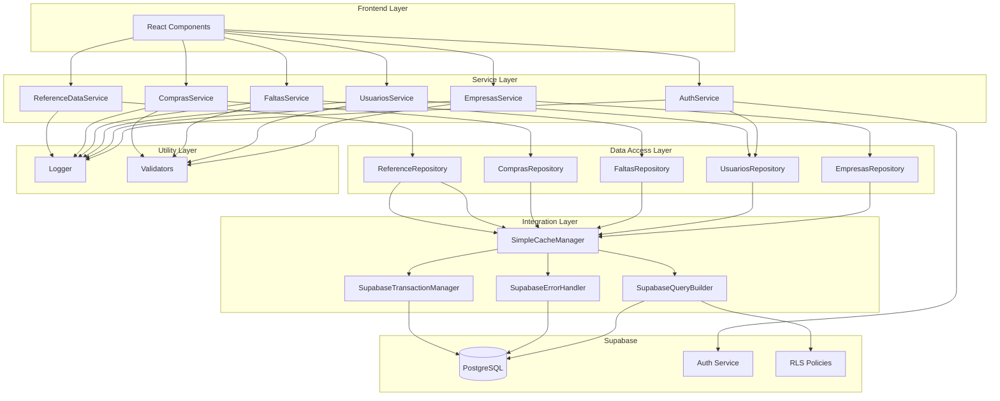
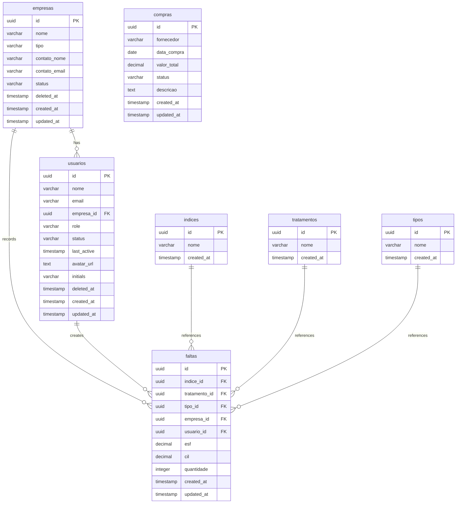

# VisuLab Backend Architecture Design

## Overview

This document defines the backend architecture for VisuLab, a web application for managing lens shortages and purchases in optical laboratories. The architecture is designed to work strictly with the confirmed Supabase schema, providing a scalable, maintainable, and performant backend solution.

## Architecture Principles

1. **Schema-Driven Design**: All architecture decisions are based 1:1 on the existing Supabase schema
2. **Layered Architecture**: Clear separation of concerns with distinct layers
3. **Type Safety**: Comprehensive TypeScript usage throughout the stack
4. **Performance Optimization**: Caching strategies and query optimization
5. **Error Resilience**: Comprehensive error handling and logging
6. **Testability**: Architecture designed for comprehensive testing

## System Architecture



## Layer Responsibilities

### 1. Integration Layer (`lib/integration/`)

**Purpose**: Direct communication with Supabase, abstracting the complexity of the client.

**Components**:
- **SupabaseClientManager**: Singleton pattern for client management, connection monitoring, and reconnection logic
- **SupabaseQueryBuilder**: Type-safe query construction with RLS integration
- **SupabaseErrorHandler**: Standardized error mapping and recovery
- **SupabaseTransactionManager**: Batch operations and rollback mechanisms

**Key Features**:
- Automatic RLS context injection
- Connection health monitoring
- Network error recovery
- Performance monitoring

### 2. Data Access Layer (`lib/dal/`)

**Purpose**: Abstract database operations into reusable patterns with limited caching for reference data only.

**Components**:
- **BaseRepository**: Generic CRUD operations
- **Specific Repositories**: Table-specific data access implementations
- **Query Builders**: Complex query construction for joins and aggregations
- **Simple Cache Manager**: Basic in-memory caching for reference data only

**Key Features**:
- Repository pattern implementation
- Simple caching for reference data (indices, tipos, tratamentos)
- Type-safe query construction
- Pagination and filtering support

### 3. Service Layer (`services/`)

**Purpose**: Implement business logic and orchestrate data operations.

**Components**:
- **BaseService**: Common service functionality with error handling
- **Entity Services**: Business logic for each entity
- **Business Logic Services**: Cross-cutting concerns like auth and workflows
- **Orchestration Services**: Complex multi-entity operations

**Key Features**:
- Business rule enforcement
- Transaction coordination
- Data transformation
- Workflow management

### 4. Validation Layer (`lib/validation/`)

**Purpose**: Ensure data integrity and business rule compliance.

**Components**:
- **Validators**: Entity-specific validation logic
- **Schemas**: Validation rule definitions
- **Type Guards**: Runtime type checking

**Key Features**:
- Pre-database validation
- Business rule enforcement
- Input sanitization
- Type safety guarantees

### 5. Utility Layer (`lib/utils/`)

**Purpose**: Provide common functionality across the application.

**Components**:
- **Logger**: Structured logging with levels and contexts
- **Error Handler**: Custom error classes and handling
- **Helpers**: Common utility functions
- **Constants**: Application-wide constants

**Key Features**:
- Comprehensive error handling
- Structured logging
- Performance monitoring
- Common utilities

## Database Schema Mapping

### Table Relationships



### RLS Policy Integration

The architecture respects all Row Level Security (RLS) policies:

- **User Context**: Automatic `auth.uid()` injection
- **Role-Based Access**: `auth.is_admin()` function integration
- **Company Isolation**: Users can only access their company's data
- **Admin Privileges**: Administrators can manage all data
- **Reference Data**: Read access for all, write access for admins

## Performance Optimization

### Caching Strategy

The caching implementation is limited to reference/static data only. No multi-level or complex caching strategies are implemented at this stage.

| Data Type | TTL | Cache Key Pattern | Invalidation Strategy |
|-----------|-----|-------------------|----------------------|
| Indices | 30 minutes | `indices:all` | Manual admin invalidation |
| Tipos | 30 minutes | `tipos:all` | Manual admin invalidation |
| Tratamentos | 30 minutes | `tratamentos:all` | Manual admin invalidation |

Note: Dynamic data such as Empresas, Usuarios, Faltas, and Compras are not cached to ensure data consistency and avoid cache invalidation complexity.

### Query Optimization

1. **Selective Loading**: Only request required columns
2. **Join Optimization**: Use efficient join patterns
3. **Pagination**: Implement cursor-based pagination for large datasets
4. **Batch Operations**: Group multiple operations into single requests
5. **Index Utilization**: Leverage database indexes for common queries

## Error Handling Strategy

### Error Hierarchy

```typescript
abstract class ApplicationError extends Error {
  abstract readonly code: string;
  abstract readonly statusCode: number;
}

class DatabaseError extends ApplicationError {
  readonly code = 'DATABASE_ERROR';
  readonly statusCode = 500;
}

class ValidationError extends ApplicationError {
  readonly code = 'VALIDATION_ERROR';
  readonly statusCode = 400;
}

class AuthenticationError extends ApplicationError {
  readonly code = 'AUTHENTICATION_ERROR';
  readonly statusCode = 401;
}

class AuthorizationError extends ApplicationError {
  readonly code = 'AUTHORIZATION_ERROR';
  readonly statusCode = 403;
}
```

### Error Handling Patterns

1. **Graceful Degradation**: Fallback to cached data when possible
2. **User-Friendly Messages**: Convert technical errors to user-friendly messages
3. **Comprehensive Logging**: Log all errors with context
4. **Retry Logic**: Implement exponential backoff for transient errors
5. **Error Reporting**: Aggregate errors for monitoring and alerting

## Security Considerations

### Data Protection

1. **Input Validation**: All inputs validated before processing
2. **SQL Injection Prevention**: Use parameterized queries
3. **XSS Prevention**: Proper output encoding
4. **Authentication**: Secure token management
5. **Authorization**: Role-based access control

### RLS Compliance

1. **User Context**: Always include user context in queries
2. **Role Checking**: Verify user roles before operations
3. **Company Isolation**: Enforce company data isolation
4. **Admin Privileges**: Properly handle administrative operations

## File Structure

```
backend/
├── lib/
│   ├── integration/          # Supabase integration layer
│   │   └── supabase/
│   ├── dal/                  # Data access layer
│   │   ├── base/
│   │   ├── repositories/
│   │   └── queries/
│   ├── validation/           # Data validation
│   │   ├── validators/
│   │   └── schemas/
│   ├── utils/                # Utilities
│   │   ├── logger/
│   │   ├── errors/
│   │   ├── helpers/
│   │   ├── constants/
│   │   └── cache/            # Simple cache for reference data only
│   └── types/                # TypeScript definitions
│       ├── database/
│       ├── api/
│       └── business/
├── services/                 # Business logic layer
│   ├── base/
│   ├── core/
│   ├── entities/
│   └── orchestration/
├── config/                   # Configuration files
└── tests/                    # Test files
    ├── unit/
    ├── integration/
    └── fixtures/
```

## Naming Conventions

### Files
- **Implementation**: `camelCase.ts`
- **Classes**: `PascalCase.ts`
- **Tests**: `*.test.ts`
- **Types**: `camelCase.types.ts`

### Code Elements
- **Classes**: `PascalCase` with descriptive suffix
- **Interfaces**: `IPascalCase`
- **Functions**: `camelCase` with descriptive verbs
- **Constants**: `UPPER_SNAKE_CASE`
- **Variables**: `camelCase`

## Implementation Roadmap

### Phase 1: Foundation
1. Set up integration layer with Supabase
2. Implement base repository and service classes
3. Create validation framework
4. Set up logging and error handling

### Phase 2: Core Entities
1. Implement empresas repository and service
2. Implement usuarios repository and service
3. Implement authentication and authorization
4. Add simple caching for reference data only

### Phase 3: Business Logic
1. Implement faltas repository and service
2. Implement compras repository and service
3. Implement reference data services
4. Add workflow orchestration

### Phase 4: Optimization
1. Performance tuning and optimization
2. Comprehensive testing
3. Documentation completion
4. Monitoring and alerting setup

## Conclusion

This backend architecture provides a robust, scalable, and maintainable foundation for the VisuLab application. The layered approach ensures clear separation of concerns, while the comprehensive error handling and caching strategies ensure reliability and performance. The architecture is designed to work seamlessly with the existing Supabase schema while providing room for future growth and enhancement.

The architecture follows industry best practices and is optimized for the specific requirements of managing optical laboratory operations, including lens shortage tracking, purchase management, and user administration.