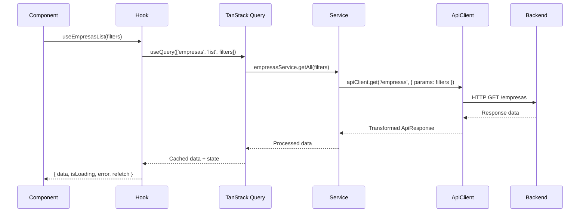

# Frontend Data-Fetching Contract Specification

## Overview

This document defines the official frontend data-fetching contract for the VisuLab application, establishing standardized patterns for TanStack Query integration, cache management, and data flow between Hooks, Services, and the ApiClient.

## 1. Query Key Factory Specification

### 1.1 Hierarchical Structure

The query key factory follows a hierarchical pattern that ensures consistency and type safety:

```typescript
// Base query key factory type
type QueryKeyFactory = {
    all: readonly [string];
    lists: () => readonly [string, 'list'];
    list: <T>(filters?: T) => readonly [string, 'list', T?];
    details: () => readonly [string, 'detail'];
    detail: (id: string) => readonly [string, 'detail', string];
    search: (query: string) => readonly [string, 'search', string];
    infinite: () => readonly [string, 'infinite'];
    infiniteList: <T>(filters?: T) => readonly [string, 'infinite', T?];
};
```

### 1.2 Entity-Specific Query Keys

```typescript
export const queryKeys = {
    // Authentication keys
    auth: {
        all: ['auth'] as const,
        user: () => [...queryKeys.auth.all, 'user'] as const,
        session: () => [...queryKeys.auth.all, 'session'] as const,
        permissions: () => [...queryKeys.auth.all, 'permissions'] as const,
    },

    // Dashboard keys
    dashboard: {
        all: ['dashboard'] as const,
        stats: () => [...queryKeys.dashboard.all, 'stats'] as const,
        charts: () => [...queryKeys.dashboard.all, 'charts'] as const,
        recentActivity: () => [...queryKeys.dashboard.all, 'recentActivity'] as const,
    },

    // Entity keys (using factory pattern)
    empresas: createQueryKeyFactory('empresas'),
    usuarios: createQueryKeyFactory('usuarios'),
    faltas: createQueryKeyFactory('faltas'),
    compras: createQueryKeyFactory('compras'),

    // Reference data keys
    indices: createQueryKeyFactory('indices'),
    tipos: createQueryKeyFactory('tipos'),
    tratamentos: createQueryKeyFactory('tratamentos'),

    // Relationship keys
    relacoes: {
        all: ['relacoes'] as const,
        empresaUsuarios: (empresaId: string) => ['relacoes', 'empresa', empresaId, 'usuarios'] as const,
        empresaFaltas: (empresaId: string) => ['relacoes', 'empresa', empresaId, 'faltas'] as const,
        usuarioFaltas: (usuarioId: string) => ['relacoes', 'usuario', usuarioId, 'faltas'] as const,
    },
};
```

### 1.3 Query Key Examples

```typescript
// List all empresas
['empresas', 'list']

// List empresas with filters
['empresas', 'list', { status: 'Ativa', page: 1 }]

// Get specific empresa
['empresas', 'detail', 'empresa-123']

// Search empresas
['empresas', 'search', 'VisuLab']

// Infinite scroll for faltas
['faltas', 'infinite', { empresa_id: 'empresa-123' }]

// Get usuarios from specific empresa
['relacoes', 'empresa', 'empresa-123', 'usuarios']
```

## 2. Cache Policies Definition

### 2.1 Standard Cache Configuration

```typescript
export const cachePolicies = {
    // Standard entities (empresas, usuarios, faltas, compras)
    standard: {
        staleTime: 5 * 60 * 1000, // 5 minutes
        gcTime: 10 * 60 * 1000,   // 10 minutes
        refetchOnWindowFocus: false,
        refetchOnReconnect: true,
        refetchOnMount: false,
    },

    // Reference data (indices, tipos, tratamentos)
    reference: {
        staleTime: 10 * 60 * 1000, // 10 minutes
        gcTime: 30 * 60 * 1000,    // 30 minutes
        refetchOnWindowFocus: false,
        refetchOnReconnect: true,
        refetchOnMount: false,
    },

    // Real-time data (dashboard stats, notifications)
    realtime: {
        staleTime: 60 * 1000,      // 1 minute
        gcTime: 5 * 60 * 1000,     // 5 minutes
        refetchOnWindowFocus: true,
        refetchOnReconnect: true,
        refetchOnMount: true,
    },

    // User session data
    session: {
        staleTime: 0,               // Always fresh
        gcTime: 0,                  // Don't cache
        refetchOnWindowFocus: true,
        refetchOnReconnect: true,
        refetchOnMount: true,
    },
};
```

### 2.2 Entity-Specific Cache Policies

```typescript
export const entityCachePolicies = {
    empresas: cachePolicies.standard,
    usuarios: cachePolicies.standard,
    faltas: cachePolicies.standard,
    compras: cachePolicies.standard,
    indices: cachePolicies.reference,
    tipos: cachePolicies.reference,
    tratamentos: cachePolicies.reference,
    dashboard: cachePolicies.realtime,
    notifications: cachePolicies.realtime,
    auth: cachePolicies.session,
};
```

## 3. Invalidation Rules for CRUD Operations

### 3.1 Standard Invalidation Patterns

```typescript
export const invalidationRules = {
    // Create operations
    create: {
        // Invalidate all list queries for the entity
        invalidateLists: (entity: string) => [entity, 'list'],
        
        // Optionally invalidate related entities
        invalidateRelated: (entity: string, id: string) => {
            switch (entity) {
                case 'faltas':
                    return [
                        ['faltas', 'list'],
                        ['dashboard'],
                        ['relacoes', 'empresa', id, 'faltas'],
                        ['relacoes', 'usuario', id, 'faltas'],
                    ];
                case 'compras':
                    return [
                        ['compras', 'list'],
                        ['dashboard'],
                    ];
                default:
                    return [[entity, 'list']];
            }
        },
    },

    // Update operations
    update: {
        // Invalidate specific entity detail
        invalidateDetail: (entity: string, id: string) => [entity, 'detail', id],
        
        // Invalidate all list queries
        invalidateLists: (entity: string) => [entity, 'list'],
        
        // Invalidate related entities
        invalidateRelated: (entity: string, id: string) => {
            switch (entity) {
                case 'empresas':
                    return [
                        ['empresas', 'detail', id],
                        ['empresas', 'list'],
                        ['relacoes', 'empresa', id, 'usuarios'],
                        ['relacoes', 'empresa', id, 'faltas'],
                        ['dashboard'],
                    ];
                case 'usuarios':
                    return [
                        ['usuarios', 'detail', id],
                        ['usuarios', 'list'],
                        ['dashboard'],
                    ];
                default:
                    return [
                        [entity, 'detail', id],
                        [entity, 'list'],
                    ];
            }
        },
    },

    // Delete operations
    delete: {
        // Invalidate all queries for the entity
        invalidateAll: (entity: string) => [entity],
        
        // Invalidate related entities
        invalidateRelated: (entity: string, id: string) => {
            return invalidationRules.update.invalidateRelated(entity, id);
        },
    },
};
```

### 3.2 Optimistic Update Rules

```typescript
export const optimisticUpdateRules = {
    // Updates that can be optimistically applied
    allowedUpdates: [
        'usuarios.status',
        'empresas.status',
        'faltas.tratamento_id',
        'compras.status',
    ],

    // Fields that should not be optimistically updated
    blockedUpdates: [
        'usuarios.email',
        'usuarios.role',
        'empresas.nome',
        'faltas.usuario_id',
        'faltas.empresa_id',
    ],

    // Rollback strategy
    rollback: {
        onError: 'restorePrevious',
        onConflict: 'refetchAndMerge',
    },
};
```

## 4. Hook ⇄ Service ⇄ ApiClient Contract

### 4.1 Layer Responsibilities

#### Hooks Layer (`src/hooks/api/`)
- **Purpose**: Provide data to components with TanStack Query
- **Responsibilities**:
  - Define query keys using the standardized factory
  - Configure cache policies per entity
  - Handle loading/error states
  - Implement optimistic updates
  - Define invalidation strategies
  - Transform data for UI consumption

#### Services Layer (`src/services/api/`)
- **Purpose**: Business logic and data transformation
- **Responsibilities**:
  - Extend BaseService for entity-specific operations
  - Implement complex business logic
  - Handle data validation and transformation
  - Compose multiple API calls
  - Handle domain-specific error cases

#### ApiClient Layer (`src/lib/apiClient.ts`)
- **Purpose**: HTTP communication with backend
- **Responsibilities**:
  - Make actual HTTP requests
  - Handle authentication headers
  - Apply request/response interceptors
  - Transform HTTP errors to ApiError format
  - Handle network-level retries

### 4.2 Data Flow Contract



### 4.3 Error Handling Contract

```typescript
// Error handling flow
1. ApiClient transforms HTTP errors to ApiError format
2. Service adds domain-specific error context
3. Hook maps errors to user-friendly messages
4. Component displays appropriate error UI
```

### 4.4 Type Safety Contract

```typescript
// Type flow from backend to frontend
Backend Entity → Service Type → Hook Type → Component Props

// Example:
Empresa (backend) → Empresa (service) → EmpresaWithUI (hook) → EmpresaDisplayProps (component)
```

## 5. Reusable Hook Template

### 5.1 Standard Query Hook Template

```typescript
/**
 * Template for creating standardized query hooks
 */
import { useQuery, UseQueryOptions, UseQueryResult } from '@tanstack/react-query';
import { queryKeys, entityCachePolicies } from '../lib/queryKeysFactory';
import { ApiError } from '../types/api/api.types';

// Template for list queries
export function createUseListQuery<T, TFilters>(
    entity: string,
    serviceMethod: (filters?: TFilters) => Promise<T[]>
) {
    return function useListQuery(
        filters?: TFilters,
        options?: Omit<UseQueryOptions<T[], ApiError>, 'queryKey' | 'queryFn'>
    ): UseQueryResult<T[], ApiError> {
        return useQuery({
            queryKey: queryKeys[entity].list(filters),
            queryFn: () => serviceMethod(filters),
            ...entityCachePolicies[entity],
            ...options,
        });
    };
}

// Template for detail queries
export function createUseDetailQuery<T>(
    entity: string,
    serviceMethod: (id: string) => Promise<T>
) {
    return function useDetailQuery(
        id: string,
        options?: Omit<UseQueryOptions<T, ApiError>, 'queryKey' | 'queryFn'>
    ): UseQueryResult<T, ApiError> {
        return useQuery({
            queryKey: queryKeys[entity].detail(id),
            queryFn: () => serviceMethod(id),
            enabled: !!id,
            ...entityCachePolicies[entity],
            ...options,
        });
    };
}

// Template for search queries
export function createUseSearchQuery<T>(
    entity: string,
    serviceMethod: (query: string) => Promise<T[]>
) {
    return function useSearchQuery(
        query: string,
        options?: Omit<UseQueryOptions<T[], ApiError>, 'queryKey' | 'queryFn'>
    ): UseQueryResult<T[], ApiError> {
        return useQuery({
            queryKey: queryKeys[entity].search(query),
            queryFn: () => serviceMethod(query),
            enabled: query.length > 0,
            staleTime: 2 * 60 * 1000, // 2 minutes for search results
            ...options,
        });
    };
}
```

### 5.2 Standard Mutation Hook Template

```typescript
/**
 * Template for creating standardized mutation hooks
 */
import { useMutation, UseMutationOptions, UseMutationResult } from '@tanstack/react-query';
import { QueryClient } from '@tanstack/react-query';
import { queryKeys, invalidationRules } from '../lib/queryKeysFactory';
import { ApiError } from '../types/api/api.types';

// Template for create mutations
export function createUseCreateMutation<T, TVariables>(
    entity: string,
    serviceMethod: (data: TVariables) => Promise<T>,
    queryClient: QueryClient
) {
    return function useCreateMutation(
        options?: Omit<UseMutationOptions<T, ApiError, TVariables>, 'mutationFn'>
    ): UseMutationResult<T, ApiError, TVariables> {
        return useMutation({
            mutationFn: serviceMethod,
            onSuccess: (data, variables, context) => {
                // Invalidate list queries
                queryClient.invalidateQueries({
                    queryKey: queryKeys[entity].lists(),
                });

                // Invalidate related queries
                const relatedKeys = invalidationRules.create.invalidateRelated(entity, data.id);
                relatedKeys.forEach(key => {
                    queryClient.invalidateQueries({ queryKey: key });
                });

                // Call user-provided onSuccess
                options?.onSuccess?.(data, variables, context);
            },
            ...options,
        });
    };
}

// Template for update mutations
export function createUseUpdateMutation<T, TVariables>(
    entity: string,
    serviceMethod: (id: string, data: TVariables) => Promise<T>,
    queryClient: QueryClient
) {
    return function useUpdateMutation(
        options?: Omit<UseMutationOptions<T, ApiError, { id: string; data: TVariables }>, 'mutationFn'>
    ): UseMutationResult<T, ApiError, { id: string; data: TVariables }> {
        return useMutation({
            mutationFn: ({ id, data }) => serviceMethod(id, data),
            onMutate: async ({ id, data }) => {
                // Cancel any outgoing refetches
                await queryClient.cancelQueries({ queryKey: queryKeys[entity].detail(id) });

                // Snapshot the previous value
                const previousData = queryClient.getQueryData(queryKeys[entity].detail(id));

                // Optimistically update to the new value
                queryClient.setQueryData(queryKeys[entity].detail(id), (old: T) => ({
                    ...old,
                    ...data,
                }));

                // Return context with the previous data
                return { previousData };
            },
            onError: (error, variables, context) => {
                // If the mutation fails, use the context returned from onMutate to roll back
                if (context?.previousData) {
                    queryClient.setQueryData(
                        queryKeys[entity].detail(variables.id),
                        context.previousData
                    );
                }
            },
            onSettled: (data, error, variables) => {
                // Invalidate detail query
                queryClient.invalidateQueries({
                    queryKey: queryKeys[entity].detail(variables.id),
                });

                // Invalidate list queries
                queryClient.invalidateQueries({
                    queryKey: queryKeys[entity].lists(),
                });

                // Invalidate related queries
                const relatedKeys = invalidationRules.update.invalidateRelated(entity, variables.id);
                relatedKeys.forEach(key => {
                    queryClient.invalidateQueries({ queryKey: key });
                });
            },
            ...options,
        });
    };
}

// Template for delete mutations
export function createUseDeleteMutation(
    entity: string,
    serviceMethod: (id: string) => Promise<void>,
    queryClient: QueryClient
) {
    return function useDeleteMutation(
        options?: Omit<UseMutationOptions<void, ApiError, string>, 'mutationFn'>
    ): UseMutationResult<void, ApiError, string> {
        return useMutation({
            mutationFn: serviceMethod,
            onSuccess: (_, id, context) => {
                // Remove the deleted item from cache
                queryClient.removeQueries({ queryKey: queryKeys[entity].detail(id) });

                // Invalidate all queries for the entity
                queryClient.invalidateQueries({ queryKey: queryKeys[entity].all });

                // Invalidate related queries
                const relatedKeys = invalidationRules.delete.invalidateRelated(entity, id);
                relatedKeys.forEach(key => {
                    queryClient.invalidateQueries({ queryKey: key });
                });

                // Call user-provided onSuccess
                options?.onSuccess?.(_, id, context);
            },
            ...options,
        });
    };
}
```

### 5.3 Example Hook Implementation

```typescript
// Example: empresas hooks implementation
import { createUseListQuery, createUseDetailQuery, createUseCreateMutation, createUseUpdateMutation, createUseDeleteMutation } from '../lib/hookTemplates';
import { empresasService } from '../services/api/empresas';
import { Empresa, EmpresaFilters, EmpresaFormData } from '../types/domain/domain.types';
import { queryClient } from '../lib/queryClient';

// Query hooks
export const useEmpresasList = createUseListQuery<Empresa[], EmpresaFilters>(
    'empresas',
    empresasService.getAll
);

export const useEmpresaDetail = createUseDetailQuery<Empresa>(
    'empresas',
    empresasService.getById
);

export const useEmpresasSearch = createUseSearchQuery<Empresa[]>(
    'empresas',
    empresasService.search
);

// Mutation hooks
export const useCreateEmpresa = createUseCreateMutation<Empresa, EmpresaFormData>(
    'empresas',
    empresasService.create,
    queryClient
);

export const useUpdateEmpresa = createUseUpdateMutation<Empresa, Partial<EmpresaFormData>>(
    'empresas',
    empresasService.update,
    queryClient
);

export const useDeleteEmpresa = createUseDeleteMutation(
    'empresas',
    empresasService.delete,
    queryClient
);
```

## 6. Implementation Guidelines

### 6.1 Hook Development Rules

1. **Always use the query key factory** - Never manually construct query keys
2. **Apply appropriate cache policies** - Use entity-specific cache configurations
3. **Handle loading and error states** - Provide consistent state management
4. **Implement proper invalidation** - Follow the defined invalidation rules
5. **Use TypeScript strictly** - Ensure type safety throughout the data flow

### 6.2 Service Development Rules

1. **Extend BaseService** - Inherit from the base service for consistency
2. **Don't call ApiClient directly** - Use inherited methods
3. **Transform data appropriately** - Convert between backend and frontend formats
4. **Handle domain-specific validation** - Implement business logic validation
5. **Document complex operations** - Add clear documentation for non-trivial methods

### 6.3 Testing Guidelines

1. **Test hooks with React Testing Library** - Use proper hook testing utilities
2. **Mock services in hook tests** - Focus on hook behavior, not service logic
3. **Test services with mocked ApiClient** - Verify data transformation and validation
4. **Test cache behavior** - Ensure invalidation works correctly
5. **Test error scenarios** - Verify proper error handling at each layer

## 7. Migration Strategy

### 7.1 Incremental Migration Approach

1. **Phase 1**: Implement query key factory and cache policies
2. **Phase 2**: Create hook templates and utility functions
3. **Phase 3**: Migrate one entity at a time (start with reference data)
4. **Phase 4**: Update existing components to use new hooks
5. **Phase 5**: Remove old data-fetching code

### 7.2 Backward Compatibility

During migration, maintain both old and new patterns side by side to ensure smooth transition without breaking existing functionality.

## 8. Conclusion

This data-fetching contract provides a standardized, type-safe, and performant approach to data management in the VisuLab frontend. By following these patterns and conventions, we ensure:

- **Consistency**: All data fetching follows the same patterns
- **Performance**: Optimized caching and invalidation strategies
- **Type Safety**: End-to-end type safety from backend to frontend
- **Maintainability**: Clear separation of concerns and predictable patterns
- **Developer Experience**: Easy-to-use hooks with sensible defaults

The contract serves as the foundation for all frontend data operations and should be referenced when implementing new features or modifying existing data-fetching logic.