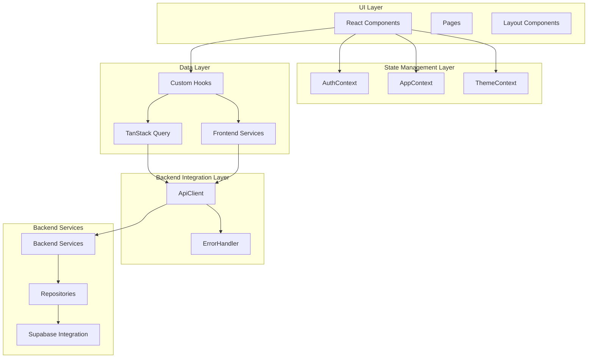
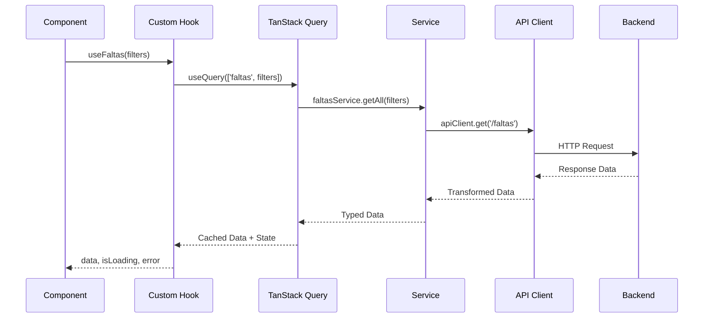
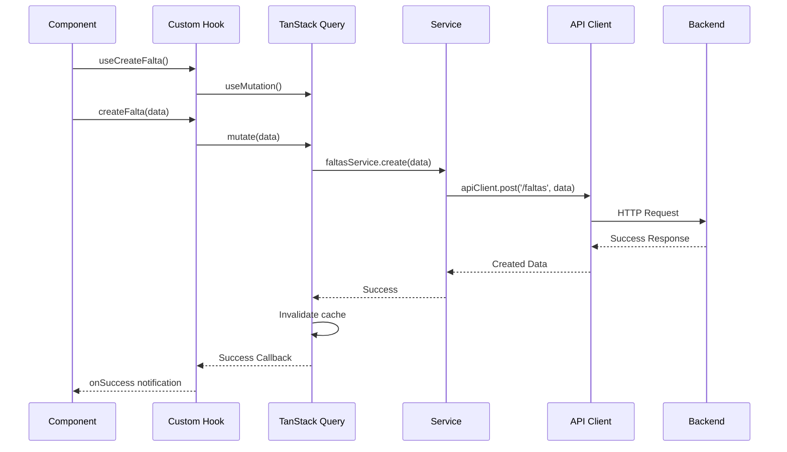

# VisuLab Frontend Architecture Design

## Overview

This document defines the frontend architecture for VisuLab, designed to consume the existing backend in a type-safe, scalable, and maintainable way. The architecture leverages React Context for state management and TanStack Query for data fetching, providing a robust foundation for the optical laboratory management application.

## Architecture Principles

1. **Type Safety**: Comprehensive TypeScript usage with strict typing throughout
2. **Separation of Concerns**: Clear boundaries between UI, state, and data layers
3. **Performance Optimized**: Efficient data fetching, caching, and rendering patterns
4. **Developer Experience**: Predictable patterns and excellent tooling support
5. **Scalability**: Architecture designed to grow with application complexity
6. **Maintainability**: Clear conventions and modular structure

## Current Frontend Analysis

### Existing Structure
- **Framework**: React 19.2.1 with TypeScript
- **Routing**: React Router DOM 6.22.3
- **Styling**: Tailwind CSS with custom design system
- **State Management**: Basic React useState (no global state management)
- **Data Fetching**: Direct service calls with manual loading/error states
- **Components**: Functional components with hooks
- **Build Tool**: Vite 6.2.0

### Identified Gaps
1. **No Global State Management**: Components manage their own state independently
2. **No Standardized Data Fetching**: Manual async/await patterns with repeated loading states
3. **No Error Boundary Strategy**: Errors handled individually per component
4. **No Type-Safe API Layer**: Services exist but lack comprehensive error handling
5. **No Caching Strategy**: Every request hits the backend directly
6. **No Optimistic Updates**: UI waits for backend confirmation before updating
7. **No Form Validation Strategy**: Manual validation logic scattered across components

## System Architecture



## Layer Responsibilities

### 1. UI Layer (`components/`, `pages/`)

**Purpose**: Presentational components and page composition.

**Components**:
- **Pages**: Route-level components that orchestrate multiple features
- **Layout**: Navigation, modals, and shared layout components
- **Features**: Domain-specific component groups
- **Common**: Reusable UI components

**Key Features**:
- Presentational-only components (no business logic)
- Props-driven rendering
- Event delegation to custom hooks
- Responsive design with Tailwind CSS

### 2. State Management Layer (`contexts/`)

**Purpose**: Global application state and cross-component communication.

**Contexts**:
- **AuthContext**: User authentication state and session management
- **AppContext**: Global application state (loading, notifications, modals)
- **ThemeContext**: Theme management and user preferences

**Key Features**:
- Provider pattern with optimized re-renders
- Type-safe context values
- Selector-based consumption to prevent unnecessary updates
- Persistent state where appropriate

### 3. Data Layer (`hooks/`, `services/`)

**Purpose**: Data fetching, caching, and business logic orchestration.

**Components**:
- **Custom Hooks**: Domain-specific data fetching and state management
- **TanStack Query**: Server state management with caching and synchronization
- **Frontend Services**: API client abstractions and data transformation

**Key Features**:
- Automatic caching and background refetching
- Optimistic updates with rollback
- Pagination and infinite scrolling support
- Type-safe API responses

### 4. Backend Integration Layer (`api/`)

**Purpose**: Type-safe communication with backend services.

**Components**:
- **ApiClient**: Centralized HTTP client with interceptors
- **ErrorHandler**: Standardized error processing and user feedback
- **Type Guards**: Runtime type validation for API responses

**Key Features**:
- Request/response interceptors for auth and logging
- Automatic retry logic with exponential backoff
- Type-safe request/response handling
- Error boundary integration

## Detailed Architecture

### State Management Strategy

#### AuthContext
```typescript
interface AuthContextType {
  user: User | null;
  isAuthenticated: boolean;
  isLoading: boolean;
  login: (credentials: LoginCredentials) => Promise<void>;
  logout: () => Promise<void>;
  updateProfile: (data: UpdateProfileData) => Promise<void>;
}
```

#### AppContext
```typescript
interface AppContextType {
  notifications: Notification[];
  globalLoading: boolean;
  modals: Record<string, boolean>;
  addNotification: (notification: Notification) => void;
  closeModal: (modalId: string) => void;
  openModal: (modalId: string) => void;
}
```

#### ThemeContext
```typescript
interface ThemeContextType {
  theme: 'light' | 'dark';
  toggleTheme: () => void;
  systemTheme: 'light' | 'dark';
}
```

### Data Fetching Strategy

#### TanStack Query Configuration
```typescript
const queryClient = new QueryClient({
  defaultOptions: {
    queries: {
      staleTime: 5 * 60 * 1000, // 5 minutes
      cacheTime: 10 * 60 * 1000, // 10 minutes
      retry: (failureCount, error) => {
        if (error.status === 401) return false;
        return failureCount < 3;
      },
      refetchOnWindowFocus: false,
    },
    mutations: {
      retry: 1,
    },
  },
});
```

#### Custom Hooks Pattern
```typescript
// Example: useFaltas hook
export const useFaltas = (filters?: FaltaFilters) => {
  return useQuery({
    queryKey: ['faltas', filters],
    queryFn: () => faltasApi.getAll(filters),
    select: (data) => data.map(transformFaltaData),
  });
};

export const useCreateFalta = () => {
  const queryClient = useQueryClient();
  
  return useMutation({
    mutationFn: faltasApi.create,
    onSuccess: () => {
      queryClient.invalidateQueries({ queryKey: ['faltas'] });
      showSuccessNotification('Falta criada com sucesso');
    },
    onError: (error) => {
      showErrorNotification(error.message);
    },
  });
};
```

### Error Handling Strategy

#### Error Boundary Implementation
```typescript
class ErrorBoundary extends React.Component<Props, State> {
  componentDidCatch(error: Error, errorInfo: React.ErrorInfo) {
    console.error('Error caught by boundary:', error, errorInfo);
    // Log to monitoring service
    // Show user-friendly error message
  }
  
  render() {
    if (this.state.hasError) {
      return <ErrorFallback onReset={this.handleReset} />;
    }
    return this.props.children;
  }
}
```

#### Global Error Handler
```typescript
export const handleApiError = (error: ApiError) => {
  switch (error.code) {
    case 'VALIDATION_ERROR':
      showValidationError(error.details);
      break;
    case 'AUTHENTICATION_ERROR':
      redirectToLogin();
      break;
    case 'NETWORK_ERROR':
      showNetworkError();
      break;
    default:
      showGenericError(error.message);
  }
};
```

### Service Layer Architecture

#### Frontend Service Pattern
```typescript
class FaltasService {
  async getAll(filters?: FaltaFilters): Promise<Falta[]> {
    return apiClient.get<Falta[]>('/faltas', { params: filters });
  }
  
  async create(data: CreateFaltaRequest): Promise<Falta> {
    return apiClient.post<Falta>('/faltas', data);
  }
  
  async update(id: string, data: UpdateFaltaRequest): Promise<Falta> {
    return apiClient.put<Falta>(`/faltas/${id}`, data);
  }
  
  async delete(id: string): Promise<void> {
    return apiClient.delete(`/faltas/${id}`);
  }
}
```

#### API Client Configuration
```typescript
class ApiClient {
  private baseURL: string;
  private interceptors: Interceptors;
  
  constructor(config: ApiConfig) {
    this.baseURL = config.baseURL;
    this.setupInterceptors();
  }
  
  private setupInterceptors() {
    // Request interceptor for auth
    this.interceptors.request.use((config) => {
      const token = getAuthToken();
      if (token) {
        config.headers.Authorization = `Bearer ${token}`;
      }
      return config;
    });
    
    // Response interceptor for error handling
    this.interceptors.response.use(
      (response) => response,
      (error) => {
        const apiError = this.transformError(error);
        handleApiError(apiError);
        return Promise.reject(apiError);
      }
    );
  }
}
```

## Folder Structure

```
src/
├── components/           # Reusable UI components
│   ├── ui/              # Basic UI elements (Button, Input, etc.)
│   ├── forms/           # Form-specific components
│   ├── layout/          # Layout components (Header, Sidebar, etc.)
│   └── features/        # Feature-specific components
├── pages/               # Route-level components
├── contexts/            # React contexts
│   ├── AuthContext.tsx
│   ├── AppContext.tsx
│   └── ThemeContext.tsx
├── hooks/               # Custom React hooks
│   ├── api/            # API-related hooks
│   ├── auth/           # Authentication hooks
│   └── ui/             # UI-related hooks
├── services/            # API service layer
│   ├── api/            # API client configuration
│   ├── faltas/         # Falta-related services
│   ├── usuarios/       # Usuario-related services
│   └── empresas/       # Empresa-related services
├── types/               # TypeScript type definitions
│   ├── api/            # API response/request types
│   ├── domain/         # Domain entity types
│   └── ui/             # UI-specific types
├── utils/               # Utility functions
│   ├── formatters/     # Data formatting utilities
│   ├── validators/     # Form validation utilities
│   └── constants/      # Application constants
├── lib/                 # External library configurations
│   ├── queryClient.ts  # TanStack Query configuration
│   └── apiClient.ts    # API client configuration
└── styles/              # Global styles and theme configuration
```

## Naming Conventions

### Files and Folders
- **Components**: `PascalCase.tsx` (e.g., `UserProfile.tsx`)
- **Hooks**: `camelCase.ts` (e.g., `useUserProfile.ts`)
- **Services**: `camelCase.service.ts` (e.g., `userProfile.service.ts`)
- **Types**: `camelCase.types.ts` (e.g., `userProfile.types.ts`)
- **Utils**: `camelCase.util.ts` (e.g., `formatDate.util.ts`)
- **Constants**: `UPPER_SNAKE_CASE.ts` (e.g., `API_ENDPOINTS.ts`)

### Code Elements
- **Components**: `PascalCase` with descriptive names
- **Hooks**: `use` prefix + `camelCase` (e.g., `useUserProfile`)
- **Functions**: `camelCase` with descriptive verbs
- **Variables**: `camelCase`
- **Constants**: `UPPER_SNAKE_CASE`
- **Interfaces**: `IPascalCase` or `PascalCaseProps`
- **Types**: `PascalCase` with `Type` suffix if needed

## Data Flow Patterns

### Component Data Flow


### Mutation Flow


## Performance Optimization

### Code Splitting
- **Route-based**: Lazy load pages with React.lazy()
- **Feature-based**: Split large features into separate chunks
- **Vendor**: Separate third-party libraries

### Rendering Optimization
- **React.memo**: Prevent unnecessary re-renders for pure components
- **useMemo**: Cache expensive computations
- **useCallback**: Stable function references for event handlers
- **Virtualization**: For large lists (react-window or react-virtualized)

### Data Optimization
- **Query Deduplication**: TanStack Query automatically dedupes requests
- **Prefetching**: Load data before it's needed
- **Background Refetching**: Keep data fresh in the background
- **Pagination**: Implement cursor-based pagination for large datasets

## Testing Strategy

### Unit Testing
- **Components**: React Testing Library for component behavior
- **Hooks**: Custom hook testing utilities
- **Services**: Mock API responses and test service logic
- **Utils**: Pure function testing

### Integration Testing
- **API Integration**: Test service layer with mocked backend
- **Component Integration**: Test component interactions
- **User Flows**: End-to-end user journey testing

### Testing Tools
- **Jest**: Test runner and assertion library
- **React Testing Library**: Component testing utilities
- **MSW**: API mocking for service testing
- **Cypress**: End-to-end testing framework

## Security Considerations

### Client-Side Security
- **Input Validation**: Validate all user inputs before sending to backend
- **XSS Prevention**: Properly sanitize user-generated content
- **CSRF Protection**: Use CSRF tokens for state-changing requests
- **Sensitive Data**: Avoid storing sensitive information in localStorage

### Authentication & Authorization
- **Token Management**: Secure storage and refresh of auth tokens
- **Role-Based Access**: Implement UI guards based on user roles
- **Session Management**: Proper logout and token invalidation
- **API Security**: Use HTTPS and secure cookie practices

## Implementation Roadmap

### Phase 1: Foundation (Week 1-2)
1. **Setup TanStack Query**: Configure query client and basic queries
2. **Implement AuthContext**: Authentication state management
3. **Create API Client**: Centralized HTTP client with interceptors
4. **Setup Error Boundaries**: Global error handling strategy
5. **Basic Custom Hooks**: Convert existing service calls to hooks

### Phase 2: Core Features (Week 3-4)
1. **Convert Pages to New Architecture**: Migrate existing pages
2. **Implement AppContext**: Global state for notifications and modals
3. **Advanced Hooks**: Implement optimistic updates and caching
4. **Form Validation Strategy**: Centralized form validation
5. **Loading States**: Consistent loading UI patterns

### Phase 3: Advanced Features (Week 5-6)
1. **Real-time Features**: WebSocket integration if needed
2. **Advanced Caching**: Implement cache invalidation strategies
3. **Performance Optimization**: Code splitting and virtualization
4. **Testing Setup**: Unit and integration test framework
5. **Documentation**: Component library documentation

### Phase 4: Polish & Optimization (Week 7-8)
1. **Performance Monitoring**: Add performance metrics
2. **Error Tracking**: Integrate error monitoring service
3. **Accessibility**: Ensure WCAG compliance
4. **Bundle Optimization**: Optimize bundle sizes
5. **Production Deployment**: CI/CD pipeline setup

## Migration Strategy

### Incremental Migration
1. **Parallel Architecture**: Run old and new code side by side
2. **Feature Flags**: Use feature flags to control migration
3. **Gradual Rollout**: Migrate one feature at a time
4. **Backward Compatibility**: Ensure old code continues working
5. **Testing**: Thoroughly test each migration step

### Risk Mitigation
1. **Rollback Plan**: Ability to quickly rollback changes
2. **Monitoring**: Monitor for errors and performance issues
3. **User Testing**: Get feedback from users during migration
4. **Documentation**: Keep migration documentation updated
5. **Team Training**: Ensure team understands new architecture

## Conclusion

This frontend architecture provides a robust, scalable, and maintainable foundation for the VisuLab application. By leveraging React Context for state management and TanStack Query for data fetching, we create a type-safe, performant, and developer-friendly environment that can grow with the application's needs.

The architecture emphasizes separation of concerns, type safety, and performance optimization while maintaining excellent developer experience. The incremental migration strategy ensures a smooth transition from the current implementation to the new architecture without disrupting existing functionality.

The patterns and conventions established in this document will serve as a foundation for consistent development practices and will help the team build high-quality, maintainable code for the long term.