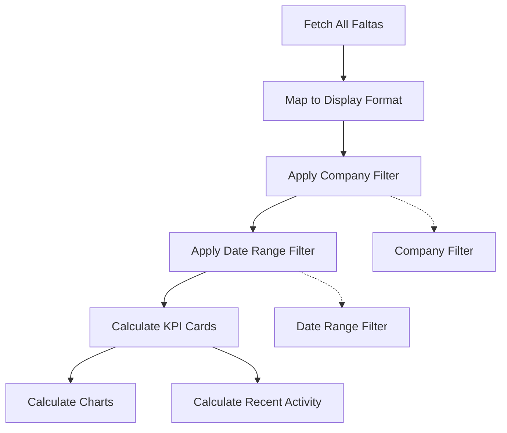

# Dashboard Company Data Profile Implementation Plan

## Overview
Implement company-based data profiles for the Dashboard that properly filter KPI cards (Total de Faltas, Faltas Hoje, Maior Falta) based on:
- Company selection: "Todas" (all companies) or individual company (Matriz or Filial)
- Date range: Hoje, 7 Dias, 30 Dias, or Personalizado

## Current State Analysis

### Existing Implementation
- **Company Filter**: Already implemented for admins (lines 643-652 in Dashboard.tsx)
- **Date Range Filter**: Already implemented (lines 657-695 in Dashboard.tsx)
- **KPI Cards**: Total de Faltas, Faltas Hoje, Maior Falta, Última Compra
- **Data Flow**: 
  1. Fetch all faltas via `faltasService.getByUserVisibility(currentUser)`
  2. Map data to display format
  3. Apply company filter to get `cardData` (lines 272-292)
  4. Calculate KPIs from `cardData` (lines 294-328)
  5. Apply date range filter to get `analyticsData` (lines 330-360)
  6. Use `analyticsData` for charts and recent activity

### Problem Identified
The date range filter is applied AFTER the KPI cards are calculated. This means:
- **Total de Faltas**: Shows all-time data, ignores date filter
- **Faltas Hoje**: Hard-coded to check only today's date, ignores date filter
- **Maior Falta**: Shows all-time most frequent index, ignores date filter

The date range filter only affects:
- Charts (Por Índice de Refração, Por Tratamento)
- Recent Activity list

## Solution Architecture

### Data Flow Diagram


### Key Changes Required

#### 1. Restructure Data Processing Order
Move date range filtering BEFORE KPI card calculations to ensure all metrics respect the selected time period.

#### 2. Update KPI Card Calculations
- **Total de Faltas**: Count faltas within the selected date range
- **Faltas Hoje**: Only show today's faltas when "Hoje" is selected, otherwise show 0
- **Maior Falta**: Find most frequent index within the selected date range

#### 3. Handle "Todas" vs Individual Company
- **Todas**: Aggregate data from all companies
- **Individual Company**: Show only that company's data (Matriz or Filial)

## Implementation Steps

### Step 1: Refactor Data Processing Logic
**File**: `pages/Dashboard.tsx`

**Changes**:
1. Move date range calculation logic to the beginning of data processing
2. Apply both company and date filters BEFORE calculating any metrics
3. Create a unified filtered dataset that respects both filters

**Code Location**: Lines 330-360 (date range filtering) needs to be moved before line 272 (card data calculation)

### Step 2: Update KPI Card Calculations
**File**: `pages/Dashboard.tsx`

**Changes**:
1. **Total de Faltas** (lines 294-299):
   - Use filtered data that respects both company and date filters
   - Sum quantities from the filtered dataset

2. **Faltas Hoje** (lines 301-309):
   - Check if selected range is "Hoje"
   - If yes, count today's faltas from filtered data
   - If no, show 0 (or remove this metric from display)

3. **Maior Falta** (lines 311-328):
   - Calculate index counts from filtered data
   - Find the index with highest count within the selected date range

### Step 3: Update Chart Calculations
**File**: `pages/Dashboard.tsx`

**Changes**:
1. Ensure charts use the same filtered dataset as KPI cards
2. Maintain consistency between cards and charts

### Step 4: Update Recent Activity
**File**: `pages/Dashboard.tsx`

**Changes**:
1. Recent activity should show items from the filtered dataset
2. Limit to 4 most recent items within the selected date range

### Step 5: Handle Edge Cases
**File**: `pages/Dashboard.tsx`

**Edge Cases**:
1. No data in selected range → Show empty state with appropriate message
2. "Hoje" range with no faltas today → Show 0 for Faltas Hoje
3. "Todas" with no data → Show empty state
4. Individual company with no data → Show empty state

## Detailed Implementation Plan

### Modified Data Processing Flow

```typescript
// 1. Calculate date range FIRST
const now = new Date();
let startDate = new Date();
startDate.setHours(0, 0, 0, 0);

if (analyticsFilters.range === '7 Dias') {
  startDate.setDate(now.getDate() - 7);
} else if (analyticsFilters.range === '30 Dias') {
  startDate.setDate(now.getDate() - 30);
} else if (analyticsFilters.range === 'Personalizado' && analyticsFilters.customStartDate) {
  startDate = new Date(analyticsFilters.customStartDate);
  startDate.setHours(0, 0, 0, 0);
}

let endDate = new Date();
endDate.setHours(23, 59, 59, 999);
if (analyticsFilters.range === 'Personalizado' && analyticsFilters.customEndDate) {
  endDate = new Date(analyticsFilters.customEndDate);
  endDate.setHours(23, 59, 59, 999);
}

// 2. Apply company filter
let filteredData = mappedData;
if (isAdmin(currentUser) && analyticsFilters.company !== 'Todas') {
  filteredData = filteredData.filter(item => item.company === analyticsFilters.company);
}

// 3. Apply date range filter
filteredData = filteredData.filter(item => {
  return item.rawDate >= startDate && item.rawDate <= endDate;
});

// 4. Calculate KPIs from filtered data
const totalShortages = filteredData.reduce(
  (sum, item) => sum + (item.quantity || 1),
  0
);

const shortagesToday = analyticsFilters.range === 'Hoje'
  ? filteredData.filter(item => item.rawDate >= startOfToday).length
  : 0;

const cardIndexCounts: Record<string, number> = {};
filteredData.forEach(item => {
  const index = item.index || 'Outros';
  const qty = item.quantity || 1;
  cardIndexCounts[index] = (cardIndexCounts[index] || 0) + qty;
});

const cardBarData = Object.entries(cardIndexCounts)
  .map(([key, value]) => ({
    name: key,
    value,
    color: INDEX_COLORS[key] || '#94a3b8'
  }))
  .sort((a, b) => b.value - a.value);

// 5. Calculate charts from same filtered data
// (treatment counts, etc.)

// 6. Set recent activity from filtered data
setRecentShortages(filteredData.slice(0, 4));
```

### Filter Logic Summary

| Filter Type | "Todas" Selection | Individual Company Selection |
|-------------|-------------------|------------------------------|
| **Company** | All companies | Only selected company |
| **Date Range** | Applied to all companies | Applied to selected company only |
| **Total de Faltas** | Sum of all faltas in range | Sum of company's faltas in range |
| **Faltas Hoje** | Today's faltas (all companies) | Today's faltas (selected company) |
| **Maior Falta** | Most frequent index in range | Most frequent index in range (company) |

## Testing Scenarios

### Scenario 1: Admin with "Todas" + "7 Dias"
- Expected: All companies' faltas from last 7 days
- Total de Faltas: Sum of all faltas from all companies in 7 days
- Faltas Hoje: 0 (not "Hoje" range)
- Maior Falta: Most frequent index across all companies in 7 days

### Scenario 2: Admin with "AMX" + "Hoje"
- Expected: AMX company's faltas from today
- Total de Faltas: AMX's faltas today
- Faltas Hoje: AMX's faltas today
- Maior Falta: Most frequent index for AMX today

### Scenario 3: Admin with "GBO" + "30 Dias"
- Expected: GBO company's faltas from last 30 days
- Total de Faltas: GBO's faltas in 30 days
- Faltas Hoje: 0 (not "Hoje" range)
- Maior Falta: Most frequent index for GBO in 30 days

### Scenario 4: Admin with "Todas" + "Personalizado" (custom dates)
- Expected: All companies' faltas within custom date range
- Total de Faltas: Sum of all faltas in custom range
- Faltas Hoje: 0 (not "Hoje" range)
- Maior Falta: Most frequent index in custom range

### Scenario 5: Regular User (always their company) + "7 Dias"
- Expected: User's company's faltas from last 7 days
- Total de Faltas: Company's faltas in 7 days
- Faltas Hoje: 0 (not "Hoje" range)
- Maior Falta: Most frequent index for company in 7 days

## Benefits

1. **Consistency**: All dashboard elements (cards, charts, recent activity) use the same filtered dataset
2. **Flexibility**: Users can analyze data by company and time period
3. **Clarity**: "Faltas Hoje" only appears when "Hoje" range is selected
4. **Accuracy**: All metrics respect both company and date filters
5. **User Experience**: Clear data profiles for "Todas" vs individual companies

## Files to Modify

1. **pages/Dashboard.tsx** - Main implementation
   - Refactor data processing order
   - Update KPI card calculations
   - Ensure consistent filtering across all components

## Dependencies

None required. This is a refactoring of existing code.

## Risk Assessment

**Low Risk**: This is a refactoring that improves data consistency. The changes are localized to the Dashboard component and do not affect other parts of the application.

**Potential Issues**:
- Users may notice different numbers if they were used to the old behavior
- Need to ensure empty states are handled gracefully

**Mitigation**:
- Clear communication about the improvement
- Thorough testing of all filter combinations
- Proper empty state handling

## Success Criteria

✅ All KPI cards respect both company and date filters
✅ Charts show consistent data with KPI cards
✅ Recent activity respects both filters
✅ "Todas" shows aggregated data from all companies
✅ Individual company shows only that company's data
✅ Empty states are handled gracefully
✅ No breaking changes to existing functionality
