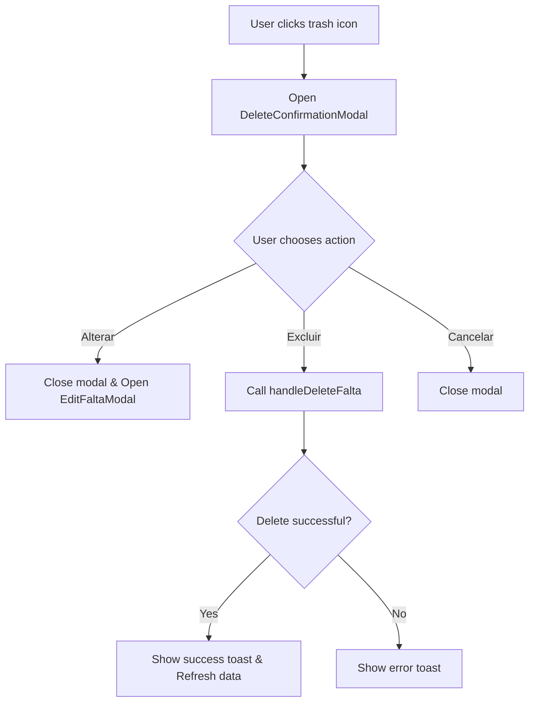
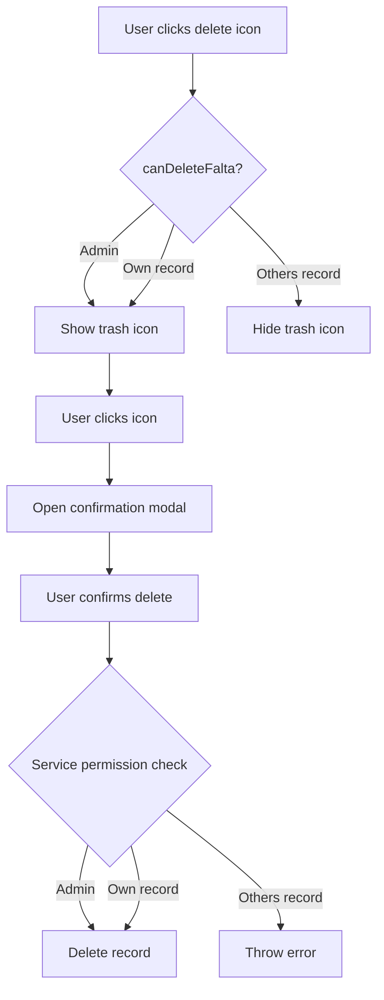

# Delete Falta Implementation Plan

## Overview
Add delete functionality to the "atividade recente" card in Dashboard.tsx, following the same permission rules as the edit functionality.

## Current State Analysis

### Edit Functionality (Already Implemented)
- **Location**: [`Dashboard.tsx`](pages/Dashboard.tsx:1024-1032) (recent activities) and [`Dashboard.tsx`](pages/Dashboard.tsx:1184-1192) (all activities modal)
- **Permission Check**: Uses [`canUpdateFalta()`](lib/utils/visibility/visibilityHelpers.ts:76-79) from visibilityHelpers
  - Admins can update any falta
  - Regular users can only update their own faltas
- **Edit Icon**: Pencil icon shown when user has permission
- **Edit Modal**: [`EditFaltaModal`](components/EditFaltaModal.tsx:1-366) component handles editing
- **Service Method**: [`faltasService.updateWithPermissionCheck()`](services/faltasService.ts:169-206)

### Delete Functionality (To Be Implemented)
- **Current State**: [`faltasService.delete()`](services/faltasService.ts:228-230) throws error
- **Permission Helper**: [`canDeleteFalta()`](lib/utils/visibility/visibilityHelpers.ts:50-52) returns false

## Implementation Plan

### 1. Create DeleteConfirmationModal Component
**File**: `components/DeleteConfirmationModal.tsx`

**Features**:
- Modal with warning message about irreversible action
- Suggests editing instead of deleting
- Three buttons:
  - **Alterar** (Edit): Opens the edit modal
  - **Excluir** (Delete): Proceeds with deletion
  - **Cancelar** (Cancel): Closes the modal

**Props**:
```typescript
interface DeleteConfirmationModalProps {
  isOpen: boolean;
  onClose: () => void;
  onEdit: () => void;
  onDelete: () => void;
}
```

### 2. Update Permission Helper
**File**: `lib/utils/visibility/visibilityHelpers.ts`

**Change**: Modify [`canDeleteFalta()`](lib/utils/visibility/visibilityHelpers.ts:50-52) to follow same rules as edit:
```typescript
export function canDeleteFalta(user: AuthUser, falta: { usuario_id: string }): boolean {
    if (isAdmin(user)) return true;
    return user.id === falta.usuario_id;
}
```

### 3. Update Faltas Service
**File**: `services/faltasService.ts`

**Change**: Replace [`delete()`](services/faltasService.ts:228-230) method with permission-checking version:
```typescript
async deleteWithPermissionCheck(user: AuthUser, faltaId: string) {
    // Check permission first
    const { data: existingFalta, error: fetchError } = await supabase
        .from('faltas')
        .select('usuario_id')
        .eq('id', faltaId)
        .single();

    if (fetchError || !existingFalta) {
        throw new Error('Falta not found');
    }

    // Check if user has permission to delete this falta
    if (!isAdmin(user) && existingFalta.usuario_id !== user.id) {
        throw new Error('Você não tem permissão para excluir este registro');
    }

    // Proceed with deletion
    const { error: deleteError } = await supabase
        .from('faltas')
        .delete()
        .eq('id', faltaId);

    if (deleteError) throw deleteError;
}
```

### 4. Update Dashboard.tsx - Add Delete State
**File**: `pages/Dashboard.tsx`

**Add State** (around line 141):
```typescript
const [deleteConfirmationModal, setDeleteConfirmationModal] = useState<{
  isOpen: boolean;
  falta: Falta | null;
}>({ isOpen: false, falta: null });
```

**Add Handler** (around line 238):
```typescript
const handleDeleteFalta = async (faltaId: string) => {
  try {
    await faltasService.deleteWithPermissionCheck(currentUser, faltaId);
    showToast('Registro excluído com sucesso!', 'success');
    setDeleteConfirmationModal({ isOpen: false, falta: null });
    setRefreshTrigger(prev => prev + 1);
  } catch (error: any) {
    showToast(error.message || 'Erro ao excluir registro', 'error');
  }
};
```

### 5. Update Dashboard.tsx - Recent Activities List
**File**: `pages/Dashboard.tsx`

**Location**: Lines 1021-1033

**Add Trash Icon** next to edit icon:
```typescript
<div className="flex items-center shrink-0 gap-2 pl-2">
  <span className="text-[10px] text-slate-400 font-medium whitespace-nowrap text-right">{item.time}</span>
  {/* Edit icon - only show if user has permission */}
  {item.falta && canUpdateFalta(currentUser, item.falta) && (
    <button
      onClick={() => handleEditFalta(item.falta)}
      className="text-slate-400 hover:text-slate-600 dark:hover:text-slate-200 transition-colors p-1"
      title="Editar"
    >
      <Icon name="edit" className="!text-sm" />
    </button>
  )}
  {/* Delete icon - only show if user has permission */}
  {item.falta && canDeleteFalta(currentUser, item.falta) && (
    <button
      onClick={() => setDeleteConfirmationModal({ isOpen: true, falta: item.falta })}
      className="text-slate-400 hover:text-red-600 dark:hover:text-red-400 transition-colors p-1"
      title="Excluir"
    >
      <Icon name="delete" className="!text-sm" />
    </button>
  )}
</div>
```

### 6. Update Dashboard.tsx - All Activities Modal
**File**: `pages/Dashboard.tsx`

**Location**: Lines 1181-1193

**Add Trash Icon** (same as recent activities):
```typescript
<div className="flex items-center shrink-0 gap-2 pl-2">
  <span className="text-[10px] text-slate-400 font-medium whitespace-nowrap text-right">{item.time}</span>
  {/* Edit icon - only show if user has permission */}
  {item.falta && canUpdateFalta(currentUser, item.falta) && (
    <button
      onClick={() => handleEditFalta(item.falta)}
      className="text-slate-400 hover:text-slate-600 dark:hover:text-slate-200 transition-colors p-1"
      title="Editar"
    >
      <Icon name="edit" className="!text-sm" />
    </button>
  )}
  {/* Delete icon - only show if user has permission */}
  {item.falta && canDeleteFalta(currentUser, item.falta) && (
    <button
      onClick={() => setDeleteConfirmationModal({ isOpen: true, falta: item.falta })}
      className="text-slate-400 hover:text-red-600 dark:hover:text-red-400 transition-colors p-1"
      title="Excluir"
    >
      <Icon name="delete" className="!text-sm" />
    </button>
  )}
</div>
```

### 7. Add DeleteConfirmationModal to Dashboard.tsx
**File**: `pages/Dashboard.tsx`

**Location**: After EditFaltaModal (around line 1208)

**Import**: Add at top of file
```typescript
import { DeleteConfirmationModal } from '../components/DeleteConfirmationModal';
```

**Add Component**:
```typescript
<DeleteConfirmationModal
  isOpen={deleteConfirmationModal.isOpen}
  onClose={() => setDeleteConfirmationModal({ isOpen: false, falta: null })}
  onEdit={() => {
    setDeleteConfirmationModal({ isOpen: false, falta: null });
    handleEditFalta(deleteConfirmationModal.falta);
  }}
  onDelete={() => handleDeleteFalta(deleteConfirmationModal.falta?.id)}
/>
```

## Component Structure

### DeleteConfirmationModal Component Flow



### Permission Check Flow



## Testing Checklist

- [ ] Trash icon appears for admins on all records
- [ ] Trash icon appears for regular users only on their own records
- [ ] Trash icon is hidden for regular users on others' records
- [ ] Clicking trash icon opens confirmation modal
- [ ] Modal shows warning about irreversible action
- [ ] Modal suggests editing instead of deleting
- [ ] "Alterar" button closes modal and opens edit modal
- [ ] "Excluir" button deletes the record
- [ ] "Cancelar" button closes modal without action
- [ ] Successful delete shows success toast
- [ ] Failed delete shows error toast
- [ ] Data refreshes after successful delete
- [ ] Recent activities list updates after delete
- [ ] All activities modal updates after delete
- [ ] Permission check prevents unauthorized deletion

## Files to Modify

1. **New File**: `components/DeleteConfirmationModal.tsx`
2. **Modify**: `lib/utils/visibility/visibilityHelpers.ts` - Update `canDeleteFalta()`
3. **Modify**: `services/faltasService.ts` - Add `deleteWithPermissionCheck()`
4. **Modify**: `pages/Dashboard.tsx` - Add delete state, handlers, and UI

## Notes

- The delete icon should use the same styling as the edit icon
- Hover state for delete icon should be red to indicate destructive action
- The confirmation modal should clearly communicate that deletion is irreversible
- The "Alterar" button in the modal provides an easy way to change action without closing and reopening
- All permission checks should be consistent with edit functionality
