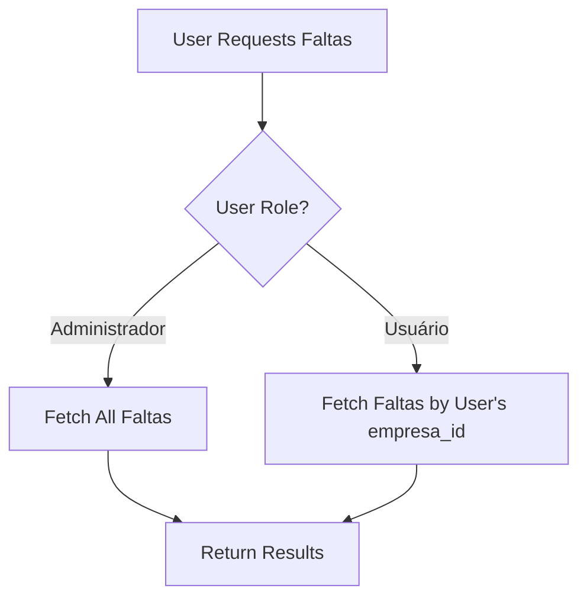

# Faltas Visibility Implementation Plan

## Overview

This document outlines the implementation of role-based visibility rules for registered absences (faltas) in the VisuLab application.

## Requirements

**Administradores:**
- Have full visibility of all faltas across all companies
- Can view faltas from any company
- Can create faltas for any company
- Can update faltas from any company
- **CANNOT delete faltas** (no delete permission for anyone)

**Usuários:**
- Can only view faltas registered by users from the same company
- Example: Users from "Matriz" can only see data from "Matriz"
- Example: Users from "Filial A" can only see data from "Filial A"
- Example: Users from "Filial B" can only see data from "Filial B"
- Can create faltas for their own company
- Can update faltas from their own company
- **CANNOT delete faltas** (no delete permission for anyone)

**Important Rule:**
- **NO USER (including admins) has permission to delete faltas records**
- Delete operations are not allowed for any role

## Current State Analysis

### Existing Components

1. **AuthContext** (`src/contexts/AuthContext.tsx`)
   - Manages user authentication state
   - Provides `user` object with `empresa_id` and `role`
   - Role values: 'Administrador' or 'Usuário'

2. **faltasService** (`services/faltasService.ts`)
   - Currently has `getAll()` method that fetches ALL faltas without filtering
   - Has `getByEmpresa(empresaId)` method that filters by company
   - No role-based filtering logic

3. **FaltasRepository** (`lib/dal/repositories/faltasRepository.ts`)
   - Has `findByEmpresa(empresaId)` method
   - Has `findByUsuario(usuarioId)` method
   - No role-aware query methods

4. **Shortages Page** (`pages/Shortages.tsx`)
   - Calls `faltasService.getAll()` in `fetchHistory()` function
   - Does not pass user context when fetching history
   - Shows all faltas regardless of user's company

### Data Model

**Falta Entity** (from `lib/types/database/generated.ts`):
```typescript
interface Falta {
    id: string
    usuario_id: string
    empresa_id: string
    tipo_id: string
    indice_id: string
    tratamiento_id?: string | null
    esf?: number | null
    cil?: number | null
    quantidade?: number | null
    created_at?: string | null
    updated_at?: string | null
}
```

**Usuario Entity** (from `lib/types/database/generated.ts`):
```typescript
interface Usuario {
    id: string
    nome: string
    email: string
    empresa_id?: string | null
    role: 'admin' | 'user' | 'viewer'
    status: 'Active' | 'Offline' | 'Pending' | 'Inactive'
    // ... other fields
}
```

## Architecture Design

### Visibility Logic Flow



### Multi-Layer Security Approach

We'll implement visibility controls at multiple layers for defense-in-depth:

1. **Application Layer (Primary)**
   - Service layer filters based on user role and empresa_id
   - UI components respect visibility rules

2. **Repository Layer (Support)**
   - Repository methods accept user context for filtering
   - Provides role-aware query methods

3. **Database Layer (Optional - Future Enhancement)**
   - Row-Level Security (RLS) policies in Supabase
   - Server-side enforcement as final security layer

## Implementation Plan

### Phase 1: Utility Functions

**File:** `lib/utils/visibility/visibilityHelpers.ts` (new file)

Create utility functions to centralize visibility logic:

```typescript
/**
 * Check if user has admin privileges
 */
export function isAdmin(user: AuthUser): boolean {
    return user?.role === 'Administrador';
}

/**
 * Check if user can view all faltas
 */
export function canViewAllFaltas(user: AuthUser): boolean {
    return isAdmin(user);
}

/**
 * Check if user can view company faltas
 */
export function canViewCompanyFaltas(user: AuthUser, empresaId: string): boolean {
    if (isAdmin(user)) return true;
    return user?.empresa_id === empresaId;
}

/**
 * Check if user can create faltas for a company
 */
export function canCreateFaltaForCompany(user: AuthUser, empresaId: string): boolean {
    if (isAdmin(user)) return true;
    return user?.empresa_id === empresaId;
}

/**
 * Check if user can update faltas for a company
 */
export function canUpdateFaltaForCompany(user: AuthUser, empresaId: string): boolean {
    if (isAdmin(user)) return true;
    return user?.empresa_id === empresaId;
}

/**
 * Check if user can delete faltas
 * IMPORTANT: NO ONE can delete faltas
 */
export function canDeleteFalta(user: AuthUser): boolean {
    return false; // Delete is not allowed for any role
}

/**
 * Get visibility filter for faltas queries
 */
export function getFaltasVisibilityFilter(user: AuthUser): {
    empresa_id?: string;
} | null {
    if (isAdmin(user)) {
        return null; // No filter - admin sees all
    }
    
    if (user?.empresa_id) {
        return { empresa_id: user.empresa_id };
    }
    
    throw new Error('User has no empresa_id assigned');
}
```

### Phase 2: Update FaltasRepository

**File:** `lib/dal/repositories/faltasRepository.ts`

Add role-aware query methods:

```typescript
/**
 * Find faltas based on user visibility rules
 */
async findByUserVisibility(user: AuthUser, options: any = {}): Promise<Falta[]> {
    const filter = getFaltasVisibilityFilter(user);
    
    if (filter) {
        // Regular user - filter by empresa_id
        return this.findByEmpresa(filter.empresa_id, options);
    } else {
        // Admin - return all
        const result = await this.findAll(options);
        return result.data;
    }
}

/**
 * Find faltas by user's company (for regular users)
 */
async findByUserCompany(user: AuthUser, options: any = {}): Promise<Falta[]> {
    if (!user.empresa_id) {
        throw new Error('User has no empresa_id assigned');
    }
    
    return this.findByEmpresa(user.empresa_id, options);
}
```

### Phase 3: Update FaltasService

**File:** `services/faltasService.ts`

Update service methods to accept user context and apply visibility rules:

```typescript
/**
 * Get faltas based on user visibility rules
 * Admins see all faltas
 * Regular users see only faltas from their company
 */
async getByUserVisibility(user: AuthUser): Promise<Falta[]> {
    const { data, error } = await supabase
        .from('faltas')
        .select(`
            *,
            usuarios (id, nome, email),
            empresas (id, nome),
            tipos (id, nome),
            indices (id, nome),
            tratamentos (id, nome)
        `)
        .order('created_at', { ascending: false });

    if (error) throw error;

    // Apply visibility filter
    const faltas = data as Falta[];
    
    if (isAdmin(user)) {
        return faltas; // Admin sees all
    }
    
    // Regular user sees only their company's faltas
    return faltas.filter(falta => falta.empresa_id === user.empresa_id);
}

/**
 * Get faltas by company (for admin use or specific company queries)
 */
async getByEmpresa(empresaId: string): Promise<Falta[]> {
    // Existing implementation - keep as is
    // ...
}
```

### Phase 4: Update Shortages Page

**File:** `pages/Shortages.tsx`

Update the `fetchHistory` function to pass user context:

```typescript
const fetchHistory = async () => {
    try {
        // Pass user context to apply visibility rules
        const data = await faltasService.getByUserVisibility(currentUser);
        
        const mapped = data.slice(0, 10).map(f => ({
            index: f.indices?.nome || '-',
            esfCil: 'Lente',
            user: f.usuarios?.nome || 'User',
            treatment: f.tratamentos?.nome || '-',
            time: f.created_at || '-',
            quantity: 1,
            type: f.tipos?.nome || '-'
        }));
        
        setRecentHistory(mapped);
    } catch (e) {
        console.error(e);
    }
};
```

### Phase 5: Update AuthContext Types

**File:** `src/contexts/AuthContext.tsx`

Ensure `AuthUser` type includes `empresa_id` and `role`:

```typescript
// Already present in current implementation
export interface AuthUser {
    id: string;
    email: string;
    name?: string;
    empresa_id?: string;  // ✅ Already present
    role?: string;        // ✅ Already present
    company?: string;    // ✅ Already present
    avatarUrl?: string;
}
```

### Phase 6: Database-Level RLS Policies (Optional)

**File:** `database_setup.sql` (or create new RLS SQL file)

Add Row-Level Security policies for the `faltas` table:

```sql
-- Enable RLS on faltas table
ALTER TABLE faltas ENABLE ROW LEVEL SECURITY;

-- Policy: Admins can view all faltas
CREATE POLICY "Admins can view all faltas"
ON faltas FOR SELECT
USING (
    EXISTS (
        SELECT 1 FROM usuarios
        WHERE usuarios.id = auth.uid()
        AND usuarios.role = 'Administrador'
    )
);

-- Policy: Users can view faltas from their company
CREATE POLICY "Users can view company faltas"
ON faltas FOR SELECT
USING (
    EXISTS (
        SELECT 1 FROM usuarios
        WHERE usuarios.id = auth.uid()
        AND usuarios.empresa_id = faltas.empresa_id
    )
);

-- Policy: Users can create faltas for their company
CREATE POLICY "Users can create company faltas"
ON faltas FOR INSERT
WITH CHECK (
    EXISTS (
        SELECT 1 FROM usuarios
        WHERE usuarios.id = auth.uid()
        AND usuarios.empresa_id = faltas.empresa_id
    )
);

-- Policy: Admins can update any falta
CREATE POLICY "Admins can update any falta"
ON faltas FOR UPDATE
USING (
    EXISTS (
        SELECT 1 FROM usuarios
        WHERE usuarios.id = auth.uid()
        AND usuarios.role = 'Administrador'
    )
);

-- Policy: Users can update faltas from their company
CREATE POLICY "Users can update company faltas"
ON faltas FOR UPDATE
USING (
    EXISTS (
        SELECT 1 FROM usuarios
        WHERE usuarios.id = auth.uid()
        AND usuarios.empresa_id = faltas.empresa_id
    )
);

-- IMPORTANT: NO DELETE POLICY - Faltas cannot be deleted by anyone
-- This is a business rule: faltas records are permanent
```

## Implementation Checklist

- [ ] Create visibility utility functions
- [ ] Update FaltasRepository with role-aware methods
- [ ] Update FaltasService with visibility filtering
- [ ] Update Shortages page to pass user context
- [ ] Remove or disable delete functionality from faltasService
- [ ] Test with admin user (should see all faltas)
- [ ] Test with regular user from "Matriz" (should see only Matriz faltas)
- [ ] Test with regular user from "Filial A" (should see only Filial A faltas)
- [ ] Test with regular user from "Filial B" (should see only Filial B faltas)
- [ ] Test that delete operations are blocked for all users
- [ ] Create database RLS policies (optional)
- [ ] Document the implementation

## Testing Strategy

### Test Cases

1. **Admin User Visibility**
   - Login as admin
   - Navigate to Shortages page
   - Open history modal
   - Verify: All faltas from all companies are displayed

2. **Regular User - Matriz**
   - Login as user from Matriz
   - Navigate to Shortages page
   - Open history modal
   - Verify: Only faltas from Matriz are displayed
   - Verify: No faltas from Filial A or Filial B are visible

3. **Regular User - Filial A**
   - Login as user from Filial A
   - Navigate to Shortages page
   - Open history modal
   - Verify: Only faltas from Filial A are displayed
   - Verify: No faltas from Matriz or Filial B are visible

4. **Regular User - Filial B**
   - Login as user from Filial B
   - Navigate to Shortages page
   - Open history modal
   - Verify: Only faltas from Filial B are visible
   - Verify: No faltas from Matriz or Filial A are visible

5. **Create Falta**
   - Login as regular user
   - Create a new falta
   - Verify: falta.empresa_id matches user's empresa_id
   - Verify: falta appears in history for that user
   - Verify: falta does NOT appear in history for users from other companies

6. **Delete Falta (Negative Test)**
   - Login as admin user
   - Attempt to delete a falta
   - Verify: Delete operation is blocked/throws error
   - Login as regular user
   - Attempt to delete a falta
   - Verify: Delete operation is blocked/throws error

## Security Considerations

1. **Defense in Depth**
   - Application layer filtering (primary)
   - Repository layer support (secondary)
   - Database RLS policies (tertiary - optional)

2. **Edge Cases**
   - User without empresa_id: Should throw error or deny access
   - User with null role: Should be treated as regular user
   - Deleted empresa_id: Should handle gracefully
   - Delete operations: Should always be blocked regardless of role

3. **Delete Operation Security**
   - Remove delete method from faltasService or make it always throw error
   - Ensure no UI components have delete buttons for faltas
   - Add explicit checks in any code that might attempt deletion

3. **Performance**
   - Index on faltas.empresa_id for efficient filtering
   - Consider caching for admin users who see all data

## Migration Notes

### Breaking Changes
- `faltasService.getAll()` will be deprecated in favor of `getByUserVisibility(user)`
- Existing code using `getAll()` should be updated to pass user context

### Backward Compatibility
- Keep existing methods (`getByEmpresa`, `getById`) for specific use cases
- Add deprecation warnings to old methods

## Future Enhancements

1. **Granular Permissions**
   - Add permission system beyond roles
   - Example: "view_own_faltas", "view_company_faltas", "view_all_faltas"

2. **Audit Logging**
   - Log who viewed which faltas
   - Track access patterns

3. **Advanced Filtering**
   - Allow admins to filter by company
   - Add date range filters with visibility rules

## Conclusion

This implementation provides a robust, multi-layered approach to faltas visibility that:
- Ensures data isolation between companies
- Gives admins full visibility
- Follows the principle of least privilege
- Is maintainable and testable
- Can be enhanced with database-level RLS for additional security
