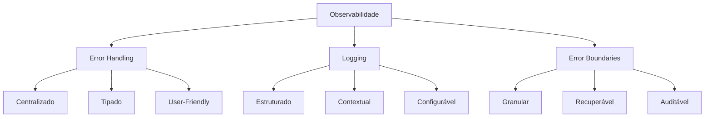
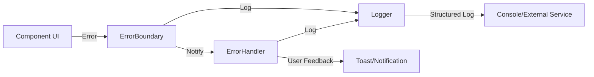
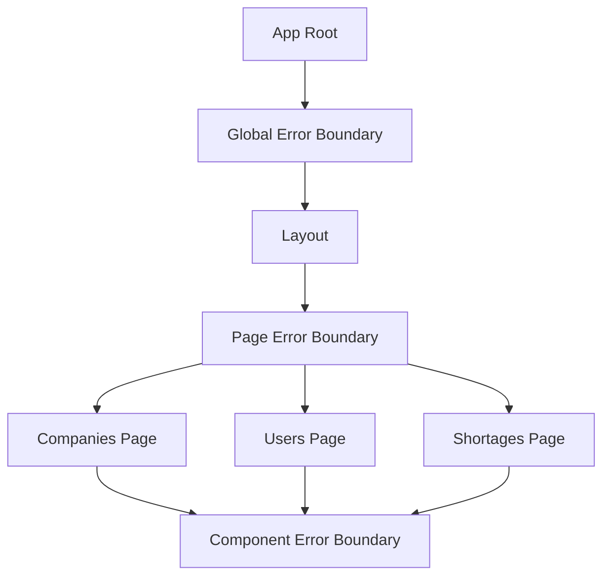
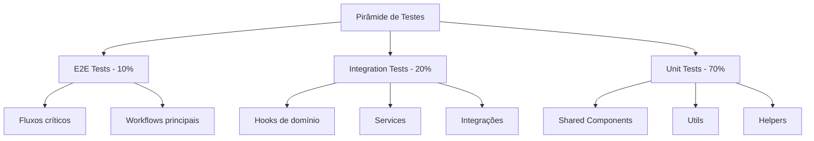
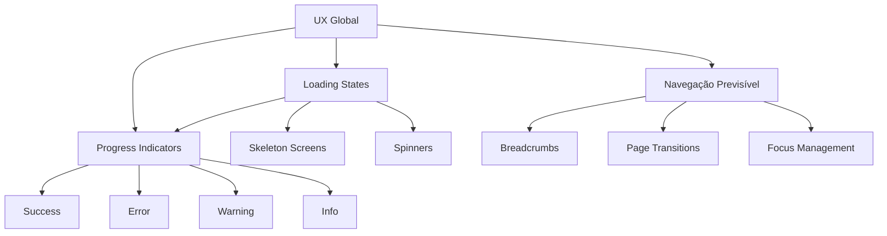

# Fase 5 - Maturidade de Produção

**Data:** 2025-12-24  
**Objetivo:** Tornar o sistema confiável, auditável e pronto para escalar em produção  
**Foco:** Observabilidade, testes, UX consistente e readiness checklist

---

## 1. Estratégia de Observabilidade

### 1.1 Visão Geral

A estratégia de observabilidade do VisuLab é baseada em três pilares fundamentais:



### 1.2 Error Handling

#### 1.2.1 Arquitetura de Tratamento de Erros

O sistema possui uma arquitetura de error handling já estabelecida:

| Camada | Componente | Responsabilidade |
|--------|-----------|-----------------|
| **Domain** | `ApplicationError` classes | Tipagem de erros de negócio |
| **Integration** | `supabaseErrorHandler` | Tradução de erros do Supabase |
| **Frontend** | `errorHandler.ts` | Centralização de tratamento de erros UI |
| **Component** | `ErrorBoundary` | Captura de erros de renderização |

#### 1.2.2 Classes de Erro Existentes

O arquivo [`lib/utils/errors/applicationErrors.ts`](lib/utils/errors/applicationErrors.ts) define:

```typescript
ApplicationError (base)
├── DatabaseError (500)
├── ValidationError (400)
├── AuthenticationError (401)
├── AuthorizationError (403)
├── NotFoundError (404)
├── ConflictError (409)
├── NetworkError (503)
├── CacheError (500)
├── ConfigurationError (500)
├── BusinessLogicError (422)
├── RateLimitError (429)
└── ServiceUnavailableError (503)
```

#### 1.2.3 Melhorias Necessárias

| Melhoria | Prioridade | Descrição |
|----------|------------|-----------|
| **Error Correlation ID** | Alta | Adicionar ID único para correlacionar logs |
| **Error Context Enrichment** | Alta | Enriquecer contexto com user ID, session ID |
| **Error Aggregation** | Média | Agregar erros repetitivos para evitar spam |
| **Error Recovery Strategies** | Alta | Implementar retry com exponential backoff |
| **Error Reporting Service** | Média | Integração com serviço de monitoramento |

#### 1.2.4 Estratégia de Error Handling por Camada



**Implementação sugerida:**

```typescript
// src/utils/observability/errorContext.ts
export interface ErrorContext {
    correlationId: string;
    userId?: string;
    sessionId?: string;
    component?: string;
    action?: string;
    timestamp: string;
    environment: string;
}

export class ErrorContextManager {
    private static instance: ErrorContextManager;
    private context: Partial<ErrorContext> = {};

    static getInstance(): ErrorContextManager {
        if (!ErrorContextManager.instance) {
            ErrorContextManager.instance = new ErrorContextManager();
        }
        return ErrorContextManager.instance;
    }

    setContext(context: Partial<ErrorContext>): void {
        this.context = { ...this.context, ...context };
    }

    getContext(): ErrorContext {
        return {
            correlationId: this.generateCorrelationId(),
            timestamp: new Date().toISOString(),
            environment: process.env.NODE_ENV || 'development',
            ...this.context,
        };
    }

    private generateCorrelationId(): string {
        return `${Date.now()}-${Math.random().toString(36).substr(2, 9)}`;
    }
}
```

### 1.3 Logging

#### 1.3.1 Arquitetura de Logging

O arquivo [`lib/utils/logger/logger.ts`](lib/utils/logger/logger.ts) fornece:

| Recurso | Status | Descrição |
|---------|--------|-----------|
| **Níveis de Log** | ✅ Implementado | DEBUG, INFO, WARN, ERROR, FATAL |
| **Contexto** | ✅ Implementado | Logger por contexto |
| **Configuração** | ✅ Implementado | Configurável por nível |
| **Console Output** | ✅ Implementado | Saída para console |
| **File Output** | ⚠️ Parcial | Placeholder implementado |
| **External Service** | ❌ Ausente | Não integrado |

#### 1.3.2 Níveis de Log - Diretrizes de Uso

| Nível | Quando Usar | Exemplo |
|-------|--------------|---------|
| **DEBUG** | Informações detalhadas para debugging | `logger.debug('Fetching empresas with filters', { filters })` |
| **INFO** | Eventos importantes do fluxo normal | `logger.info('User created empresa', { empresaId, userId })` |
| **WARN** | Situações que não são erros mas merecem atenção | `logger.warn('Cache miss for empresas list')` |
| **ERROR** | Erros que não param a aplicação | `logger.error('Failed to fetch empresas', error)` |
| **FATAL** | Erros críticos que param a aplicação | `logger.fatal('Database connection failed', error)` |

#### 1.3.3 Estrutura de Log Padrão

```json
{
  "timestamp": "2025-12-24T20:00:00.000Z",
  "level": "INFO",
  "context": "EmpresasService",
  "message": "Empresa created successfully",
  "data": {
    "empresaId": "123",
    "userId": "456",
    "empresaNome": "Acme Corp"
  },
  "error": null,
  "correlationId": "1735070400000-abc123def"
}
```

#### 1.3.4 Melhorias Necessárias

| Melhoria | Prioridade | Descrição |
|----------|------------|-----------|
| **Log Sampling** | Média | Amostrar logs de DEBUG em produção |
| **Log Sanitization** | Alta | Remover dados sensíveis (senhas, tokens) |
| **Log Aggregation** | Média | Agregar logs similares |
| **Log Retention Policy** | Média | Definir política de retenção |
| **External Service Integration** | Alta | Integração com Sentry/DataDog/LogRocket |

#### 1.3.5 Integração com Serviços de Monitoramento

**Opções recomendadas:**

| Serviço | Custo | Complexidade | Recomendação |
|---------|-------|---------------|--------------|
| **Sentry** | Freemium | Baixa | ✅ Recomendado |
| **LogRocket** | Paid | Média | Para replay de sessão |
| **DataDog** | Paid | Alta | Para monitoramento completo |
| **Vercel Analytics** | Incluído | Baixa | Se hospedado na Vercel |

**Implementação sugerida para Sentry:**

```typescript
// src/utils/observability/sentryIntegration.ts
import * as Sentry from '@sentry/react';
import { ErrorContextManager } from './errorContext';

export function initSentry() {
    Sentry.init({
        dsn: process.env.VITE_SENTRY_DSN,
        environment: process.env.NODE_ENV,
        tracesSampleRate: 0.1,
        beforeSend(event, hint) {
            // Enrich event with error context
            const context = ErrorContextManager.getInstance().getContext();
            event.contexts = {
                ...event.contexts,
                app: context,
            };
            return event;
        },
    });
}

export function captureError(error: Error, context?: Record<string, any>) {
    Sentry.captureException(error, {
        extra: context,
    });
}
```

### 1.4 Error Boundaries

#### 1.4.1 Arquitetura de Error Boundaries

O componente [`ErrorBoundary`](src/components/ui/error/ErrorBoundary.tsx) já está implementado com:

| Recurso | Status | Descrição |
|---------|--------|-----------|
| **Fallback UI** | ✅ Implementado | Interface de erro amigável |
| **Error Logging** | ✅ Implementado | Integração com errorHandler |
| **Retry Mechanism** | ✅ Implementado | Botão de tentar novamente |
| **Development Details** | ✅ Implementado | Detalhes em desenvolvimento |
| **Custom Fallback** | ✅ Implementado | Suporte a fallback customizado |

#### 1.4.2 Estratégia de Error Boundaries



**Diretrizes de implementação:**

| Nível | Localização | Responsabilidade |
|-------|-------------|------------------|
| **Root** | `App.tsx` | Captura erros globais, última linha de defesa |
| **Page** | Cada página (Companies, Users, etc.) | Isola erros por página |
| **Component** | Componentes críticos (DataTable, FormLayout) | Isola erros de componente |

#### 1.4.3 Melhorias Necessárias

| Melhoria | Prioridade | Descrição |
|----------|------------|-----------|
| **Error Recovery** | Alta | Implementar estratégias de recuperação |
| **Error Reporting** | Alta | Integração com serviço de monitoramento |
| **Granular Boundaries** | Média | Adicionar boundaries em componentes críticos |
| **Error State Persistence** | Baixa | Persistir estado para recuperação |

---

## 2. Arquitetura Mínima de Testes

### 2.1 Visão Geral

A arquitetura de testes do VisuLab segue a pirâmide de testes:



### 2.2 Stack de Testes

| Tipo | Ferramenta | Justificativa |
|------|------------|---------------|
| **Unit Tests** | Vitest | Rápido, integrado com Vite |
| **Component Tests** | React Testing Library | Padrão para React |
| **E2E Tests** | Playwright | Cross-browser, moderno |
| **Mocking** | Vitest Mock | Integrado com Vitest |
| **Coverage** | c8/v8 | Integrado com Vitest |

### 2.3 Estrutura de Diretórios de Testes

```
tests/
├── unit/
│   ├── components/
│   │   ├── shared/
│   │   │   ├── DataTable.test.tsx
│   │   │   ├── FormLayout.test.tsx
│   │   │   ├── PageHeader.test.tsx
│   │   │   ├── ConfirmActionDialog.test.tsx
│   │   │   └── FeedbackState.test.tsx
│   │   └── ui/
│   │       ├── Button.test.tsx
│   │       ├── Input.test.tsx
│   │       ├── Modal.test.tsx
│   │       └── ErrorBoundary.test.tsx
│   ├── hooks/
│   │   ├── domain/
│   │   │   ├── empresas.test.ts
│   │   │   ├── usuarios.test.ts
│   │   │   └── faltas.test.ts
│   │   └── queries/
│   │       └── useGenericQuery.test.ts
│   ├── utils/
│   │   ├── errorHandler.test.ts
│   │   └── logger.test.ts
│   └── services/
│       └── empresasService.test.ts
├── integration/
│   ├── hooks/
│   │   └── empresas.test.ts
│   └── services/
│       └── supabase.test.ts
└── e2e/
    ├── empresas.spec.ts
    ├── usuarios.spec.ts
    └── faltas.spec.ts
```

### 2.4 Testes para Shared Components

#### 2.4.1 DataTable

```typescript
// tests/unit/components/shared/DataTable.test.tsx
import { render, screen } from '@testing-library/react';
import { DataTable } from '@/components/shared/DataTable';

describe('DataTable', () => {
    const mockColumns = [
        { key: 'name', label: 'Name' },
        { key: 'email', label: 'Email' },
    ];

    const mockData = [
        { id: '1', name: 'John', email: 'john@example.com' },
        { id: '2', name: 'Jane', email: 'jane@example.com' },
    ];

    it('renders data correctly', () => {
        render(<DataTable columns={mockColumns} data={mockData} />);
        expect(screen.getByText('John')).toBeInTheDocument();
        expect(screen.getByText('jane@example.com')).toBeInTheDocument();
    });

    it('renders empty state when no data', () => {
        render(<DataTable columns={mockColumns} data={[]} />);
        expect(screen.getByText(/nenhum dado encontrado/i)).toBeInTheDocument();
    });

    it('calls onRowClick when row is clicked', () => {
        const handleRowClick = jest.fn();
        render(
            <DataTable 
                columns={mockColumns} 
                data={mockData} 
                onRowClick={handleRowClick}
            />
        );
        screen.getByText('John').click();
        expect(handleRowClick).toHaveBeenCalledWith(mockData[0]);
    });
});
```

#### 2.4.2 FormLayout

```typescript
// tests/unit/components/shared/FormLayout.test.tsx
import { render, screen } from '@testing-library/react';
import { FormLayout } from '@/components/shared/FormLayout';

describe('FormLayout', () => {
    it('renders form fields correctly', () => {
        render(
            <FormLayout onSubmit={jest.fn()}>
                <FormLayout.Field name="name" label="Name" required />
                <FormLayout.Field name="email" label="Email" type="email" />
            </FormLayout>
        );
        expect(screen.getByLabelText('Name')).toBeInTheDocument();
        expect(screen.getByLabelText('Email')).toBeInTheDocument();
    });

    it('calls onSubmit when form is submitted', () => {
        const handleSubmit = jest.fn();
        render(
            <FormLayout onSubmit={handleSubmit}>
                <FormLayout.Field name="name" label="Name" />
                <button type="submit">Submit</button>
            </FormLayout>
        );
        // Simulate form submission
        // ...
    });
});
```

#### 2.4.3 FeedbackState

```typescript
// tests/unit/components/shared/FeedbackState.test.tsx
import { render, screen } from '@testing-library/react';
import { FeedbackState } from '@/components/shared/FeedbackState';

describe('FeedbackState', () => {
    it('renders loading state', () => {
        render(<FeedbackState type="loading" />);
        expect(screen.getByText(/carregando/i)).toBeInTheDocument();
    });

    it('renders error state with retry button', () => {
        const onRetry = jest.fn();
        render(
            <FeedbackState 
                type="error" 
                error={{ message: 'Test error' } as Error}
                onRetry={onRetry}
            />
        );
        expect(screen.getByText(/ocorreu um erro/i)).toBeInTheDocument();
        expect(screen.getByRole('button', { name: /tentar novamente/i })).toBeInTheDocument();
    });

    it('renders empty state with action', () => {
        const action = { label: 'Create', onClick: jest.fn() };
        render(
            <FeedbackState 
                type="empty" 
                action={action}
            />
        );
        expect(screen.getByText('Create')).toBeInTheDocument();
    });
});
```

### 2.5 Testes para Fluxos Críticos

#### 2.5.1 Fluxo de Criação de Empresa

```typescript
// tests/e2e/empresas.spec.ts
import { test, expect } from '@playwright/test';

test.describe('Empresas - Fluxo Crítico', () => {
    test.beforeEach(async ({ page }) => {
        await page.goto('/empresas');
        await page.waitForLoadState('networkidle');
    });

    test('deve criar uma nova empresa com sucesso', async ({ page }) => {
        // Click no botão de criar
        await page.click('[data-testid="btn-create-empresa"]');
        
        // Preencher formulário
        await page.fill('[name="nome"]', 'Test Company');
        await page.fill('[name="cnpj"]', '12.345.678/0001-90');
        await page.fill('[name="contato_email"]', 'test@company.com');
        
        // Submeter
        await page.click('[data-testid="btn-submit"]');
        
        // Verificar sucesso
        await expect(page.locator('[data-testid="toast-success"]')).toBeVisible();
        await expect(page.getByText('Test Company')).toBeVisible();
    });

    test('deve mostrar erro de validação ao criar empresa sem nome', async ({ page }) => {
        await page.click('[data-testid="btn-create-empresa"]');
        await page.click('[data-testid="btn-submit"]');
        
        await expect(page.getByText(/nome é obrigatório/i)).toBeVisible();
    });
});
```

#### 2.5.2 Fluxo de Aprovação de Faltas

```typescript
// tests/e2e/faltas.spec.ts
import { test, expect } from '@playwright/test';

test.describe('Faltas - Fluxo de Aprovação', () => {
    test('deve aprovar uma falta com sucesso', async ({ page }) => {
        await page.goto('/faltas');
        await page.waitForLoadState('networkidle');
        
        // Encontrar falta pendente
        const pendingRow = page.locator('[data-status="Pendente"]').first();
        
        // Clicar em aprovar
        await pendingRow.locator('[data-action="approve"]').click();
        
        // Confirmar no modal
        await page.click('[data-testid="btn-confirm-approve"]');
        
        // Verificar sucesso
        await expect(page.locator('[data-testid="toast-success"]')).toBeVisible();
        await expect(pendingRow).toHaveAttribute('data-status', 'Aprovada');
    });
});
```

### 2.6 Testes para Hooks de Domínio

```typescript
// tests/unit/hooks/domain/empresas.test.ts
import { renderHook, waitFor } from '@testing-library/react';
import { QueryClient, QueryClientProvider } from '@tanstack/react-query';
import { useEmpresasList, useCreateEmpresa } from '@/hooks/domain/empresas';

const createWrapper = () => {
    const queryClient = new QueryClient({
        defaultOptions: {
            queries: { retry: false },
            mutations: { retry: false },
        },
    });
    return ({ children }: { children: React.ReactNode }) => (
        <QueryClientProvider client={queryClient}>{children}</QueryClientProvider>
    );
};

describe('useEmpresasList', () => {
    it('deve buscar lista de empresas com sucesso', async () => {
        const { result } = renderHook(() => useEmpresasList(), {
            wrapper: createWrapper(),
        });
        
        await waitFor(() => expect(result.current.isSuccess).toBe(true));
        expect(result.current.data).toBeDefined();
    });

    it('deve aplicar filtros corretamente', async () => {
        const { result } = renderHook(
            () => useEmpresasList({ filters: { status: 'Ativa' } }),
            { wrapper: createWrapper() }
        );
        
        await waitFor(() => expect(result.current.isSuccess).toBe(true));
        expect(result.current.data?.every(e => e.status === 'Ativa')).toBe(true);
    });
});

describe('useCreateEmpresa', () => {
    it('deve criar empresa com sucesso', async () => {
        const { result } = renderHook(() => useCreateEmpresa(), {
            wrapper: createWrapper(),
        });
        
        const empresaData = {
            nome: 'Test Company',
            cnpj: '12.345.678/0001-90',
            tipo: 'Cliente',
            contato_email: 'test@company.com',
        };
        
        await result.current.mutateAsync(empresaData);
        
        await waitFor(() => expect(result.current.isSuccess).toBe(true));
        expect(result.current.data).toBeDefined();
    });
});
```

### 2.7 Matriz de Cobertura de Testes

| Componente/Fluxo | Unit | Integration | E2E | Prioridade |
|-----------------|------|-------------|-----|------------|
| **DataTable** | ✅ Obrigatório | - | - | Alta |
| **FormLayout** | ✅ Obrigatório | - | - | Alta |
| **PageHeader** | ✅ Obrigatório | - | - | Média |
| **ConfirmActionDialog** | ✅ Obrigatório | - | - | Alta |
| **FeedbackState** | ✅ Obrigatório | - | - | Alta |
| **ErrorBoundary** | ✅ Obrigatório | - | - | Alta |
| **Button** | ✅ Obrigatório | - | - | Média |
| **Input** | ✅ Obrigatório | - | - | Média |
| **useEmpresasList** | ✅ Obrigatório | ✅ Recomendado | - | Alta |
| **useCreateEmpresa** | ✅ Obrigatório | ✅ Recomendado | - | Alta |
| **useUpdateEmpresa** | ✅ Obrigatório | ✅ Recomendado | - | Alta |
| **useDeleteEmpresa** | ✅ Obrigatório | ✅ Recomendado | - | Alta |
| **Fluxo: Criar Empresa** | - | - | ✅ Obrigatório | Alta |
| **Fluxo: Editar Empresa** | - | - | ✅ Obrigatório | Alta |
| **Fluxo: Excluir Empresa** | - | - | ✅ Obrigatório | Alta |
| **Fluxo: Aprovar Falta** | - | - | ✅ Obrigatório | Alta |
| **Fluxo: Rejeitar Falta** | - | - | ✅ Obrigatório | Alta |
| **Fluxo: Bulk Operations** | - | - | ✅ Recomendado | Média |

### 2.8 Configuração de Testes

```json
// vitest.config.ts
import { defineConfig } from 'vitest/config';
import react from '@vitejs/plugin-react';

export default defineConfig({
  plugins: [react()],
  test: {
    globals: true,
    environment: 'jsdom',
    setupFiles: './tests/setup.ts',
    coverage: {
      provider: 'v8',
      reporter: ['text', 'json', 'html'],
      exclude: [
        'node_modules/',
        'tests/',
        '**/*.config.*',
        '**/*.d.ts',
      ],
      thresholds: {
        lines: 70,
        functions: 70,
        branches: 60,
        statements: 70,
      },
    },
  },
});
```

---

## 3. Padrões de UX Global

### 3.1 Visão Geral

Os padrões de UX global garantem uma experiência consistente e previsível em toda a aplicação.



### 3.2 Loading States

#### 3.2.1 Tipos de Loading

| Tipo | Quando Usar | Componente |
|------|-------------|------------|
| **Skeleton** | Carregamento inicial de listas | `DataTable` com skeleton |
| **Spinner** | Ações rápidas (< 2s) | `LoadingSpinner` |
| **Progress** | Operações longas (> 5s) | `ProgressBar` |
| **Overlay** | Ações que bloqueam a UI | `LoadingSpinner` com overlay |

#### 3.2.2 Diretrizes de Loading

```typescript
// Diretrizes para loading states

// 1. Usar skeleton para listas
<DataTable 
    loading={isLoading}
    data={empresas}
    columns={columns}
/>

// 2. Usar spinner para ações rápidas
<Button loading={isSubmitting}>Salvar</Button>

// 3. Usar overlay para operações que bloqueiam a UI
<LoadingSpinner 
    overlay={true} 
    message="Processando..."
/>

// 4. Usar FeedbackState para estados de carregamento
<FeedbackState 
    type="loading" 
    title="Carregando dados..."
    description="Por favor, aguarde."
/>
```

#### 3.2.3 Componente Skeleton (Sugestão de Implementação)

```typescript
// src/components/ui/skeleton/Skeleton.tsx
import { cn } from '@/utils';

interface SkeletonProps {
    className?: string;
    variant?: 'text' | 'circular' | 'rectangular';
    width?: string | number;
    height?: string | number;
}

export const Skeleton: React.FC<SkeletonProps> = ({
    className,
    variant = 'rectangular',
    width,
    height,
}) => {
    const variantClasses = {
        text: 'rounded',
        circular: 'rounded-full',
        rectangular: 'rounded-md',
    };

    return (
        <div
            className={cn(
                'animate-pulse bg-slate-200 dark:bg-slate-700',
                variantClasses[variant],
                className
            )}
            style={{ width, height }}
            role="status"
            aria-label="Carregando"
        />
    );
};
```

### 3.3 Feedback States

#### 3.3.1 Tipos de Feedback

| Tipo | Quando Usar | Componente | Duração |
|------|-------------|------------|---------|
| **Success** | Operação concluída com sucesso | `Toast` (success) | 3s |
| **Error** | Erro recuperável | `Toast` (error) | 5s |
| **Warning** | Aviso não crítico | `Toast` (warning) | 4s |
| **Info** | Informação importante | `Toast` (info) | 4s |

#### 3.3.2 Diretrizes de Feedback

```typescript
// Diretrizes para feedback states

// 1. Success - operação bem-sucedida
showSuccess('Empresa criada', 'A empresa foi criada com sucesso.');

// 2. Error - erro recuperável
showError('Erro ao criar empresa', 'Verifique os dados e tente novamente.');

// 3. Warning - aviso não crítico
showWarning('Atenção', 'Esta ação não pode ser desfeita.');

// 4. Info - informação importante
showInfo('Dica', 'Você pode filtrar por status usando o menu acima.');
```

#### 3.3.3 FeedbackState - Uso Recomendado

```typescript
// Para estados de loading
<FeedbackState 
    type="loading" 
    size="lg"
    title="Carregando empresas..."
/>

// Para estados vazios
<FeedbackState 
    type="empty" 
    title="Nenhuma empresa encontrada"
    description="Crie sua primeira empresa para começar."
    action={{ label: 'Criar Empresa', onClick: openCreateModal }}
/>

// Para estados de erro
<FeedbackState 
    type="error" 
    title="Erro ao carregar empresas"
    error={error}
    onRetry={refetch}
    retryText="Tentar novamente"
/>
```

### 3.4 Navegação Previsível

#### 3.4.1 Breadcrumbs

```typescript
// Padrão de breadcrumbs
<Breadcrumb>
    <Breadcrumb.Item href="/">Início</Breadcrumb.Item>
    <Breadcrumb.Item href="/empresas">Empresas</Breadcrumb.Item>
    <Breadcrumb.Item active>Detalhes</Breadcrumb.Item>
</Breadcrumb>
```

#### 3.4.2 Transições de Página

```typescript
// Diretrizes para transições
// 1. Usar React Router para navegação
navigate('/empresas');

// 2. Preservar scroll position ao navegar
// Configurar no Router

// 3. Mostrar loading state durante navegação
// Usar <Suspense> para lazy loading

// 4. Gerenciar focus ao navegar
// Usar useEffect com autoFocus
```

#### 3.4.3 Focus Management

```typescript
// src/utils/focus.ts
export const useFocusManagement = () => {
    const focusRef = React.useRef<HTMLElement>(null);

    React.useEffect(() => {
        if (focusRef.current) {
            focusRef.current.focus();
        }
    }, []);

    return focusRef;
};

// Uso
const focusRef = useFocusManagement();
<Button ref={focusRef}>Botão Principal</Button>
```

### 3.5 Padrões de UX por Tipo de Ação

| Ação | Loading | Feedback | Navegação |
|------|---------|----------|-----------|
| **Criar** | Spinner no botão | Toast success | Permanecer na página |
| **Editar** | Spinner no botão | Toast success | Permanecer na página |
| **Excluir** | Spinner no botão | Toast success | Permanecer na página |
| **Aprovar** | Spinner no botão | Toast success | Permanecer na página |
| **Rejeitar** | Spinner no botão | Toast success | Permanecer na página |
| **Bulk Action** | Overlay com spinner | Toast success | Permanecer na página |
| **Exportar** | Spinner no botão | Toast success | Download automático |
| **Filtrar** | Skeleton na tabela | Nenhum | Permanecer na página |
| **Buscar** | Skeleton na tabela | Nenhum | Permanecer na página |

### 3.6 Accessibility (Acessibilidade)

| Diretriz | Descrição | Implementação |
|----------|-----------|---------------|
| **ARIA Labels** | Labels descritivos para elementos interativos | `aria-label`, `aria-labelledby` |
| **Keyboard Navigation** | Navegação por teclado | `tabindex`, `onKeyDown` |
| **Focus Indicators** | Indicadores visuais de focus | `:focus-visible` |
| **Screen Reader Support** | Suporte a leitores de tela | `role`, `aria-live` |
| **Color Contrast** | Contraste de cores adequado | WCAG AA |
| **Error Announcements** | Anúncio de erros para leitores de tela | `aria-live="assertive"` |

---

## 4. Checklist de Readiness para Produção

### 4.1 Checklist Completo

#### 4.1.1 Observabilidade

| Item | Status | Observação |
|------|--------|------------|
| Error handling centralizado implementado | ✅ | Verificar [`errorHandler.ts`](src/utils/errorHandler.ts) - Integrado com ErrorContextManager |
| Logging estruturado implementado | ✅ | Verificar [`logger.ts`](lib/utils/logger/logger.ts) |
| Error boundaries implementados | ✅ | Verificar [`ErrorBoundary.tsx`](src/components/ui/error/ErrorBoundary.tsx) |
| Error correlation ID implementado | ✅ | Implementado em [`src/utils/observability/errorContext.ts`](src/utils/observability/errorContext.ts) |
| Error context enrichment implementado | ✅ | Adicionado user ID, session ID, component, action |
| Error recovery strategies implementado | ⬜ | Implementar retry com backoff (pendente) |
| External error reporting integrado | ✅ | Implementado em [`src/utils/observability/sentryIntegration.ts`](src/utils/observability/sentryIntegration.ts) - pronto para uso |
| Log sanitization implementado | ⬜ | Remover dados sensíveis (pendente) |
| Log sampling configurado | ⬜ | Configurar amostragem em produção (pendente) |
| Log retention policy definida | ⬜ | Definir política de retenção (pendente) |

#### 4.1.2 Testes

| Item | Status | Observação |
|------|--------|------------|
| Stack de testes configurada | ✅ | Vitest + React Testing Library + Playwright configurado em [`vitest.config.ts`](vitest.config.ts) e [`playwright.config.ts`](playwright.config.ts) |
| Testes unitários para shared components | ✅ | FeedbackState e Skeleton implementados em [`tests/unit/components/shared/`](tests/unit/components/shared/) |
| Testes unitários para UI components | ✅ | Skeleton implementado em [`tests/unit/components/ui/Skeleton.test.tsx`](tests/unit/components/ui/Skeleton.test.tsx) |
| Testes unitários para hooks de domínio | ⬜ | empresas, usuarios, faltas (pendente) |
| Testes unitários para utils | ⬜ | errorHandler, logger (pendente) |
| Testes de integração para hooks | ⬜ | hooks de domínio com services (pendente) |
| Testes de integração para services | ⬜ | services com Supabase (pendente) |
| Testes E2E para fluxos críticos | ✅ | Empresas implementado em [`tests/e2e/empresas.spec.ts`](tests/e2e/empresas.spec.ts) |
| Testes E2E para fluxos de aprovação | ✅ | Faltas implementado em [`tests/e2e/faltas.spec.ts`](tests/e2e/faltas.spec.ts) |
| Testes E2E para bulk operations | ✅ | Empresas e Faltas implementados |
| Cobertura de testes >= 70% | ⬜ | Configurar threshold no Vitest - pronto, aguardar instalação de dependências |
| CI/CD configurado para rodar testes | ⬜ | GitHub Actions ou similar (pendente) |

#### 4.1.3 UX

| Item | Status | Observação |
|------|--------|------------|
| Loading states implementados | ✅ | Skeleton, spinner, overlay implementados em [`src/components/ui/skeleton/Skeleton.tsx`](src/components/ui/skeleton/Skeleton.tsx) |
| Feedback states implementados | ✅ | Success, error, warning, info implementados em [`src/components/shared/FeedbackState/FeedbackState.tsx`](src/components/shared/FeedbackState/FeedbackState.tsx) |
| Navegação previsível implementada | ⬜ | Breadcrumbs, transições (pendente) |
| Focus management implementado | ⬜ | Auto-focus em modais (pendente) |
| ARIA labels implementados | ✅ | Labels descritivos em FeedbackState, Skeleton, ErrorBoundary |
| Keyboard navigation implementada | ⬜ | Navegação por teclado (pendente) |
| Focus indicators implementados | ⬜ | Indicadores visuais (pendente) |
| Screen reader support implementado | ✅ | Suporte a leitores de tela em FeedbackState, Skeleton, ErrorBoundary |
| Color contrast adequado | ⬜ | WCAG AA (pendente) |
| Error announcements implementados | ✅ | `aria-live="assertive"` em FeedbackState |

#### 4.1.4 Performance

| Item | Status | Observação |
|------|--------|------------|
| Lazy loading implementado | ⬜ | `React.lazy()` para páginas |
| Code splitting configurado | ⬜ | Vite code splitting |
| Image optimization implementada | ⬜ | Imagens otimizadas |
| Cache strategy configurada | ⬜ | React Query cache policies |
| Bundle size otimizado | ⬜ | Analisar com bundle analyzer |
| Performance budget definido | ⬜ | Definir limites de bundle |
| Lighthouse score >= 90 | ⬜ | Rodar Lighthouse |
| Web Vitals monitorados | ⬜ | CLS, FID, LCP |

#### 4.1.5 Segurança

| Item | Status | Observação |
|------|--------|------------|
| Environment variables configuradas | ⬜ | `.env.production` |
| Secrets não expostos no client | ⬜ | Verificar build |
| HTTPS configurado | ⬜ | Certificado SSL |
| CSP headers configurados | ⬜ | Content Security Policy |
| XSS protection implementada | ⬜ | Sanitização de inputs |
| CSRF protection implementada | ⬜ | Tokens CSRF |
| Rate limiting configurado | ⬜ | Limite de requisições |
| Authentication flow implementado | ⬜ | Login, logout, refresh token |
| Authorization flow implementado | ⬜ | Verificação de permissões |

#### 4.1.6 Deploy

| Item | Status | Observação |
|------|--------|------------|
| Build de produção configurado | ⬜ | `vite build` |
| Environment de produção configurado | ⬜ | `.env.production` |
| CI/CD pipeline configurado | ⬜ | GitHub Actions |
| Deploy automatizado configurado | ⬜ | Auto-deploy em merge |
| Rollback strategy definido | ⬜ | Estratégia de rollback |
| Health check endpoint implementado | ⬜ | `/health` |
| Monitoring configurado | ⬜ | Uptime monitoring |
| Backup strategy definida | ⬜ | Backup de dados |
| Disaster recovery plan definido | ⬜ | Plano de recuperação |

#### 4.1.7 Documentação

| Item | Status | Observação |
|------|--------|------------|
| README atualizado | ⬜ | Instruções de setup |
| API documentation atualizada | ⬜ | Documentação de endpoints |
| Component documentation atualizada | ⬜ | Storybook ou similar |
| Deployment guide atualizado | ⬜ | Guia de deploy |
| Troubleshooting guide atualizado | ⬜ | Guia de troubleshooting |
| Architecture document atualizado | ⬜ | Documentação de arquitetura |
| Changelog mantido | ⬜ | Histórico de mudanças |

#### 4.1.8 Monitoramento

| Item | Status | Observação |
|------|--------|------------|
| Error tracking configurado | ⬜ | Sentry ou similar |
| Performance monitoring configurado | ⬜ | Web Vitals |
| User analytics configurado | ⬜ | Google Analytics ou similar |
| Uptime monitoring configurado | ⬜ | UptimeRobot ou similar |
| Alert rules configuradas | ⬜ | Alertas de erros críticos |
| Dashboard configurado | ⬜ | Dashboard de monitoramento |
| Log aggregation configurado | ⬜ | Centralização de logs |

### 4.2 Critérios de Go/No-Go

#### 4.2.1 Go para Produção

O projeto está pronto para produção quando:

- ✅ Todos os itens de **Observabilidade** estão completos
- ✅ Todos os itens de **Testes** estão completos
- ✅ Todos os itens de **UX** estão completos
- ✅ Todos os itens de **Segurança** estão completos
- ✅ Todos os itens de **Deploy** estão completos
- ✅ Cobertura de testes >= 70%
- ✅ Lighthouse score >= 90
- ✅ Sem bugs críticos conhecidos
- ✅ Documentação completa

#### 4.2.2 No-Go para Produção

O projeto **NÃO** está pronto para produção se:

- ❌ Qualquer item de **Segurança** está incompleto
- ❌ Qualquer item de **Deploy** está incompleto
- ❌ Bugs críticos conhecidos
- ❌ Cobertura de testes < 50%
- ❌ Lighthouse score < 70
- ❌ Error tracking não configurado
- ❌ Sem estratégia de rollback

---

## 5. Próximos Passos

### 5.1 Implementação Imediata (Alta Prioridade)

1. **Configurar stack de testes**
   - Instalar Vitest, React Testing Library, Playwright
   - Configurar `vitest.config.ts`
   - Configurar `playwright.config.ts`

2. **Implementar ErrorContextManager**
   - Criar `src/utils/observability/errorContext.ts`
   - Integrar com `errorHandler.ts`
   - Adicionar correlation ID em todos os logs

3. **Implementar testes unitários para shared components**
   - DataTable
   - FormLayout
   - PageHeader
   - ConfirmActionDialog
   - FeedbackState

4. **Implementar testes E2E para fluxos críticos**
   - Criar empresa
   - Editar empresa
   - Excluir empresa
   - Aprovar falta
   - Rejeitar falta

5. **Integrar Sentry ou similar**
   - Criar conta no Sentry
   - Configurar `sentryIntegration.ts`
   - Testar integração

### 5.2 Implementação Curto Prazo (Média Prioridade)

1. **Implementar Skeleton components**
   - Criar `Skeleton.tsx`
   - Integrar com `DataTable`
   - Integrar com `PageHeader`

2. **Implementar testes para hooks de domínio**
   - empresas
   - usuarios
   - faltas

3. **Configurar CI/CD**
   - GitHub Actions
   - Rodar testes em PR
   - Deploy automático em merge

4. **Implementar focus management**
   - Criar `useFocusManagement.ts`
   - Integrar com modais
   - Integrar com formulários

### 5.3 Implementação Longo Prazo (Baixa Prioridade)

1. **Implementar log aggregation**
   - Integrar com serviço de logs
   - Configurar retenção
   - Configurar amostragem

2. **Implementar performance monitoring**
   - Web Vitals
   - Bundle analyzer
   - Performance budget

3. **Implementar user analytics**
   - Google Analytics
   - Event tracking
   - User behavior

---

## 6. Conclusão

### 6.1 Resumo Executivo

A Fase 5 - Maturidade de Produção estabelece uma estratégia completa para tornar o VisuLab confiável, auditável e pronto para escalar em produção.

| Aspecto | Status | Prioridade |
|---------|--------|------------|
| **Observabilidade** | 📋 Planejado | Alta |
| **Testes** | 📋 Planejado | Alta |
| **UX Global** | 📋 Planejado | Alta |
| **Readiness Checklist** | 📋 Planejado | Alta |

### 6.2 Principais Entregáveis

1. **Estratégia de Observabilidade**
   - Error handling centralizado com correlation ID
   - Logging estruturado com context enrichment
   - Error boundaries granulares com recovery strategies
   - Integração com serviço de monitoramento (Sentry)

2. **Arquitetura Mínima de Testes**
   - Stack: Vitest + React Testing Library + Playwright
   - Testes unitários para shared components
   - Testes E2E para fluxos críticos
   - Cobertura de testes >= 70%

3. **Padrões de UX Global**
   - Loading states consistentes (skeleton, spinner, overlay)
   - Feedback states padronizados (success, error, warning, info)
   - Navegação previsível (breadcrumbs, transições, focus management)
   - Acessibilidade (ARIA, keyboard navigation, screen reader)

4. **Checklist de Readiness**
   - Checklist completo com 50+ itens
   - Critérios de Go/No-Go definidos
   - Prioridades claras para implementação

### 6.3 Estimativa de Esforço

| Fase | Itens | Esforço Relativo |
|------|-------|------------------|
| **Observabilidade** | 10 itens | Médio |
| **Testes** | 12 itens | Alto |
| **UX** | 10 itens | Médio |
| **Readiness** | 50+ itens | Alto |

### 6.4 Recomendação

**Recomenda-se implementar a Fase 5 antes do deploy em produção**, com prioridade para:

1. Stack de testes configurada
2. Testes unitários para shared components
3. Testes E2E para fluxos críticos
4. ErrorContextManager implementado
5. Integração com Sentry configurada

---

**Fim do Documento da Fase 5**
