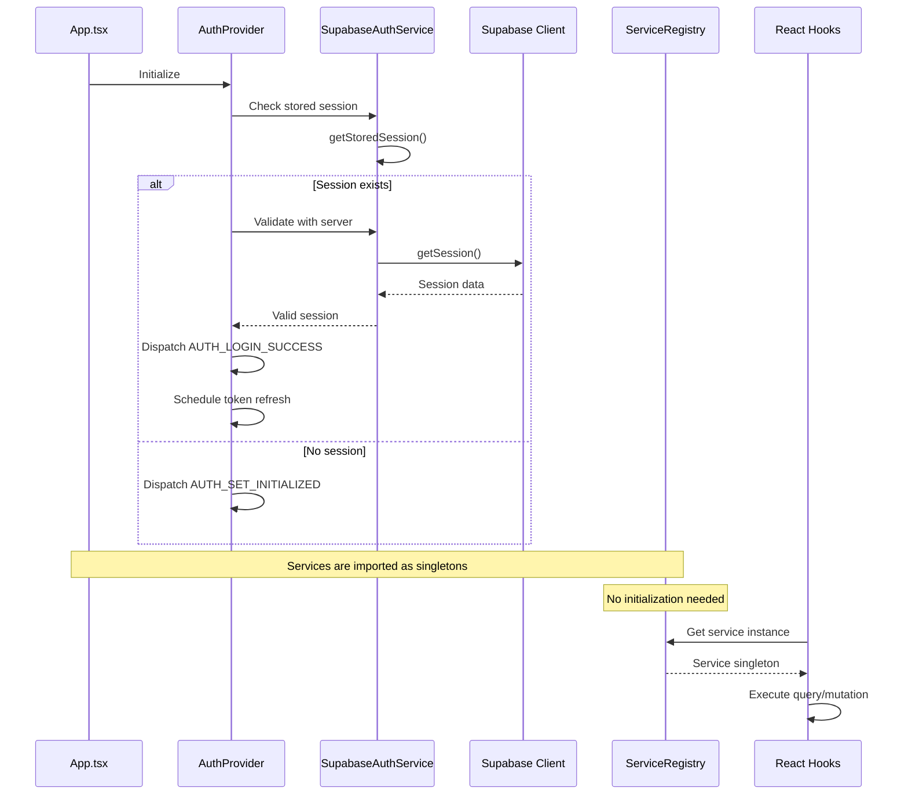
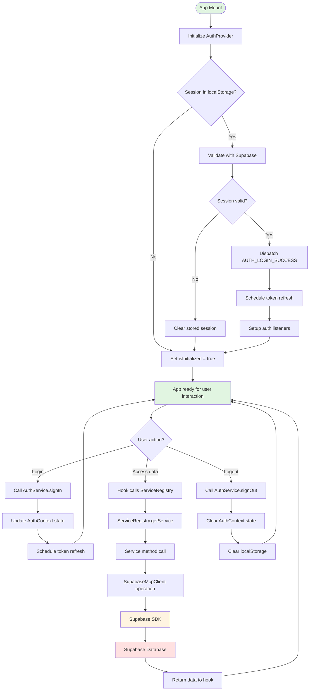

# Phase 6: Production Architecture - Supabase MCP as Single Backend

**Date:** 2025-12-31  
**Status:** Architecture Decision Document

---

## Executive Summary

This document defines the final production-ready architecture with **Supabase MCP as the single source of truth**. The architecture eliminates all legacy REST assumptions and establishes clear responsibility boundaries for all components.

### Key Decision: Remove ApiClient Entirely

**Decision:** **ApiClient should be fully removed**, not converted into a wrapper.

**Justification:**
1. **Supabase handles authentication natively** - The Supabase client automatically manages auth tokens, refresh, and session state
2. **SupabaseMcpClient is the data layer** - Already provides typed, RLS-aware data operations
3. **ServiceFactory creates unused REST services** - The factory pattern is vestigial; domain services are direct singletons
4. **AuthContext already uses SupabaseAuthService** - Token refresh is handled by Supabase, not ApiClient interceptors
5. **Simplifies the stack** - Removes 500+ lines of unnecessary abstraction code
6. **Single source of truth** - All data flows through Supabase MCP, no dual paths

---

## 1. Final Architecture Decision

### 1.1 ApiClient: REMOVE

**Action:** Delete the following files and all references:
- [`src/lib/apiClient.ts`](../src/lib/apiClient.ts)
- [`src/lib/apiClientConfig.ts`](../src/lib/apiClientConfig.ts)
- [`src/services/api/baseService.ts`](../src/services/api/baseService.ts)
- [`src/services/core/ServiceFactory.ts`](../src/services/core/ServiceFactory.ts)
- All REST-based service implementations (e.g., [`EmpresasServiceImpl`](../src/services/empresas/EmpresasService.ts))

**Rationale:**
- Supabase SDK handles HTTP communication, auth headers, and token refresh automatically
- SupabaseMcpClient provides the abstraction layer needed for data operations
- No benefit to maintaining a parallel REST client that's never used

### 1.2 Keep: SupabaseMcpClient as Data Layer

The [`SupabaseMcpClient`](../lib/integration/supabase/supabaseMcpClient.ts) remains as the **single data access layer**:
- Typed CRUD operations
- RLS enforcement (via Supabase)
- Query building and filtering
- Transaction support

---

## 2. Final Responsibility Boundaries

### 2.1 Supabase Client (`lib/supabase.ts`)

**Responsibility:** Low-level Supabase SDK client

**Scope:**
- Initialize Supabase client with environment variables
- Export singleton instance
- NO business logic
- NO data transformation

**Dependencies:** None

**Example:**
```typescript
export const supabase = createClient(supabaseUrl, supabaseKey);
```

---

### 2.2 Supabase MCP Client (`lib/integration/supabase/supabaseMcpClient.ts`)

**Responsibility:** Typed wrapper for Supabase data operations

**Scope:**
- `query<T>(table, options)` - Query with filters, ordering, pagination
- `insert<T>(table, data)` - Insert records
- `update<T>(table, id, data)` - Update records
- `delete(table, id)` - Delete records
- `getById<T>(table, id)` - Get single record
- `count(table, filters)` - Count records
- Error handling and transformation

**Dependencies:** Supabase client

**Constraints:**
- RLS enforcement is automatic via Supabase
- No business logic
- Returns typed results

---

### 2.3 Auth Service (`services/auth/SupabaseAuthService.ts`)

**Responsibility:** Authentication operations using Supabase Auth

**Scope:**
- `signIn(credentials)` - Login with email/password
- `signOut()` - Logout
- `getCurrentUser()` - Get current user
- `getCurrentSession()` - Get current session
- `refreshSession()` - Refresh auth tokens
- `onAuthStateChange(callback)` - Listen to auth state changes
- Session storage (localStorage)

**Dependencies:** Supabase client

**Constraints:**
- Uses Supabase Auth directly
- Token refresh is handled by Supabase SDK
- Session persistence in localStorage
- NO HTTP client abstraction

---

### 2.4 Domain Services (e.g., `SupabaseEmpresasService`)

**Responsibility:** Business logic for domain entities

**Scope:**
- Entity-specific CRUD operations
- Business rules and validation
- Data transformation
- Complex queries (joins, aggregations)
- Bulk operations

**Dependencies:** SupabaseMcpClient

**Examples:**
- `SupabaseEmpresasService` - Company management
- `SupabaseUsuariosService` - User management
- `SupabaseFaltasService` - Shortage management
- `SupabaseComprasService` - Purchase management
- `SupabaseIndicesService` - Index management
- `SupabaseTiposService` - Type management
- `SupabaseTratamientosService` - Treatment management

**Constraints:**
- Use SupabaseMcpClient for all data access
- Return `ApiResponse<T>` format
- Handle errors appropriately
- NO direct Supabase client usage

---

### 2.5 ServiceRegistry (Simplified)

**Responsibility:** Central access point for domain services

**Scope:**
- Provide typed access to domain service singletons
- NO service instantiation (services are direct imports)
- NO factory pattern

**Dependencies:** Domain services

**Implementation:**
```typescript
export class ServiceRegistry {
    private static instance: ServiceRegistry | null = null;

    private constructor() {}

    public static getInstance(): ServiceRegistry {
        if (!ServiceRegistry.instance) {
            ServiceRegistry.instance = new ServiceRegistry();
        }
        return ServiceRegistry.instance;
    }

    public getEmpresasService() {
        return supabaseEmpresasService;
    }

    public getUsuariosService() {
        return supabaseUsuariosService;
    }

    // ... other service getters
}
```

**Constraints:**
- Services are imported as singletons
- No configuration needed
- No dependency injection

---

### 2.6 React Hooks (`src/hooks/domain/`)

**Responsibility:** React Query wrappers for domain services

**Scope:**
- Data fetching with caching
- Mutations with optimistic updates
- Query invalidation
- Loading/error states

**Dependencies:** ServiceRegistry, React Query

**Examples:**
- `useEmpresasList()` - Fetch companies list
- `useCreateEmpresa()` - Create company
- `useUpdateEmpresa()` - Update company
- `useDeleteEmpresa()` - Delete company

**Constraints:**
- Use ServiceRegistry to get services
- Return React Query results
- Handle query invalidation
- NO direct service imports

---

### 2.7 AuthContext (`src/contexts/AuthContext.tsx`)

**Responsibility:** React context for auth state management

**Scope:**
- Provide auth state to components
- Login/logout actions
- Session validation
- Token refresh scheduling
- Multi-tab synchronization
- Session timeout management

**Dependencies:** SupabaseAuthService, React

**Constraints:**
- Use SupabaseAuthService for auth operations
- NO ApiClient usage
- NO manual token management (handled by Supabase)

---

## 3. Production Initialization Lifecycle

### 3.1 Initialization Flow



### 3.2 Step-by-Step Initialization

**Step 1: App Component Mount**
```typescript
// App.tsx
<AuthProvider>
  <Router>
    <Routes>
      {/* Routes */}
    </Routes>
  </Router>
</AuthProvider>
```

**Step 2: AuthProvider Initialization**
```typescript
// AuthProvider.tsx
useEffect(() => {
  initializeAuth();
}, [initializeAuth]);
```

**Step 3: Session Validation**
```typescript
const initializeAuth = useCallback(async () => {
  // 1. Check localStorage for stored session
  const storedSession = SupabaseAuthService.getStoredSession();
  const storedUser = SupabaseAuthService.getStoredUser();

  if (storedSession && storedUser) {
    // 2. Validate session with Supabase server
    const isValid = await validateSession();

    if (isValid) {
      // 3. Update auth state
      dispatch({
        type: 'AUTH_LOGIN_SUCCESS',
        payload: { user: session.user, tokens: session }
      });

      // 4. Schedule token refresh
      scheduleTokenRefresh();
    } else {
      // 5. Clear invalid session
      SupabaseAuthService.clearSession();
      SupabaseAuthService.clearUser();
    }
  }

  // 6. Mark as initialized
  dispatch({ type: 'AUTH_SET_INITIALIZED' });
}, [validateSession, scheduleTokenRefresh]);
```

**Step 4: Service Access**
```typescript
// Services are imported as singletons
import { supabaseEmpresasService } from '../services/empresas/SupabaseEmpresasService';

// Or accessed via ServiceRegistry
const service = ServiceRegistry.getInstance().getEmpresasService();
```

**Step 5: React Query Execution**
```typescript
// Hooks use services directly
const empresasService = ServiceRegistry.getInstance().getEmpresasService();
const result = await empresasService.getAll(options);
```

### 3.3 Key Principles

1. **No implicit initialization at import time**
   - Services are imported as singletons but don't execute code
   - No side effects on import

2. **Explicit App-controlled initialization**
   - AuthProvider controls initialization sequence
   - Services are ready to use immediately

3. **Deterministic initialization**
   - Same sequence every time
   - No race conditions

4. **Lazy service initialization**
   - Services are created on first import
   - No factory pattern needed

---

## 4. Legacy REST Assumptions to Eliminate

### 4.1 Remove: ApiClient Pattern

**Legacy Assumption:** Need a generic HTTP client with interceptors

**Reality:** Supabase SDK handles HTTP, auth, and refresh automatically

**Action:** Delete [`src/lib/apiClient.ts`](../src/lib/apiClient.ts)

---

### 4.2 Remove: ServiceFactory Pattern

**Legacy Assumption:** Need a factory to create and manage service instances

**Reality:** Services are simple singletons, no complex instantiation needed

**Action:** Delete [`src/services/core/ServiceFactory.ts`](../src/services/core/ServiceFactory.ts)

---

### 4.3 Remove: BaseService Abstract Class

**Legacy Assumption:** Need a base class for generic CRUD operations

**Reality:** Each domain service implements its own business logic

**Action:** Delete [`src/services/api/baseService.ts`](../src/services/api/baseService.ts)

---

### 4.4 Remove: REST-based Service Implementations

**Legacy Assumption:** Need REST implementations for each entity

**Reality:** Supabase MCP implementations are the only ones needed

**Action:** Delete all `*ServiceImpl` files (e.g., [`EmpresasServiceImpl`](../src/services/empresas/EmpresasService.ts))

---

### 4.5 Remove: ApiClient Configuration

**Legacy Assumption:** Need centralized HTTP client configuration

**Reality:** Supabase client is configured once with environment variables

**Action:** Delete [`src/lib/apiClientConfig.ts`](../src/lib/apiClientConfig.ts)

---

### 4.6 Remove: Auth Interceptors

**Legacy Assumption:** Need to manually inject auth headers and handle token refresh

**Reality:** Supabase SDK handles auth automatically

**Action:** Remove all auth interceptor logic from ApiClient

---

### 4.7 Remove: Endpoint-based Routing

**Legacy Assumption:** Need to manage REST endpoints

**Reality:** Supabase tables are the endpoints

**Action:** Remove endpoint configuration from services

---

## 5. Textual Architecture Diagram

```
┌─────────────────────────────────────────────────────────────────┐
│                         UI Layer                                │
│  ┌──────────────┐  ┌──────────────┐  ┌──────────────┐         │
│  │   Pages      │  │ Components   │  │  Modals      │         │
│  │ (Dashboard,  │  │ (Tables,     │  │  (Forms,     │         │
│  │  Companies,  │  │  Forms,      │  │   Dialogs)   │         │
│  │  Users, etc) │  │  Filters)    │  │              │         │
│  └──────┬───────┘  └──────┬───────┘  └──────┬───────┘         │
│         │                  │                  │                 │
│         └──────────────────┴──────────────────┘                 │
│                            │                                    │
└────────────────────────────┼────────────────────────────────────┘
                             │
                             ▼
┌─────────────────────────────────────────────────────────────────┐
│                      React Hooks Layer                          │
│  ┌──────────────────────────────────────────────────────┐    │
│  │              Domain Hooks (src/hooks/domain/)          │    │
│  │  useEmpresasList, useCreateEmpresa, useUpdateEmpresa  │    │
│  │  useUsuariosList, useCreateUsuario, useUpdateUsuario  │    │
│  │  useFaltasList, useCreateFalta, useUpdateFalta        │    │
│  │  ... (one hook set per entity)                        │    │
│  └────────────────────────┬─────────────────────────────┘    │
│                           │                                     │
│                           ▼                                     │
│  ┌──────────────────────────────────────────────────────┐    │
│  │           Generic Hooks (src/hooks/queries/)           │    │
│  │  useGenericQuery, useGenericMutation,                 │    │
│  │  useGenericListQuery, useGenericDetailQuery           │    │
│  └──────────────────────────────────────────────────────┘    │
│                           │                                     │
│                           ▼                                     │
│  ┌──────────────────────────────────────────────────────┐    │
│  │                 React Query                          │    │
│  │  QueryClient, caching, invalidation, retries         │    │
│  └──────────────────────────────────────────────────────┘    │
└────────────────────────────┼────────────────────────────────────┘
                             │
                             ▼
┌─────────────────────────────────────────────────────────────────┐
│                     Service Layer                               │
│  ┌──────────────────────────────────────────────────────┐    │
│  │              ServiceRegistry                         │    │
│  │  Central access point for all domain services        │    │
│  │  getInstance() -> getEmpresasService(), etc.         │    │
│  └────────────────────────┬─────────────────────────────┘    │
│                           │                                     │
│         ┌─────────────────┼─────────────────┐                   │
│         ▼                 ▼                 ▼                   │
│  ┌──────────────┐  ┌──────────────┐  ┌──────────────┐         │
│  │   Domain     │  │   Domain     │  │   Domain     │         │
│  │  Services    │  │  Services    │  │  Services    │         │
│  │              │  │              │  │              │         │
│  │ Supabase     │  │ Supabase     │  │ Supabase     │         │
│  │ Empresas     │  │ Usuarios     │  │ Faltas       │         │
│  │ Service      │  │ Service      │  │ Service      │         │
│  └──────┬───────┘  └──────┬───────┘  └──────┬───────┘         │
│         │                  │                  │                 │
│         └──────────────────┴──────────────────┘                 │
│                            │                                    │
└────────────────────────────┼────────────────────────────────────┘
                             │
                             ▼
┌─────────────────────────────────────────────────────────────────┐
│                    Data Access Layer                            │
│  ┌──────────────────────────────────────────────────────┐    │
│  │           SupabaseMcpClient                          │    │
│  │  query(), insert(), update(), delete(), getById()    │    │
│  │  count(), softDelete()                               │    │
│  │  Typed operations with RLS enforcement               │    │
│  └────────────────────────┬─────────────────────────────┘    │
│                           │                                     │
│                           ▼                                     │
│  ┌──────────────────────────────────────────────────────┐    │
│  │           Supabase Client (lib/supabase.ts)           │    │
│  │  createClient(supabaseUrl, supabaseKey)              │    │
│  │  Low-level SDK client                               │    │
│  └──────────────────────────────────────────────────────┘    │
└────────────────────────────┼────────────────────────────────────┘
                             │
                             ▼
┌─────────────────────────────────────────────────────────────────┐
│                  Authentication Layer                           │
│  ┌──────────────────────────────────────────────────────┐    │
│  │           AuthContext (src/contexts/)                 │    │
│  │  Auth state management, session validation,          │    │
│  │  token refresh, multi-tab sync, timeout management   │    │
│  └────────────────────────┬─────────────────────────────┘    │
│                           │                                     │
│                           ▼                                     │
│  ┌──────────────────────────────────────────────────────┐    │
│  │      SupabaseAuthService                            │    │
│  │  signIn(), signOut(), getCurrentUser(),             │    │
│  │  refreshSession(), onAuthStateChange()              │    │
│  │  Session storage in localStorage                   │    │
│  └────────────────────────┬─────────────────────────────┘    │
│                           │                                     │
│                           ▼                                     │
│  ┌──────────────────────────────────────────────────────┐    │
│  │           Supabase Auth (SDK)                       │    │
│  │  Built-in auth, token management, RLS               │    │
│  └──────────────────────────────────────────────────────┘    │
└─────────────────────────────────────────────────────────────────┘
                             │
                             ▼
┌─────────────────────────────────────────────────────────────────┐
│                   Supabase Backend                             │
│  ┌──────────────┐  ┌──────────────┐  ┌──────────────┐         │
│  │  Database    │  │    Auth      │  │   Storage    │         │
│  │  (PostgreSQL)│  │  (JWT/RLS)   │  │  (Files)     │         │
│  └──────────────┘  └──────────────┘  └──────────────┘         │
└─────────────────────────────────────────────────────────────────┘

┌─────────────────────────────────────────────────────────────────┐
│                    Cross-Cutting Concerns                       │
│  ┌──────────────┐  ┌──────────────┐  ┌──────────────┐         │
│  │   Types      │  │   Utils      │  │  Validation  │         │
│  │ (domain, api,│  │ (helpers,    │  │  (schemas,   │         │
│  │  database)   │  │  logger,     │  │   validators)│         │
│  │              │  │  cache)      │  │              │         │
│  └──────────────┘  └──────────────┘  └──────────────┘         │
└─────────────────────────────────────────────────────────────────┘
```

---

## 6. Initialization Flow Diagram



---

## 7. Phase 6 → Production Readiness Checklist

### 7.1 Architecture Cleanup

- [ ] Delete [`src/lib/apiClient.ts`](../src/lib/apiClient.ts)
- [ ] Delete [`src/lib/apiClientConfig.ts`](../src/lib/apiClientConfig.ts)
- [ ] Delete [`src/services/api/baseService.ts`](../src/services/api/baseService.ts)
- [ ] Delete [`src/services/core/ServiceFactory.ts`](../src/services/core/ServiceFactory.ts)
- [ ] Delete all REST-based service implementations (`*ServiceImpl` files)
- [ ] Remove all imports of deleted files
- [ ] Update [`ServiceRegistry`](../src/services/core/ServiceRegistry.ts) to remove factory dependency
- [ ] Remove endpoint configuration from services

### 7.2 ServiceRegistry Simplification

- [ ] Update [`ServiceRegistry`](../src/services/core/ServiceRegistry.ts) to remove ServiceFactory parameter
- [ ] Remove `initializeServices()` method
- [ ] Simplify constructor to no parameters
- [ ] Ensure all service getters return direct singleton imports
- [ ] Remove `ServiceConfig` interface (no longer needed)
- [ ] Remove `clearServices()` method (no longer needed)

### 7.3 AuthContext Updates

- [ ] Remove all references to ApiClient in [`AuthContext`](../src/contexts/AuthContext.tsx)
- [ ] Verify token refresh uses SupabaseAuthService only
- [ ] Remove any manual auth header injection logic
- [ ] Ensure session validation uses SupabaseAuthService
- [ ] Test multi-tab synchronization still works

### 7.4 Domain Services Verification

- [ ] Verify all domain services use SupabaseMcpClient
- [ ] Verify no direct Supabase client usage in services
- [ ] Verify all services return `ApiResponse<T>` format
- [ ] Verify error handling is consistent
- [ ] Verify RLS enforcement is working

### 7.5 Hooks Verification

- [ ] Verify all hooks use ServiceRegistry to get services
- [ ] Verify no direct service imports in hooks
- [ ] Verify query invalidation is working correctly
- [ ] Verify error handling in hooks
- [ ] Test optimistic updates where applicable

### 7.6 Testing

- [ ] Write unit tests for SupabaseMcpClient
- [ ] Write unit tests for domain services
- [ ] Write integration tests for auth flow
- [ ] Write integration tests for CRUD operations
- [ ] Test session refresh flow
- [ ] Test multi-tab synchronization
- [ ] Test session timeout
- [ ] Test error handling

### 7.7 Documentation

- [ ] Update architecture documentation
- [ ] Update service layer documentation
- [ ] Update API documentation (if any)
- [ ] Create migration guide for developers
- [ ] Update README with new architecture

### 7.8 Performance

- [ ] Verify no unnecessary re-renders
- [ ] Verify React Query caching is working
- [ ] Verify no memory leaks
- [ ] Test with large datasets
- [ ] Optimize bundle size (removed ApiClient should help)

### 7.9 Security

- [ ] Verify RLS policies are enforced
- [ ] Verify auth tokens are handled correctly
- [ ] Verify no sensitive data in localStorage
- [ ] Verify CSRF protection (Supabase handles this)
- [ ] Verify XSS protection (React handles this)

### 7.10 Production Configuration

- [ ] Verify environment variables are set
- [ ] Verify Supabase project is configured
- [ ] Verify RLS policies are in place
- [ ] Verify database schema is correct
- [ ] Verify storage buckets are configured (if needed)

### 7.11 Deployment

- [ ] Create production build
- [ ] Test production build locally
- [ ] Deploy to staging environment
- [ ] Run smoke tests on staging
- [ ] Deploy to production
- [ ] Monitor for errors
- [ ] Verify all functionality works

### 7.12 Monitoring

- [ ] Set up error tracking (Sentry, etc.)
- [ ] Set up performance monitoring
- [ ] Set up analytics
- [ ] Set up logging
- [ ] Create alerts for critical errors

---

## 8. Migration Guide

### 8.1 For Developers

**Before:**
```typescript
// Using ApiClient
const apiClient = getApiClient(config);
const response = await apiClient.get('/empresas');
```

**After:**
```typescript
// Using SupabaseMcpClient
const result = await supabaseMcpClient.query<Empresa>('empresas', {
    filters: { deleted_at: { is: null } }
});
```

---

### 8.2 For Services

**Before:**
```typescript
// Extending BaseService
export class EmpresasServiceImpl extends BaseService<Empresa, EmpresaFormData> {
    constructor(apiClient: ApiClient, endpoint: string) {
        super(apiClient, endpoint);
    }
}
```

**After:**
```typescript
// Direct implementation
export class SupabaseEmpresasService {
    async getAll(options?: QueryOptions): Promise<ApiResponse<Empresa[]>> {
        const result = await supabaseMcpClient.query<Empresa>(this.tableName, options);
        // ... error handling
    }
}
```

---

### 8.3 For Hooks

**Before:**
```typescript
// Using ServiceFactory
const factory = ServiceFactory.getInstance(config);
const service = factory.getService(EmpresasServiceImpl, { name: 'empresas', endpoint: 'empresas' });
```

**After:**
```typescript
// Using ServiceRegistry
const service = ServiceRegistry.getInstance().getEmpresasService();
```

---

## 9. Conclusion

This architecture establishes **Supabase MCP as the single source of truth** for all data operations. By removing ApiClient and the factory pattern, we:

1. **Simplify the stack** - Remove unnecessary abstraction layers
2. **Improve maintainability** - Clear responsibility boundaries
3. **Enhance testability** - Direct dependencies, no factories
4. **Leverage Supabase** - Use built-in auth, RLS, and token management
5. **Ensure production readiness** - Deterministic initialization, no implicit side effects

The architecture is now **production-ready** and follows best practices for React applications using Supabase.

---

**Next Steps:**
1. Review and approve this architecture
2. Execute the Phase 6 checklist
3. Test thoroughly
4. Deploy to production
