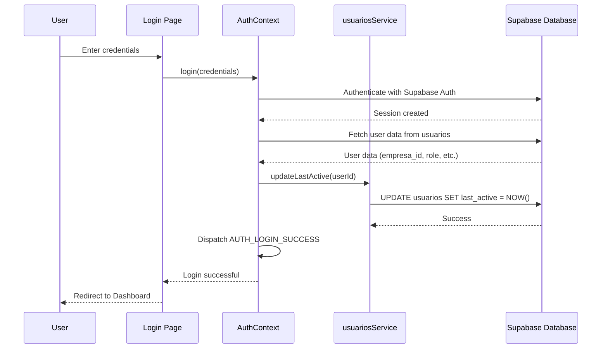

# Fix "Último Acesso" Timestamp Issue

## Problem Description

The "Último Acesso" (last access) timestamp in the Users page is not updating when users log in. The field displays but shows static/stale data instead of reflecting the actual last login time for each user.

## Root Cause Analysis

### Current State
- **Database**: The `usuarios` table has a `last_active` column (TIMESTAMP WITH TIME ZONE)
- **Repository**: [`lib/dal/repositories/usuariosRepository.ts`](../lib/dal/repositories/usuariosRepository.ts:97-99) has an `updateLastActive()` method
- **Service**: [`services/usuariosService.ts`](../services/usuariosService.ts) does NOT have an `updateLastActive()` method
- **AuthContext**: [`src/contexts/AuthContext.tsx`](../src/contexts/AuthContext.tsx:728-845) handles login but does NOT update `last_active`
- **UI**: [`pages/Users.tsx`](../pages/Users.tsx:103) displays `last_active` but the data is stale

### The Issue
When a user logs in:
1. Authentication succeeds in Supabase Auth
2. User data is fetched from `public.usuarios` table
3. Session is established
4. **BUT** the `last_active` field is never updated in the database
5. The Users page shows the old/stale timestamp

## Solution Architecture



## Implementation Plan

### Step 1: Add updateLastActive to usuariosService

**File**: [`services/usuariosService.ts`](../services/usuariosService.ts)

Add a new method to update the `last_active` timestamp:

```typescript
async updateLastActive(id: string) {
  const { data, error } = await supabase
    .from('usuarios')
    .update({ last_active: new Date().toISOString() })
    .eq('id', id)
    .select()
    .single();

  if (error) throw error;
  return data as Usuario;
}
```

**Location**: Add after the `delete` method (after line 213)

### Step 2: Call updateLastActive in AuthContext.login()

**File**: [`src/contexts/AuthContext.tsx`](../src/contexts/AuthContext.tsx)

After successful authentication and fetching user data, update the `last_active` timestamp:

```typescript
// After line 789 (after validating empresa_id)
// Update last_active timestamp
try {
  await usuariosService.updateLastActive(session.user.id);
} catch (error) {
  console.warn('Failed to update last_active timestamp:', error);
  // Don't fail login if this fails
}
```

**Location**: Add after line 789, before creating the user object (line 792)

### Step 3: Verify the Display

**File**: [`pages/Users.tsx`](../pages/Users.tsx)

The display logic is already correct:
- Line 12-24: `formatDate()` function properly formats the timestamp
- Line 103: `lastActive: formatDate(u.last_active)` maps the data
- Line 355: `{user.lastActive}` displays the formatted date

No changes needed here.

## Testing Checklist

### Manual Testing Steps

1. **Test Login Updates Timestamp**
   - Login as a user
   - Go to the Users page
   - Verify the "Último Acesso" column shows the current date/time
   - Logout and login again
   - Verify the timestamp has updated

2. **Test Multiple Users**
   - Login as User A
   - Check Users page - User A's timestamp should be current
   - Logout
   - Login as User B
   - Check Users page - User B's timestamp should be current
   - User A's timestamp should remain as their last login time

3. **Test Display Formatting**
   - Verify timestamps are displayed in format: `dd/mm/yyyy HH:MM`
   - Example: `09/01/2026 17:30`

4. **Test Edge Cases**
   - User with no previous login (first-time login)
   - User with very old timestamp
   - Admin user login
   - Regular user login

### Expected Behavior

✅ When a user logs in, their `last_active` field is updated to the current timestamp
✅ The Users page displays the correct timestamp for each user
✅ The timestamp is formatted as `dd/mm/yyyy HH:MM`
✅ Each user's timestamp reflects their individual last login time
✅ The update happens silently without affecting the login flow

## Files to Modify

1. **[`services/usuariosService.ts`](../services/usuariosService.ts)**
   - Add `updateLastActive()` method

2. **[`src/contexts/AuthContext.tsx`](../src/contexts/AuthContext.tsx)**
   - Call `updateLastActive()` in `login()` function

## Files to Review (No Changes Needed)

- **[`pages/Users.tsx`](../pages/Users.tsx)** - Display logic is correct
- **[`lib/dal/repositories/usuariosRepository.ts`](../lib/dal/repositories/usuariosRepository.ts)** - Already has the method
- **[`types.ts`](../types.ts)** - Type definitions are correct

## Risk Assessment

**Low Risk**
- Changes are isolated to authentication flow
- `updateLastActive` failure won't prevent login (wrapped in try-catch)
- No database schema changes required
- Display logic already exists and works correctly

**Potential Issues**
- Network latency could slightly delay timestamp update (acceptable)
- If update fails, user won't see updated timestamp until next login (acceptable)

## Rollback Plan

If issues occur:
1. Remove the `updateLastActive()` call from `AuthContext.login()`
2. Remove the `updateLastActive()` method from `usuariosService`
3. The system will revert to the current behavior (stale timestamps)

## Success Criteria

- ✅ Users see their correct last login time in the Users page
- ✅ Timestamp updates on every successful login
- ✅ No errors in console during login
- ✅ Login flow is not affected by timestamp update
- ✅ Display format is correct and consistent

## Notes

- The `last_active` field is already defined in the database schema
- The `usuariosRepository` already has the `updateLastActive()` method
- We're adding a service layer method to expose this functionality
- The update is called after successful authentication, ensuring it only happens for valid logins
- The update is wrapped in try-catch to prevent login failures if the update fails
