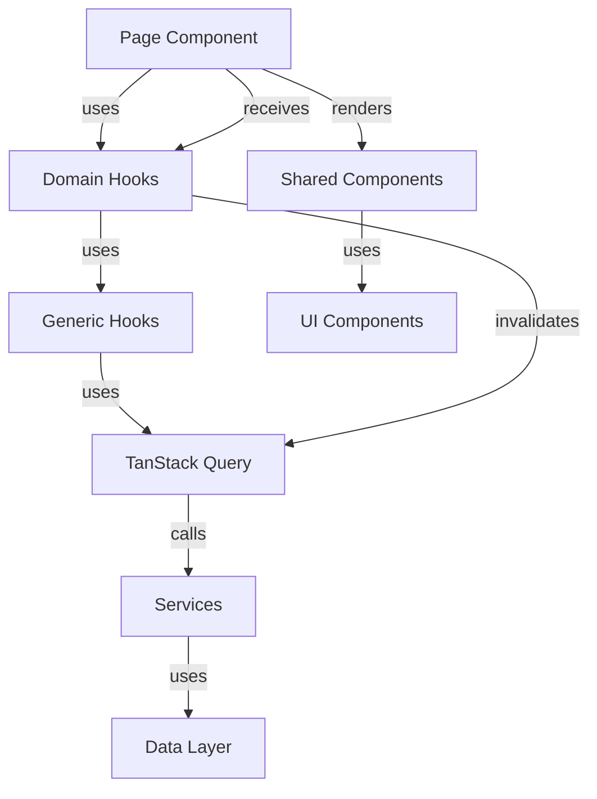

# List Page Architecture Standard

## Overview

This document defines the canonical architectural pattern for list-based pages using TanStack Query in the VisuLab application. All new list pages MUST follow this standard to ensure consistency, maintainability, and prevent regressions.

## Core Principles

1. **Separation of Concerns**: Pages orchestrate, hooks fetch, services execute business logic
2. **Consistent State Handling**: Every page must handle loading, error, and empty states
3. **No Blank Screens**: Pages must never return null, empty fragments, or render nothing
4. **Reusable Components**: Use shared components (FeedbackState, DataTable, PageHeader, FormLayout)
5. **Type Safety**: Leverage TypeScript for all data structures

## Canonical Page Structure

### 1. Imports (Order Matters)

```typescript
// 1. React and hooks
import React, { useState, useCallback } from 'react';

// 2. Shared components
import { DataTable, PageHeader, FormLayout, ConfirmActionDialog, FeedbackState } from '../src/components/shared';
import { Button, Input } from '../src/components/ui';

// 3. Domain hooks
import { useEntityList, useCreateEntity, useUpdateEntity, useDeleteEntity } from '../src/hooks/domain/entities';

// 4. Types
import { EntityFilters, EntityFormData } from '../src/types/domain/domain.types';

// 5. Utilities
import { showSuccess, showWarning, showInfo } from '../src/utils/errorHandler';
```

### 2. Type Definitions

Define local types for UI-specific data transformations:

```typescript
type Entity = {
  id: string;
  name: string;
  // ... other UI-specific fields
};
```

### 3. Component State

Organize state by responsibility:

```typescript
const [isCreateModalOpen, setIsCreateModalOpen] = useState(false);
const [isEditModalOpen, setIsEditModalOpen] = useState(false);
const [selectedEntity, setSelectedEntity] = useState<Entity | null>(null);
const [selectedIds, setSelectedIds] = useState<string[]>([]);

const [filters, setFilters] = useState<EntityFilters>({});
const [searchQuery, setSearchQuery] = useState('');
```

### 4. Query Hooks

Use domain hooks for data fetching:

```typescript
const {
  data: entitiesData,
  isLoading,
  error,
  refetch
} = useEntityList({
  filters: {
    ...filters,
    ...(searchQuery && { name: { contains: searchQuery } })
  }
});

const createMutation = useCreateEntity();
const updateMutation = useUpdateEntity();
const deleteMutation = useDeleteEntity();
```

### 5. Data Extraction

Extract data from paginated response:

```typescript
const entities = entitiesData?.data || [];
```

### 6. State Handling (MANDATORY)

Every page MUST handle all three states using FeedbackState:

```typescript
{isLoading ? (
  <FeedbackState
    type="loading"
    variant="full"
    size="lg"
  />
) : error ? (
  <FeedbackState
    type="error"
    title="Erro ao carregar entidades"
    description={error.message || 'Ocorreu um erro ao buscar as entidades. Tente novamente.'}
    onRetry={refetch}
    variant="full"
    size="lg"
  />
) : entities.length === 0 ? (
  <FeedbackState
    type="empty"
    title="Nenhuma entidade encontrada"
    description="Não há entidades cadastradas no momento. Clique em 'Nova Entidade' para adicionar a primeira."
    icon="inbox"
    variant="full"
    size="lg"
    action={{
      label: 'Nova Entidade',
      onClick: openCreateModal,
      icon: 'add'
    }}
  />
) : (
  // Render DataTable here
)}
```

**CRITICAL RULE**: Never return null, empty fragments, or skip rendering. Always show one of the three states.

## Folder Responsibilities

### `pages/`
**Purpose**: Page-level components that orchestrate UI and business logic

**Responsibilities**:
- Import and use domain hooks
- Manage local UI state (modals, selections, filters)
- Handle user interactions and events
- Orchestrate data flow between hooks and components
- Transform data for UI presentation

**NOT Allowed**:
- Direct API calls (use hooks instead)
- Business logic (delegate to services)
- Complex data transformations (use hooks or services)

### `src/hooks/`
**Purpose**: React hooks for data fetching and state management

**Subdirectories**:
- `domain/` - Entity-specific hooks (e.g., `usuarios.ts`, `empresas.ts`)
- `queries/` - Generic query/mutation hooks (e.g., `useGenericQuery.ts`)
- `auth/` - Authentication-related hooks
- `ui/` - UI state hooks (if needed)

**Responsibilities**:
- Wrap TanStack Query for data fetching
- Handle query invalidation and cache management
- Provide domain-specific data access methods
- Transform data from API format to domain format

**NOT Allowed**:
- UI rendering logic
- Business logic (delegate to services)
- Direct DOM manipulation

### `services/`
**Purpose**: Business logic layer that interacts with data sources

**Responsibilities**:
- Implement business rules and validations
- Coordinate between multiple data sources
- Handle data transformations
- Provide methods for CRUD operations
- Manage service-level error handling

**NOT Allowed**:
- UI-specific logic
- React hooks or state management
- Direct DOM manipulation

### `src/components/ui/`
**Purpose**: Low-level, reusable UI primitives

**Responsibilities**:
- Provide basic UI components (Button, Input, etc.)
- Be framework-agnostic where possible
- Handle accessibility concerns
- Support theming and styling

**NOT Allowed**:
- Business logic
- Data fetching
- Domain-specific behavior

### `src/components/shared/`
**Purpose**: High-level, domain-agnostic components

**Responsibilities**:
- Combine UI primitives into reusable patterns
- Handle common UI scenarios (DataTable, PageHeader, FormLayout)
- Provide consistent user experience
- Support FeedbackState for all states

**NOT Allowed**:
- Domain-specific business logic
- Direct data fetching (accept data via props)

## Non-Negotiable Rules

### Rule 1: State Handling
Every page using queries MUST render:
- ✅ Loading state (when `isLoading` is true)
- ✅ Error state (when `error` exists)
- ✅ Empty state (when data array is empty)
- ✅ Data state (when data exists)

### Rule 2: No Blank Screens
Pages may NEVER return:
- ❌ `null`
- ❌ `<></>` (empty fragment)
- ❌ Blank screens
- ❌ Unhandled states

### Rule 3: Use FeedbackState
All state feedback MUST use the [`FeedbackState`](src/components/shared/FeedbackState/FeedbackState.tsx) component:
- For loading: `<FeedbackState type="loading" />`
- For error: `<FeedbackState type="error" onRetry={refetch} />`
- For empty: `<FeedbackState type="empty" action={{...}} />`

### Rule 4: Domain Hooks Only
Pages MUST use domain hooks from `src/hooks/domain/`:
- ❌ Direct `useQuery` calls in pages
- ❌ Direct service calls in pages
- ✅ `useEntityList()`, `useCreateEntity()`, etc.

### Rule 5: No Business Logic in Pages
Pages MUST only orchestrate:
- ❌ Business rules, validations, transformations
- ✅ UI state management
- ✅ Event handling
- ✅ Data flow coordination

## Data Flow



## Query Hook Pattern

Domain hooks follow this pattern:

```typescript
// src/hooks/domain/entities.ts
export function useEntityList(options?: QueryOptions) {
  const entityService = ServiceRegistry.getInstance().getEntityService();
  return useGenericListQuery<Entity>(
    'entities',
    entityService,
    options
  );
}

export function useCreateEntity() {
  const queryClient = useQueryClient();
  const entityService = ServiceRegistry.getInstance().getEntityService();

  return useGenericCreateMutation<Entity, EntityFormData>(
    'entities',
    entityService,
    {
      onSuccess: () => {
        queryInvalidation.invalidateEntity(queryClient, 'entities');
      },
    }
  );
}
```

## Page Component Pattern

```typescript
const EntityListPage: React.FC = () => {
  // 1. State management
  const [filters, setFilters] = useState<EntityFilters>({});
  
  // 2. Query hooks
  const { data, isLoading, error, refetch } = useEntityList({ filters });
  
  // 3. Data extraction
  const entities = data?.data || [];
  
  // 4. Event handlers
  const handleCreate = useCallback(async (data: EntityFormData) => {
    await createMutation.mutateAsync(data);
    showSuccess('Entidade criada com sucesso!');
  }, [createMutation]);
  
  // 5. Render
  return (
    <div className="h-full flex flex-col">
      <PageHeader ... />
      <div className="flex-1">
        {isLoading ? (
          <FeedbackState type="loading" variant="full" size="lg" />
        ) : error ? (
          <FeedbackState type="error" onRetry={refetch} variant="full" size="lg" />
        ) : entities.length === 0 ? (
          <FeedbackState type="empty" variant="full" size="lg" />
        ) : (
          <DataTable data={entities} ... />
        )}
      </div>
    </div>
  );
};
```

## Best Practices

1. **Use `useCallback` for event handlers** to prevent unnecessary re-renders
2. **Extract data from paginated response** using optional chaining: `data?.data || []`
3. **Provide meaningful error messages** in FeedbackState
4. **Include retry functionality** for error states
5. **Add action buttons** to empty states to guide users
6. **Use consistent naming** across hooks, services, and types
7. **Leverage TypeScript** for type safety throughout the stack
8. **Keep pages focused** on orchestration, not implementation details

## Compliance Checklist

Before creating a new list page, ensure:

- [ ] Page uses domain hooks from `src/hooks/domain/`
- [ ] Page handles loading state with FeedbackState
- [ ] Page handles error state with FeedbackState and retry
- [ ] Page handles empty state with FeedbackState and action
- [ ] Page renders DataTable when data exists
- [ ] No blank screens, null returns, or empty fragments
- [ ] No direct API calls or service usage in page
- [ ] No business logic in page component
- [ ] All event handlers use useCallback
- [ ] Data extraction uses optional chaining
- [ ] TypeScript types are defined and used
- [ ] Error messages are user-friendly
- [ ] Empty states provide actionable next steps

## References

- [Users Page Example](../pages/Users.tsx)
- [Companies Page Example](../pages/Companies.tsx)
- [Shortages Page Example](../pages/Shortages.tsx)
- [FeedbackState Component](../src/components/shared/FeedbackState/FeedbackState.tsx)
- [Generic Query Hooks](../src/hooks/queries/useGenericQuery.ts)
- [Domain Hooks Example](../src/hooks/domain/usuarios.ts)
