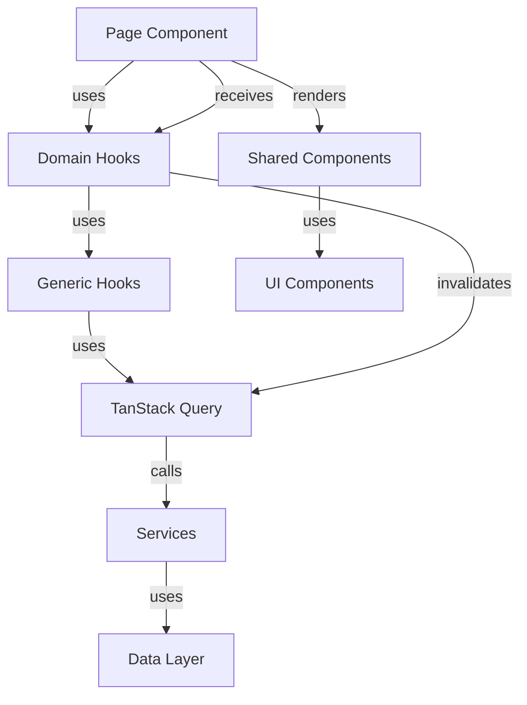

# List Page Architecture - Executive Summary

## Overview

This document summarizes the architectural standards established for list-based pages using TanStack Query in the VisuLab application. These standards ensure consistency, maintainability, and prevent future regressions.

## Deliverables

### 1. Architecture Standard Document
**File**: [`list-page-architecture-standard.md`](./list-page-architecture-standard.md)

**Contents**:
- Core principles and architectural patterns
- Canonical page structure with detailed sections
- Folder responsibilities (pages/, hooks/, services/, components/ui/)
- Non-negotiable rules for list pages
- Data flow diagrams
- Query hook patterns
- Best practices and compliance checklist

**Key Highlights**:
- Separation of concerns between layers
- Mandatory state handling (loading, error, empty)
- No blank screens or null returns
- Use of FeedbackState for all feedback
- Domain hooks for data access

### 2. Reference Page Template
**File**: [`list-page-template.md`](./list-page-template.md)

**Contents**:
- Complete, production-ready template code
- Detailed annotations for each section
- Key sections explained
- Adaptation checklist

**Key Features**:
- Full implementation of all state handling
- Complete CRUD operations
- Bulk operations support
- Search and filtering
- Modal management
- Toast notifications
- DataTable configuration

### 3. Developer Checklist
**File**: [`new-page-checklist.md`](./new-page-checklist.md)

**Contents**:
- Pre-development planning checklist
- Implementation checklist (detailed)
- Code quality checklist
- Testing checklist
- Code review checklist
- Post-implementation verification
- Common pitfalls to avoid
- Quick reference patterns

**Key Sections**:
- 60+ checklist items organized by phase
- Manual testing scenarios
- Edge case testing
- Performance and accessibility checks
- Common mistakes and solutions

## Core Architectural Rules

### Rule 1: State Handling (MANDATORY)
Every page using queries MUST render:
- ✅ Loading state (when `isLoading` is true)
- ✅ Error state (when `error` exists)
- ✅ Empty state (when data array is empty)
- ✅ Data state (when data exists)

### Rule 2: No Blank Screens
Pages may NEVER return:
- ❌ `null`
- ❌ `<></>` (empty fragment)
- ❌ Blank screens
- ❌ Unhandled states

### Rule 3: Use FeedbackState
All state feedback MUST use the [`FeedbackState`](../src/components/shared/FeedbackState/FeedbackState.tsx) component:
- For loading: `<FeedbackState type="loading" variant="full" size="lg" />`
- For error: `<FeedbackState type="error" onRetry={refetch} variant="full" size="lg" />`
- For empty: `<FeedbackState type="empty" action={{...}} variant="full" size="lg" />`

### Rule 4: Domain Hooks Only
Pages MUST use domain hooks from `src/hooks/domain/`:
- ❌ Direct `useQuery` calls in pages
- ❌ Direct service calls in pages
- ✅ `useEntityList()`, `useCreateEntity()`, etc.

### Rule 5: No Business Logic in Pages
Pages MUST only orchestrate:
- ❌ Business rules, validations, transformations
- ✅ UI state management
- ✅ Event handling
- ✅ Data flow coordination

## Folder Responsibilities

### `pages/`
**Purpose**: Page-level components that orchestrate UI and business logic

**Responsibilities**:
- Import and use domain hooks
- Manage local UI state (modals, selections, filters)
- Handle user interactions and events
- Orchestrate data flow between hooks and components
- Transform data for UI presentation

**NOT Allowed**:
- Direct API calls (use hooks instead)
- Business logic (delegate to services)
- Complex data transformations (use hooks or services)

### `src/hooks/`
**Purpose**: React hooks for data fetching and state management

**Subdirectories**:
- `domain/` - Entity-specific hooks (e.g., `usuarios.ts`, `empresas.ts`)
- `queries/` - Generic query/mutation hooks (e.g., `useGenericQuery.ts`)
- `auth/` - Authentication-related hooks
- `ui/` - UI state hooks (if needed)

**Responsibilities**:
- Wrap TanStack Query for data fetching
- Handle query invalidation and cache management
- Provide domain-specific data access methods
- Transform data from API format to domain format

**NOT Allowed**:
- UI rendering logic
- Business logic (delegate to services)
- Direct DOM manipulation

### `services/`
**Purpose**: Business logic layer that interacts with data sources

**Responsibilities**:
- Implement business rules and validations
- Coordinate between multiple data sources
- Handle data transformations
- Provide methods for CRUD operations
- Manage service-level error handling

**NOT Allowed**:
- UI-specific logic
- React hooks or state management
- Direct DOM manipulation

### `src/components/ui/`
**Purpose**: Low-level, reusable UI primitives

**Responsibilities**:
- Provide basic UI components (Button, Input, etc.)
- Be framework-agnostic where possible
- Handle accessibility concerns
- Support theming and styling

**NOT Allowed**:
- Business logic
- Data fetching
- Domain-specific behavior

### `src/components/shared/`
**Purpose**: High-level, domain-agnostic components

**Responsibilities**:
- Combine UI primitives into reusable patterns
- Handle common UI scenarios (DataTable, PageHeader, FormLayout)
- Provide consistent user experience
- Support FeedbackState for all states

**NOT Allowed**:
- Domain-specific business logic
- Direct data fetching (accept data via props)

## Data Flow Architecture



## Implementation Pattern

### 1. Imports (Order Matters)
```typescript
// 1. React and hooks
import React, { useState, useCallback } from 'react';

// 2. Shared components
import { DataTable, PageHeader, FormLayout, ConfirmActionDialog, FeedbackState } from '../src/components/shared';

// 3. Domain hooks
import { useEntityList, useCreateEntity, useUpdateEntity, useDeleteEntity } from '../src/hooks/domain/entities';

// 4. Types
import { EntityFilters, EntityFormData } from '../src/types/domain/domain.types';

// 5. Utilities
import { showSuccess, showWarning, showInfo } from '../src/utils/errorHandler';
```

### 2. State Handling (MANDATORY)
```typescript
{isLoading ? (
  <FeedbackState type="loading" variant="full" size="lg" />
) : error ? (
  <FeedbackState type="error" onRetry={refetch} variant="full" size="lg" />
) : entities.length === 0 ? (
  <FeedbackState type="empty" action={{...}} variant="full" size="lg" />
) : (
  <DataTable data={entities} ... />
)}
```

### 3. Data Extraction
```typescript
const entities = entitiesData?.data || [];
```

### 4. Event Handlers
```typescript
const handleCreate = useCallback(async (data: EntityFormData) => {
  try {
    await createMutation.mutateAsync(data);
    showSuccess('Entidade criada com sucesso!');
    closeAllModals();
  } catch (error) {
    console.error('Error creating entity:', error);
    showWarning('Erro ao criar entidade. Tente novamente.');
  }
}, [createMutation, closeAllModals]);
```

## Benefits of This Architecture

### 1. Consistency
- All pages follow the same structure
- Predictable state handling
- Uniform user experience

### 2. Maintainability
- Clear separation of concerns
- Easy to locate and fix issues
- Reusable patterns reduce code duplication

### 3. Scalability
- Easy to add new pages following the template
- Consistent patterns make onboarding faster
- Architecture supports future enhancements

### 4. Reliability
- No blank screens or unhandled states
- Proper error handling everywhere
- Consistent user feedback

### 5. Developer Experience
- Clear guidelines and checklists
- Reference template for quick start
- Comprehensive documentation

## Compliance Verification

To verify compliance with these standards:

1. **Review the Architecture Standard** - Understand the rules and patterns
2. **Use the Template** - Start from the reference template
3. **Follow the Checklist** - Complete all checklist items
4. **Test All States** - Verify loading, error, empty, and data states
5. **Code Review** - Ensure all non-negotiable rules are followed

## Existing Examples

The following pages demonstrate compliance with these standards:

- [`pages/Users.tsx`](../pages/Users.tsx) - Complete user management page
- [`pages/Companies.tsx`](../pages/Companies.tsx) - Complete company management page
- [`pages/Shortages.tsx`](../pages/Shortages.tsx) - Complete absence management page

## Getting Started

To create a new list page:

1. Read [`list-page-architecture-standard.md`](./list-page-architecture-standard.md)
2. Copy the template from [`list-page-template.md`](./list-page-template.md)
3. Follow the checklist in [`new-page-checklist.md`](./new-page-checklist.md)
4. Adapt the template for your specific entity
5. Test all states (loading, error, empty, data)
6. Submit for code review

## Support and References

- **Architecture Standard**: [`list-page-architecture-standard.md`](./list-page-architecture-standard.md)
- **Reference Template**: [`list-page-template.md`](./list-page-template.md)
- **Developer Checklist**: [`new-page-checklist.md`](./new-page-checklist.md)
- **Example Pages**: Users, Companies, Shortages
- **FeedbackState Component**: [`src/components/shared/FeedbackState/FeedbackState.tsx`](../src/components/shared/FeedbackState/FeedbackState.tsx)
- **Generic Query Hooks**: [`src/hooks/queries/useGenericQuery.ts`](../src/hooks/queries/useGenericQuery.ts)

## Conclusion

These architectural standards provide a solid foundation for building consistent, maintainable, and reliable list-based pages. By following these guidelines, templates, and checklists, developers can ensure that all pages meet the same high standards and provide a uniform user experience.

The architecture is designed to be:
- **Clear**: Well-documented with examples
- **Consistent**: Uniform patterns across all pages
- **Maintainable**: Easy to understand and modify
- **Scalable**: Supports future growth and enhancements
- **Reliable**: No unhandled states or blank screens

All new list pages MUST comply with these standards to maintain code quality and user experience across the application.
