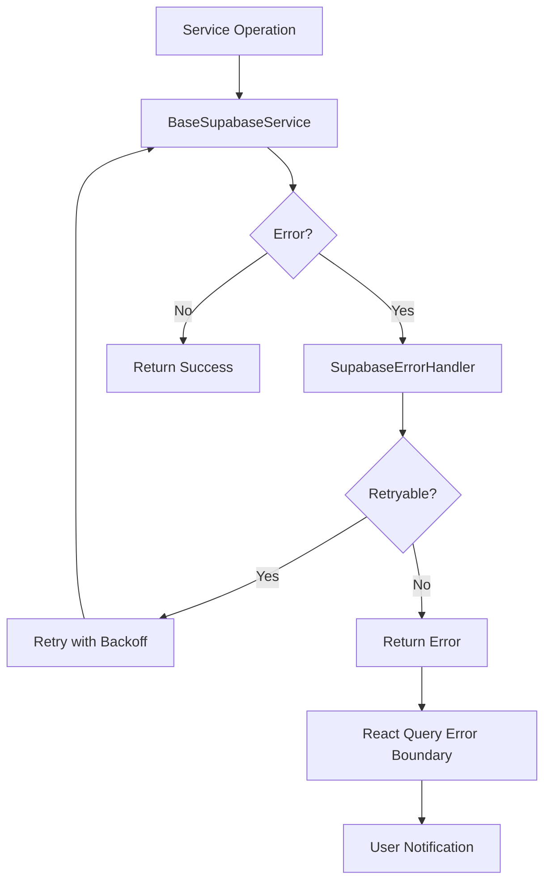
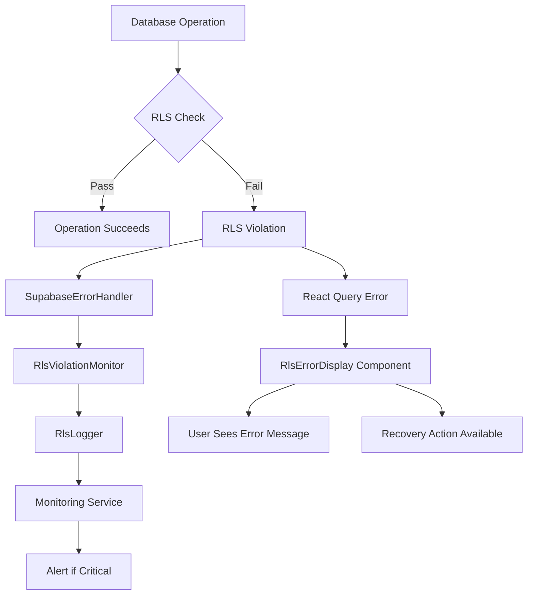

# Phase 7: Supabase Consolidation & Hardening

**Date:** 2025-12-31
**Status:** Planning
**Previous Phase:** Phase 6 - Legacy Code Removal (Completed)

---

## Executive Summary

Phase 7 focuses on consolidating and hardening the Supabase integration established in Phase 6. This phase standardizes the service layer, improves type safety, strengthens error handling, validates RLS assumptions, and prepares the application for production deployment with Supabase as the single, hardened data layer.

---

## Phase 7 Objectives

### Primary Objectives

1. **Standardize Supabase Domain Services**
   - Establish consistent naming conventions across all services
   - Define clear service responsibilities and boundaries
   - Create a standardized service interface/base class
   - Implement consistent error handling patterns

2. **Optimize ServiceRegistry Usage**
   - Replace `any` types with proper service type definitions
   - Add service metadata and capabilities
   - Implement service lifecycle management
   - Add service health checking capabilities

3. **Align Error Handling with Supabase + React Query**
   - Integrate SupabaseErrorHandler with React Query error boundaries
   - Implement centralized retry strategy with exponential backoff
   - Create consistent error mapping between services and UI
   - Add error recovery mechanisms

4. **Improve Type Safety with Supabase Database Types**
   - Generate and integrate Supabase database types
   - Replace manual entity types with generated types
   - Ensure type safety across service layer
   - Add type guards and validation utilities

5. **Validate RLS Assumptions**
   - Document RLS policies per table and role
   - Validate frontend RLS assumptions match database policies
   - Create RLS test coverage
   - Implement RLS status monitoring

6. **Production Readiness**
   - Create comprehensive production checklist
   - Implement monitoring and observability
   - Add performance optimization
   - Document deployment procedures

---

## Architectural Decisions

### What to Add

#### 1. **Supabase Service Base Class**
```typescript
// New: lib/integration/supabase/baseSupabaseService.ts
- Standardized CRUD operations
- Built-in error handling with SupabaseErrorHandler
- Automatic retry logic integration
- Type-safe database operations
- RLS validation hooks
- Logging and telemetry
```

#### 2. **Generated Database Types**
```typescript
// New: lib/types/database/generated.ts
- Auto-generated from Supabase schema
- Includes all tables, views, and functions
- Row-level security types
- Database constraint types
```

#### 3. **Enhanced ServiceRegistry**
```typescript
// Enhanced: src/services/core/ServiceRegistry.ts
- Typed service interfaces
- Service metadata (capabilities, health status)
- Service lifecycle management
- Dependency injection support
- Service discovery
```

#### 4. **React Query Error Boundary Integration**
```typescript
// New: src/components/error/ReactQueryErrorBoundary.tsx
- Centralized error handling for React Query
- Error classification and user-friendly messages
- Automatic retry with backoff
- Error reporting integration
```

#### 5. **RLS Validation Utilities**
```typescript
// New: lib/utils/rls/rlsValidator.ts
- RLS policy documentation
- Frontend RLS assumption validation
- RLS test utilities
- RLS status monitoring
```

#### 6. **Service Health Monitoring**
```typescript
// New: lib/monitoring/serviceHealth.ts
- Health check endpoints
- Service availability monitoring
- Performance metrics collection
- Alerting integration
```

#### 7. **Type Safety Utilities**
```typescript
// New: lib/utils/types/typeGuards.ts
- Runtime type guards
- Schema validation
- Type assertion helpers
- Database type validators
```

### What to Avoid

#### 1. **Avoid Custom Error Wrapping**
- ❌ Do not create additional error wrapper classes
- ✅ Use existing `ApplicationError` hierarchy
- ✅ Extend SupabaseErrorHandler when needed
- ✅ Maintain single source of truth for error types

#### 2. **Avoid Manual Type Definitions**
- ❌ Do not manually maintain entity types
- ✅ Generate types from Supabase schema
- ✅ Use Supabase CLI type generation
- ✅ Keep types in sync with database

#### 3. **Avoid Service Duplication**
- ❌ Do not create multiple service implementations
- ✅ Single Supabase service per entity
- ✅ Use composition for complex operations
- ✅ Keep services focused and single-purpose

#### 4. **Avoid Bypassing RLS**
- ❌ Do not create RLS bypass mechanisms
- ✅ Respect RLS at all layers
- ✅ Validate RLS assumptions
- ✅ Monitor RLS violations

#### 5. **Avoid Inconsistent Retry Logic**
- ❌ Do not implement retry logic in individual services
- ✅ Use centralized retry strategy
- ✅ Integrate with React Query retry
- ✅ Apply exponential backoff consistently

#### 6. **Avoid Tight Coupling to React Query**
- ❌ Do not import React Query in service layer
- ✅ Keep services framework-agnostic
- ✅ Use hooks layer for React Query integration
- ✅ Maintain separation of concerns

#### 7. **Avoid Silent Failures**
- ❌ Do not swallow errors without logging
- ✅ Always log errors with context
- ✅ Provide user feedback
- ✅ Implement error recovery

---

## Standardized Service Layer Structure

### Service Naming Conventions

#### File Naming
```
src/services/{entity}/Supabase{Entity}Service.ts
```

**Examples:**
- `src/services/empresas/SupabaseEmpresasService.ts`
- `src/services/usuarios/SupabaseUsuariosService.ts`
- `src/services/faltas/SupabaseFaltasService.ts`

#### Service Class Naming
```typescript
export class Supabase{Entity}Service extends BaseSupabaseService<{Entity}>
```

#### Service Instance Naming
```typescript
export const supabase{Entity}Service = new Supabase{Entity}Service();
```

### Service Interface Standardization

#### Required Methods
Every Supabase service MUST implement:
```typescript
interface ISupabaseService<T> {
    // CRUD Operations
    getAll(options?: QueryOptions): Promise<ApiResponse<T[]>>;
    getById(id: string): Promise<ApiResponse<T>>;
    create(data: CreateDto<T>): Promise<ApiResponse<T>>;
    update(id: string, data: UpdateDto<T>): Promise<ApiResponse<T>>;
    delete(id: string): Promise<ApiResponse<void>>;
    
    // Query Operations
    findWithFilters(filters: Record<string, any>, options?: QueryOptions): Promise<ApiResponse<T[]>>;
    search(term: string, options?: QueryOptions): Promise<ApiResponse<T[]>>;
    count(filters?: Record<string, any>): Promise<number>;
    
    // Bulk Operations
    bulkCreate(data: CreateDto<T>[]): Promise<ApiResponse<T[]>>;
    bulkUpdate(updates: Array<{ id: string; data: UpdateDto<T> }>): Promise<ApiResponse<T[]>>;
    bulkDelete(ids: string[]): Promise<ApiResponse<void>>;
    
    // Soft Delete (if applicable)
    softDelete(id: string): Promise<ApiResponse<T>>;
    
    // Health Check
    healthCheck(): Promise<ServiceHealth>;
}
```

#### Service Metadata
Every service MUST provide metadata:
```typescript
interface ServiceMetadata {
    name: string;
    version: string;
    entity: string;
    tableName: string;
    capabilities: ServiceCapabilities;
    dependencies: string[];
}
```

### Service Responsibilities

#### Service Layer SHOULD:
- ✅ Provide business logic for data operations
- ✅ Enforce business rules and validation
- ✅ Handle data transformation
- ✅ Coordinate multiple repository operations
- ✅ Implement caching strategies
- ✅ Provide error handling and logging
- ✅ Validate RLS assumptions

#### Service Layer SHOULD NOT:
- ❌ Implement UI-specific logic
- ❌ Handle HTTP requests/responses directly
- ❌ Access browser APIs
- ❌ Implement authentication (use AuthService)
- ❌ Implement authorization (use RLS)
- ❌ Handle view state

### Recommended Folder Structure

```
src/services/
├── core/
│   ├── ServiceRegistry.ts              # Enhanced registry with types
│   ├── serviceInterfaces.ts            # Service interface definitions
│   └── serviceMetadata.ts              # Service metadata types
├── base/
│   └── BaseSupabaseService.ts          # New base class
├── auth/
│   └── SupabaseAuthService.ts          # Authentication service
├── empresas/
│   ├── SupabaseEmpresasService.ts
│   ├── empresas.types.ts                # DTOs and validators
│   └── empresas.constants.ts           # Constants and enums
├── usuarios/
│   ├── SupabaseUsuariosService.ts
│   ├── usuarios.types.ts
│   └── usuarios.constants.ts
├── faltas/
│   ├── SupabaseFaltasService.ts
│   ├── faltas.types.ts
│   └── faltas.constants.ts
├── compras/
│   ├── SupabaseComprasService.ts
│   ├── compras.types.ts
│   └── compras.constants.ts
├── indices/
│   ├── SupabaseIndicesService.ts
│   ├── indices.types.ts
│   └── indices.constants.ts
├── tipos/
│   ├── SupabaseTiposService.ts
│   ├── tipos.types.ts
│   └── tipos.constants.ts
├── tratamientos/
│   ├── SupabaseTratamientosService.ts
│   ├── tratamientos.types.ts
│   └── tratamientos.constants.ts
└── index.ts                            # Central exports
```

---

## ServiceRegistry Improvements

### Current Issues
1. Methods return `any` type instead of proper service types
2. No service metadata or capabilities
3. No health checking
4. No lifecycle management
5. No dependency injection support

### Proposed Enhancements

#### 1. Typed Service Interfaces
```typescript
// src/services/core/serviceInterfaces.ts

export interface IService {
    readonly metadata: ServiceMetadata;
    healthCheck(): Promise<ServiceHealth>;
    initialize(): Promise<void>;
    dispose(): Promise<void>;
}

export interface ISupabaseService<T> extends IService {
    getAll(options?: QueryOptions): Promise<ApiResponse<T[]>>;
    getById(id: string): Promise<ApiResponse<T>>;
    create(data: any): Promise<ApiResponse<T>>;
    update(id: string, data: any): Promise<ApiResponse<T>>;
    delete(id: string): Promise<ApiResponse<void>>;
}

export interface ServiceMetadata {
    name: string;
    version: string;
    entity: string;
    tableName: string;
    capabilities: {
        crud: boolean;
        search: boolean;
        bulk: boolean;
        softDelete: boolean;
        relations: string[];
    };
    dependencies: string[];
}

export interface ServiceHealth {
    status: 'healthy' | 'degraded' | 'unhealthy';
    lastCheck: string;
    latency?: number;
    errors?: string[];
}
```

#### 2. Enhanced ServiceRegistry
```typescript
// src/services/core/ServiceRegistry.ts

export class ServiceRegistry {
    private static instance: ServiceRegistry | null = null;
    private services: Map<string, IService> = new Map();
    private healthCheckInterval?: NodeJS.Timeout;

    private constructor() {
        this.registerServices();
        this.startHealthChecks();
    }

    // Typed service getters
    public getEmpresasService(): ISupabaseService<Empresa> {
        return this.getService<ISupabaseService<Empresa>>('empresas');
    }

    public getUsuariosService(): ISupabaseService<Usuario> {
        return this.getService<ISupabaseService<Usuario>>('usuarios');
    }

    // Generic service getter
    private getService<T>(serviceName: string): T {
        const service = this.services.get(serviceName);
        if (!service) {
            throw new Error(`Service '${serviceName}' not found`);
        }
        return service as T;
    }

    // Service discovery
    public getAllServices(): Map<string, IService> {
        return new Map(this.services);
    }

    public getServiceMetadata(serviceName: string): ServiceMetadata | undefined {
        return this.services.get(serviceName)?.metadata;
    }

    // Health management
    public async checkAllServicesHealth(): Promise<Map<string, ServiceHealth>> {
        const healthResults = new Map<string, ServiceHealth>();
        
        for (const [name, service] of this.services) {
            try {
                const health = await service.healthCheck();
                healthResults.set(name, health);
            } catch (error) {
                healthResults.set(name, {
                    status: 'unhealthy',
                    lastCheck: new Date().toISOString(),
                    errors: [error instanceof Error ? error.message : 'Unknown error']
                });
            }
        }
        
        return healthResults;
    }

    // Lifecycle management
    public async initializeAll(): Promise<void> {
        const initPromises = Array.from(this.services.values()).map(
            service => service.initialize()
        );
        await Promise.all(initPromises);
    }

    public async disposeAll(): Promise<void> {
        if (this.healthCheckInterval) {
            clearInterval(this.healthCheckInterval);
        }
        
        const disposePromises = Array.from(this.services.values()).map(
            service => service.dispose()
        );
        await Promise.all(disposePromises);
    }

    private registerServices(): void {
        // Register all services with their metadata
        this.registerService('empresas', supabaseEmpresasService);
        this.registerService('usuarios', supabaseUsuariosService);
        // ... other services
    }

    private registerService(name: string, service: IService): void {
        this.services.set(name, service);
    }

    private startHealthChecks(): void {
        // Check health every 5 minutes
        this.healthCheckInterval = setInterval(
            () => this.checkAllServicesHealth(),
            5 * 60 * 1000
        );
    }
}
```

#### 3. Service Capabilities
```typescript
// Service capabilities for feature detection
export const SERVICE_CAPABILITIES = {
    empresas: {
        crud: true,
        search: true,
        bulk: true,
        softDelete: true,
        relations: ['usuarios', 'faltas']
    },
    usuarios: {
        crud: true,
        search: true,
        bulk: false,
        softDelete: true,
        relations: ['empresas', 'faltas']
    },
    // ... other services
} as const;
```

---

## Error Handling and Retry Strategy

### Current State
- `SupabaseErrorHandler` provides error parsing and categorization
- Services have individual try-catch blocks
- No centralized retry strategy
- React Query has default retry but not integrated with SupabaseErrorHandler

### Proposed Strategy

#### 1. Centralized Error Handling Architecture



#### 2. BaseSupabaseService with Integrated Error Handling

```typescript
// lib/integration/supabase/baseSupabaseService.ts

export abstract class BaseSupabaseService<T> implements ISupabaseService<T> {
    protected abstract readonly tableName: string;
    protected abstract readonly metadata: ServiceMetadata;
    protected readonly supabaseClient = supabaseMcpClient;
    protected readonly errorHandler = new SupabaseErrorHandler();
    protected readonly logger: Logger;

    constructor() {
        this.logger = new Logger(this.metadata.name);
    }

    // Wrapper for all operations with error handling
    protected async executeOperation<R>(
        operation: string,
        fn: () => Promise<R>,
        options?: {
            retries?: number;
            retryDelay?: number;
        }
    ): Promise<R> {
        const maxRetries = options?.retries ?? 3;
        const baseDelay = options?.retryDelay ?? 1000;

        for (let attempt = 1; attempt <= maxRetries; attempt++) {
            try {
                const result = await fn();
                this.logger.debug(`${operation} succeeded`, { attempt });
                return result;
            } catch (error) {
                const parsedError = this.errorHandler.handleError(error);
                
                if (!this.errorHandler.shouldRetry(error, attempt, maxRetries)) {
                    this.logger.error(`${operation} failed`, {
                        attempt,
                        error: parsedError.message
                    });
                    throw parsedError;
                }

                const delay = this.errorHandler.getRetryDelay(attempt, baseDelay);
                this.logger.warn(`${operation} retrying`, {
                    attempt,
                    maxRetries,
                    delay: Math.round(delay)
                });

                await this.sleep(delay);
            }
        }

        throw new Error(`${operation} failed after ${maxRetries} attempts`);
    }

    private sleep(ms: number): Promise<void> {
        return new Promise(resolve => setTimeout(resolve, ms));
    }

    // CRUD operations with error handling
    async getAll(options?: QueryOptions): Promise<ApiResponse<T[]>> {
        return this.executeOperation('getAll', async () => {
            const result = await this.supabaseClient.query<T>(
                this.tableName,
                options
            );
            
            if (result.error) {
                throw result.error;
            }

            return {
                success: true,
                data: result.data || []
            };
        });
    }

    // ... other CRUD methods
}
```

#### 3. React Query Integration

```typescript
// src/hooks/queries/queryClient.ts

import { QueryClient } from '@tanstack/react-query';
import { SupabaseErrorHandler } from '../../../lib/integration/supabase/supabaseErrorHandler';

const errorHandler = new SupabaseErrorHandler();

export const queryClient = new QueryClient({
    defaultOptions: {
        queries: {
            // Retry only on network/timeout errors
            retry: (failureCount, error) => {
                return errorHandler.shouldRetry(error, failureCount, 3);
            },
            retryDelay: (attemptIndex) => {
                return errorHandler.getRetryDelay(attemptIndex + 1);
            },
            // Cache configuration
            staleTime: 5 * 60 * 1000, // 5 minutes
            gcTime: 10 * 60 * 1000, // 10 minutes
            // Error handling
            throwOnError: (error) => {
                // Don't throw on 404s, let UI handle gracefully
                return error?.code !== 'NOT_FOUND';
            }
        },
        mutations: {
            retry: (failureCount, error) => {
                return errorHandler.shouldRetry(error, failureCount, 2);
            },
            retryDelay: (attemptIndex) => {
                return errorHandler.getRetryDelay(attemptIndex + 1);
            }
        }
    }
});
```

#### 4. Error Boundary Component

```typescript
// src/components/error/ReactQueryErrorBoundary.tsx

import { ErrorBoundary } from 'react-error-boundary';
import { SupabaseErrorHandler } from '../../../lib/integration/supabase/supabaseErrorHandler';

const errorHandler = new SupabaseErrorHandler();

function ErrorFallback({ error, resetErrorBoundary }: any) {
    const appError = errorHandler.handleError(error);
    
    return (
        <div className="error-fallback">
            <h2>Something went wrong</h2>
            <p>{appError.message}</p>
            {appError.isRetryable && (
                <button onClick={resetErrorBoundary}>
                    Try again
                </button>
            )}
        </div>
    );
}

export function ReactQueryErrorBoundary({ children }: { children: React.ReactNode }) {
    return (
        <ErrorBoundary
            FallbackComponent={ErrorFallback}
            onReset={() => {
                // Clear query cache on reset
                queryClient.clear();
            }}
        >
            {children}
        </ErrorBoundary>
    );
}
```

#### 5. Error Classification for User Messages

```typescript
// lib/integration/supabase/errorMessages.ts

export const ERROR_MESSAGES = {
    network: {
        title: 'Connection Error',
        message: 'Unable to connect to the server. Please check your internet connection.',
        action: 'Retry'
    },
    authentication: {
        title: 'Authentication Required',
        message: 'Your session has expired. Please log in again.',
        action: 'Log In'
    },
    authorization: {
        title: 'Access Denied',
        message: 'You do not have permission to perform this action.',
        action: 'Contact Administrator'
    },
    validation: {
        title: 'Invalid Data',
        message: 'Please check your input and try again.',
        action: 'Fix Errors'
    },
    notFound: {
        title: 'Not Found',
        message: 'The requested resource was not found.',
        action: 'Go Back'
    },
    constraint: {
        title: 'Data Conflict',
        message: 'This record already exists or is referenced by other records.',
        action: 'Review Data'
    },
    unknown: {
        title: 'Unexpected Error',
        message: 'An unexpected error occurred. Please try again.',
        action: 'Retry'
    }
};
```

---

## Type-Safety Improvements

### Current State
- Manual entity types in `lib/types/database/entities.types.ts`
- Types may become out of sync with database schema
- No generated types from Supabase
- Limited type safety in service operations

### Proposed Improvements

#### 1. Generate Database Types from Supabase

```bash
# Generate types using Supabase CLI
npx supabase gen types typescript --project-id YOUR_PROJECT_ID --schema public > lib/types/database/generated.ts
```

#### 2. Type Structure

```typescript
// lib/types/database/generated.ts (AUTO-GENERATED - DO NOT EDIT)

export type Json =
  | string
  | number
  | boolean
  | null
  | { [key: string]: Json | undefined }
  | Json[]

export interface Database {
  public: {
    Tables: {
      empresas: {
        Row: { /* ... */ }
        Insert: { /* ... */ }
        Update: { /* ... */ }
      }
      usuarios: { /* ... */ }
      // ... other tables
    }
    Views: {
      [_ in never]: never
    }
    Functions: {
      [_ in never]: never
    }
    Enums: {
      user_role: 'admin' | 'user' | 'viewer'
      status: 'Ativa' | 'Inativa'
      // ... other enums
    }
  }
}

// Convenience types
export type Empresa = Database['public']['Tables']['empresas']['Row'];
export type EmpresaInsert = Database['public']['Tables']['empresas']['Insert'];
export type EmpresaUpdate = Database['public']['Tables']['empresas']['Update'];
```

#### 3. Service Type Safety

```typescript
// src/services/base/BaseSupabaseService.ts

export abstract class BaseSupabaseService<
    TRow extends Database['public']['Tables']['any']['Row'],
    TInsert extends Database['public']['Tables']['any']['Insert'],
    TUpdate extends Database['public']['Tables']['any']['Update']
> implements ISupabaseService<TRow> {
    
    protected abstract readonly tableName: string;
    protected abstract readonly metadata: ServiceMetadata;
    
    // Type-safe CRUD operations
    async getAll(options?: QueryOptions): Promise<ApiResponse<TRow[]>> {
        // Implementation
    }
    
    async getById(id: string): Promise<ApiResponse<TRow>> {
        // Implementation
    }
    
    async create(data: TInsert): Promise<ApiResponse<TRow>> {
        // Implementation
    }
    
    async update(id: string, data: TUpdate): Promise<ApiResponse<TRow>> {
        // Implementation
    }
}

// Usage in concrete service
export class SupabaseEmpresasService extends BaseSupabaseService<
    Empresa,
    EmpresaInsert,
    EmpresaUpdate
> {
    protected readonly tableName = TABLE_NAMES.EMPRESAS;
    protected readonly metadata = {
        name: 'SupabaseEmpresasService',
        version: '1.0.0',
        entity: 'Empresa',
        tableName: TABLE_NAMES.EMPRESAS,
        capabilities: { /* ... */ },
        dependencies: []
    };
}
```

#### 4. Type Guards and Validators

```typescript
// lib/utils/types/typeGuards.ts

import { Empresa, Usuario, Falta } from '../../types/database/generated';

export function isEmpresa(data: unknown): data is Empresa {
    return (
        typeof data === 'object' &&
        data !== null &&
        'id' in data &&
        'nome' in data &&
        'status' in data
    );
}

export function isUsuario(data: unknown): data is Usuario {
    return (
        typeof data === 'object' &&
        data !== null &&
        'id' in data &&
        'nome' in data &&
        'email' in data &&
        'role' in data
    );
}

// Generic type guard for arrays
export function isArrayOf<T>(
    data: unknown,
    guard: (item: unknown) => item is T
): data is T[] {
    return Array.isArray(data) && data.every(guard);
}
```

#### 5. Schema Validation with Zod

```typescript
// lib/validation/schemas/empresasSchema.ts

import { z } from 'zod';

// Validation schema matching database constraints
export const EmpresaInsertSchema = z.object({
    nome: z.string().min(1).max(255),
    tipo: z.string().max(100).optional(),
    contato_nome: z.string().max(255).optional(),
    contato_email: z.string().email().optional(),
    status: z.enum(['Ativa', 'Inativa']).default('Ativa')
});

export const EmpresaUpdateSchema = EmpresaInsertSchema.partial();

export type EmpresaFormData = z.infer<typeof EmpresaInsertSchema>;
export type EmpresaUpdateData = z.infer<typeof EmpresaUpdateSchema>;

// Validate before sending to database
export function validateEmpresaInsert(data: unknown): EmpresaFormData {
    return EmpresaInsertSchema.parse(data);
}

export function validateEmpresaUpdate(data: unknown): EmpresaUpdateData {
    return EmpresaUpdateSchema.parse(data);
}
```

---

## RLS Validation

### Current State
- `RlsAwareRepository` provides RLS validation and filtering
- RLS utilities exist in `src/utils/rls`
- No documented RLS assumptions
- No validation that frontend assumptions match database policies

### RLS Security Principles

**Core Principle:** Never trust frontend for authorization. RLS must be enforced at the database layer. Frontend assumptions are for UI optimization and user experience only.

**Security Rule:** Any discrepancy between frontend assumptions and database RLS policies must be treated as a critical security vulnerability.

---

### 1. Frontend Assumptions vs Database Policies Mapping

#### Complete RLS Matrix for All Tables

**Table: empresas**

| Operation | Role | Database Policy | Frontend Assumption | Scope | Validation |
|-----------|-------|----------------|---------------------|--------|------------|
| SELECT | admin | All rows | `canRead: true` | All | ✅ Match |
| SELECT | user | `empresa_id = auth.uid()` OR `empresa_id IN (SELECT empresa_id FROM usuarios WHERE id = auth.uid())` | `canRead: true` | Own empresa | ✅ Match |
| SELECT | viewer | `empresa_id = auth.uid()` OR `empresa_id IN (SELECT empresa_id FROM usuarios WHERE id = auth.uid())` | `canRead: true` | Own empresa | ✅ Match |
| INSERT | admin | No restriction | `canCreate: true` | All | ✅ Match |
| INSERT | user | `false` (never allowed) | `canCreate: false` | None | ✅ Match |
| INSERT | viewer | `false` (never allowed) | `canCreate: false` | None | ✅ Match |
| UPDATE | admin | All rows | `canUpdate: true` | All | ✅ Match |
| UPDATE | user | `empresa_id = auth.uid()` OR `empresa_id IN (SELECT empresa_id FROM usuarios WHERE id = auth.uid())` | `canUpdate: true` | Own empresa | ✅ Match |
| UPDATE | viewer | `false` (never allowed) | `canUpdate: false` | None | ✅ Match |
| DELETE | admin | All rows | `canDelete: true` | All | ✅ Match |
| DELETE | user | `false` (never allowed) | `canDelete: false` | None | ✅ Match |
| DELETE | viewer | `false` (never allowed) | `canDelete: false` | None | ✅ Match |

**Table: usuarios**

| Operation | Role | Database Policy | Frontend Assumption | Scope | Validation |
|-----------|-------|----------------|---------------------|--------|------------|
| SELECT | admin | All rows | `canRead: true` | All | ✅ Match |
| SELECT | user | `id = auth.uid()` OR `empresa_id IN (SELECT empresa_id FROM usuarios WHERE id = auth.uid())` | `canRead: true` | Self + same empresa | ✅ Match |
| SELECT | viewer | `id = auth.uid()` OR `empresa_id IN (SELECT empresa_id FROM usuarios WHERE id = auth.uid())` | `canRead: true` | Self + same empresa | ✅ Match |
| INSERT | admin | No restriction | `canCreate: true` | All | ✅ Match |
| INSERT | user | `false` (never allowed) | `canCreate: false` | None | ✅ Match |
| INSERT | viewer | `false` (never allowed) | `canCreate: false` | None | ✅ Match |
| UPDATE | admin | All rows | `canUpdate: true` | All | ✅ Match |
| UPDATE | user | `id = auth.uid()` | `canUpdate: true` | Self only | ✅ Match |
| UPDATE | viewer | `false` (never allowed) | `canUpdate: false` | None | ✅ Match |
| DELETE | admin | All rows | `canDelete: true` | All | ✅ Match |
| DELETE | user | `false` (never allowed) | `canDelete: false` | None | ✅ Match |
| DELETE | viewer | `false` (never allowed) | `canDelete: false` | None | ✅ Match |

**Table: faltas**

| Operation | Role | Database Policy | Frontend Assumption | Scope | Validation |
|-----------|-------|----------------|---------------------|--------|------------|
| SELECT | admin | All rows | `canRead: true` | All | ✅ Match |
| SELECT | user | `empresa_id IN (SELECT empresa_id FROM usuarios WHERE id = auth.uid())` | `canRead: true` | Same empresa | ✅ Match |
| SELECT | viewer | `empresa_id IN (SELECT empresa_id FROM usuarios WHERE id = auth.uid())` | `canRead: true` | Same empresa | ✅ Match |
| INSERT | admin | No restriction | `canCreate: true` | All | ✅ Match |
| INSERT | user | `empresa_id IN (SELECT empresa_id FROM usuarios WHERE id = auth.uid())` | `canCreate: true` | Same empresa | ✅ Match |
| INSERT | viewer | `false` (never allowed) | `canCreate: false` | None | ✅ Match |
| UPDATE | admin | All rows | `canUpdate: true` | All | ✅ Match |
| UPDATE | user | `empresa_id IN (SELECT empresa_id FROM usuarios WHERE id = auth.uid())` | `canUpdate: true` | Same empresa | ✅ Match |
| UPDATE | viewer | `false` (never allowed) | `canUpdate: false` | None | ✅ Match |
| DELETE | admin | All rows | `canDelete: true` | All | ✅ Match |
| DELETE | user | `empresa_id IN (SELECT empresa_id FROM usuarios WHERE id = auth.uid())` | `canDelete: true` | Same empresa | ✅ Match |
| DELETE | viewer | `false` (never allowed) | `canDelete: false` | None | ✅ Match |

**Table: compras**

| Operation | Role | Database Policy | Frontend Assumption | Scope | Validation |
|-----------|-------|----------------|---------------------|--------|------------|
| SELECT | admin | All rows | `canRead: true` | All | ✅ Match |
| SELECT | user | All rows (public data) | `canRead: true` | All | ✅ Match |
| SELECT | viewer | All rows (public data) | `canRead: true` | All | ✅ Match |
| INSERT | admin | No restriction | `canCreate: true` | All | ✅ Match |
| INSERT | user | `false` (never allowed) | `canCreate: false` | None | ✅ Match |
| INSERT | viewer | `false` (never allowed) | `canCreate: false` | None | ✅ Match |
| UPDATE | admin | All rows | `canUpdate: true` | All | ✅ Match |
| UPDATE | user | `false` (never allowed) | `canUpdate: false` | None | ✅ Match |
| UPDATE | viewer | `false` (never allowed) | `canUpdate: false` | None | ✅ Match |
| DELETE | admin | All rows | `canDelete: true` | All | ✅ Match |
| DELETE | user | `false` (never allowed) | `canDelete: false` | None | ✅ Match |
| DELETE | viewer | `false` (never allowed) | `canDelete: false` | None | ✅ Match |

**Table: indices, tipos, tratamientos** (Reference Data)

| Operation | Role | Database Policy | Frontend Assumption | Scope | Validation |
|-----------|-------|----------------|---------------------|--------|------------|
| SELECT | all | All rows (public) | `canRead: true` | All | ✅ Match |
| INSERT | admin | No restriction | `canCreate: true` | All | ✅ Match |
| INSERT | user | `false` | `canCreate: false` | None | ✅ Match |
| INSERT | viewer | `false` | `canCreate: false` | None | ✅ Match |
| UPDATE | admin | All rows | `canUpdate: true` | All | ✅ Match |
| UPDATE | user | `false` | `canUpdate: false` | None | ✅ Match |
| UPDATE | viewer | `false` | `canUpdate: false` | None | ✅ Match |
| DELETE | admin | All rows | `canDelete: true` | All | ✅ Match |
| DELETE | user | `false` | `canDelete: false` | None | ✅ Match |
| DELETE | viewer | `false` | `canDelete: false` | None | ✅ Match |

---

### 2. What Must NEVER Be Assumed on Frontend

#### Critical Security Assumptions to Avoid

**❌ NEVER Assume:**

1. **Frontend Authorization is Sufficient**
   - Never assume that hiding UI elements prevents access
   - Never assume that client-side validation prevents unauthorized operations
   - Database RLS is the ONLY source of truth for authorization

2. **User Role Visibility**
   - Never assume users can only see what their role allows
   - Always let RLS filter results at the database level
   - Frontend role checks are for UX optimization only

3. **Data Scope Based on User ID**
   - Never assume `empresa_id = auth.uid()` filtering happens automatically
   - Never assume users can only access their own data
   - Let RLS policies enforce data scope

4. **Write Permissions Based on Read Permissions**
   - Never assume that if a user can read, they can write
   - Each operation (SELECT/INSERT/UPDATE/DELETE) has independent RLS policies
   - Validate each operation separately

5. **Cross-Entity Relationships**
   - Never assume that accessing related entities follows the same RLS rules
   - Each table has independent RLS policies
   - Validate assumptions for each table separately

6. **Soft Delete Bypass**
   - Never assume soft-deleted records are inaccessible
   - Never assume `deleted_at IS NULL` filtering is automatic
   - Explicitly filter soft-deleted records in queries

7. **RLS Policy Consistency**
   - Never assume RLS policies are consistent across tables
   - Each table may have different RLS rules
   - Document and validate each table independently

8. **Admin Privilege Scope**
   - Never assume admin role has unlimited access
   - Admin privileges may be scoped by table or operation
   - Validate admin access per table/operation

**✅ Always Do:**

1. **Let Database Enforce RLS**
   - Never add client-side filtering for security
   - Use RLS-aware queries only
   - Trust database results

2. **Document All Assumptions**
   - Every frontend assumption must be documented
   - Every assumption must be validated against database
   - Keep assumptions in sync with RLS policies

3. **Validate Assumptions Regularly**
   - Run RLS validation tests before every deployment
   - Monitor RLS violations in production
   - Review RLS policies when schema changes

4. **Handle RLS Failures Gracefully**
   - Show user-friendly error messages
   - Log all RLS violations with context
   - Provide recovery actions when possible

5. **Use RLS for UX Optimization Only**
   - Hide UI elements based on user role for better UX
   - Disable buttons based on permissions to prevent errors
   - Never rely on UI hiding for security

---

### 3. Automated RLS Validation Strategy

#### 3.1 Pre-Deployment Validation (Automated)

**CI/CD Pipeline Integration**

```typescript
// scripts/validate-rls.ts
// Run as part of CI/CD pipeline before deployment

import { validateRlsAssumptions } from '../lib/rls/rlsValidator';
import { Logger } from '../lib/utils/logger/logger';

const logger = new Logger('RLS-Validation');

async function runRlsValidation() {
    logger.info('Starting RLS validation...');
    
    const results = validateRlsAssumptions();
    
    const invalidResults = results.filter(r => !r.valid);
    
    if (invalidResults.length > 0) {
        logger.error('RLS validation failed!', {
            total: results.length,
            invalid: invalidResults.length,
            mismatches: invalidResults
        });
        
        // Exit with error code to block deployment
        process.exit(1);
    }
    
    logger.info('RLS validation passed!', {
        total: results.length,
        valid: results.length
    });
    
    // Exit successfully
    process.exit(0);
}

runRlsValidation().catch(error => {
    logger.error('RLS validation error', error);
    process.exit(1);
});
```

**Package.json Script:**
```json
{
  "scripts": {
    "validate:rls": "ts-node scripts/validate-rls.ts",
    "prebuild": "npm run validate:rls",
    "predeploy": "npm run validate:rls"
  }
}
```

**GitHub Actions Example:**
```yaml
# .github/workflows/rls-validation.yml
name: RLS Validation

on: [push, pull_request]

jobs:
  validate-rls:
    runs-on: ubuntu-latest
    steps:
      - uses: actions/checkout@v3
      - uses: actions/setup-node@v3
        with:
          node-version: '18'
      - run: npm ci
      - run: npm run validate:rls
```

#### 3.2 Runtime Validation (Semi-Automated)

**Development Mode Validation**

```typescript
// lib/rls/rlsDevValidator.ts
// Runs in development mode to catch RLS mismatches early

import { validateRlsAssumptions } from './rlsValidator';

export function enableDevModeRlsValidation() {
    if (import.meta.env.DEV) {
        // Validate RLS on application startup
        const results = validateRlsAssumptions();
        const invalidResults = results.filter(r => !r.valid);
        
        if (invalidResults.length > 0) {
            console.error('⚠️ RLS MISMATCHES DETECTED IN DEVELOPMENT MODE');
            console.error('These must be fixed before deployment:');
            console.table(invalidResults);
            
            // Show warning banner in UI
            showRlsWarningBanner(invalidResults);
        }
    }
}

function showRlsWarningBanner(mismatches: any[]) {
    // Create a warning banner component
    const banner = document.createElement('div');
    banner.style.cssText = `
        position: fixed;
        top: 0;
        left: 0;
        right: 0;
        background: #dc2626;
        color: white;
        padding: 16px;
        z-index: 9999;
        font-family: monospace;
    `;
    banner.innerHTML = `
        <strong>⚠️ RLS VALIDATION FAILED (${mismatches.length} mismatches)</strong><br/>
        Check console for details. Deployment blocked until fixed.
    `;
    document.body.appendChild(banner);
}
```

**Integration in App.tsx:**
```typescript
import { enableDevModeRlsValidation } from './lib/rls/rlsDevValidator';

function App() {
    useEffect(() => {
        enableDevModeRlsValidation();
    }, []);
    
    // ... rest of app
}
```

#### 3.3 Production Monitoring (Automated)

**RLS Violation Monitoring**

```typescript
// lib/rls/rlsViolationMonitor.ts

import { Logger } from '../utils/logger/logger';

interface RlsViolation {
    timestamp: string;
    table: string;
    operation: string;
    role: string;
    userId: string;
    assumption: string;
    policy: string;
    severity: 'critical' | 'high' | 'medium' | 'low';
}

export class RlsViolationMonitor {
    private logger: Logger;
    private violations: RlsViolation[] = [];
    
    constructor() {
        this.logger = new Logger('RlsViolationMonitor');
    }
    
    /**
     * Log an RLS violation
     */
    logViolation(violation: Omit<RlsViolation, 'timestamp'>): void {
        const fullViolation: RlsViolation = {
            timestamp: new Date().toISOString(),
            ...violation
        };
        
        this.violations.push(fullViolation);
        
        // Log with appropriate severity
        this.logger.error('RLS violation detected', fullViolation);
        
        // Send to monitoring service (Sentry, DataDog, etc.)
        this.sendToMonitoring(fullViolation);
        
        // Alert if critical
        if (fullViolation.severity === 'critical') {
            this.sendAlert(fullViolation);
        }
    }
    
    /**
     * Detect RLS violation from error
     */
    detectFromError(error: any, context: {
        table: string;
        operation: string;
        role: string;
    }): void {
        // Check if error is an RLS violation
        if (error?.code === 'PGRST302' || error?.code === 'PGRST303') {
            this.logViolation({
                table: context.table,
                operation: context.operation,
                role: context.role,
                userId: this.getCurrentUserId(),
                assumption: 'Frontend assumed access',
                policy: 'Database denied access',
                severity: 'critical'
            });
        }
    }
    
    /**
     * Get violation statistics
     */
    getStatistics() {
        return {
            total: this.violations.length,
            byTable: this.groupBy('table'),
            byOperation: this.groupBy('operation'),
            byRole: this.groupBy('role'),
            bySeverity: this.groupBy('severity'),
            recent: this.violations.slice(-10)
        };
    }
    
    /**
     * Check if RLS is healthy
     */
    isHealthy(): boolean {
        const recentViolations = this.violations.filter(
            v => Date.now() - new Date(v.timestamp).getTime() < 3600000 // Last hour
        );
        
        return recentViolations.length === 0;
    }
    
    private sendToMonitoring(violation: RlsViolation): void {
        // Integration with monitoring service
        // Example: Sentry.captureException(new Error('RLS Violation'), { extra: violation });
    }
    
    private sendAlert(violation: RlsViolation): void {
        // Send alert to team (Slack, email, etc.)
        // Example: sendSlackAlert(`Critical RLS violation: ${violation.table} ${violation.operation}`);
    }
    
    private getCurrentUserId(): string {
        // Get current user ID from auth context
        return 'unknown';
    }
    
    private groupBy(key: keyof RlsViolation): Record<string, number> {
        return this.violations.reduce((acc, violation) => {
            const value = violation[key] as string;
            acc[value] = (acc[value] || 0) + 1;
            return acc;
        }, {} as Record<string, number>);
    }
}

export const rlsViolationMonitor = new RlsViolationMonitor();
```

#### 3.4 Integration with Error Handler

```typescript
// lib/integration/supabase/supabaseErrorHandler.ts (Enhanced)

import { rlsViolationMonitor } from '../../rls/rlsViolationMonitor';

export class SupabaseErrorHandler {
    // ... existing code ...
    
    public handleError(error: any): ApplicationError {
        const parsedError = this.parseError(error);
        
        // Check for RLS violations
        if (parsedError.type === 'authorization') {
            // Log RLS violation
            rlsViolationMonitor.detectFromError(error, {
                table: this.extractTableFromError(error),
                operation: this.extractOperationFromError(error),
                role: this.extractRoleFromError(error)
            });
        }
        
        // ... rest of error handling ...
    }
    
    private extractTableFromError(error: any): string {
        // Extract table name from error message or context
        return error?.table || 'unknown';
    }
    
    private extractOperationFromError(error: any): string {
        // Extract operation from error message or context
        return error?.operation || 'unknown';
    }
    
    private extractRoleFromError(error: any): string {
        // Extract user role from auth context
        return error?.role || 'unknown';
    }
}
```

---

### 4. RLS Failure Error Taxonomy

#### Error Classification

```typescript
// lib/rls/rlsErrorTaxonomy.ts

export enum RlsErrorType {
    // Access Denied Errors
    SELECT_DENIED = 'RLS_SELECT_DENIED',
    INSERT_DENIED = 'RLS_INSERT_DENIED',
    UPDATE_DENIED = 'RLS_UPDATE_DENIED',
    DELETE_DENIED = 'RLS_DELETE_DENIED',
    
    // Policy Mismatch Errors
    POLICY_MISMATCH = 'RLS_POLICY_MISMATCH',
    ASSUMPTION_INVALID = 'RLS_ASSUMPTION_INVALID',
    
    // Scope Errors
    SCOPE_VIOLATION = 'RLS_SCOPE_VIOLATION',
    CROSS_ENTITY_ACCESS = 'RLS_CROSS_ENTITY_ACCESS',
    
    // Configuration Errors
    RLS_NOT_ENABLED = 'RLS_NOT_ENABLED',
    RLS_POLICY_MISSING = 'RLS_POLICY_MISSING',
}

export interface RlsError {
    type: RlsErrorType;
    code: string;
    table: string;
    operation: string;
    role: string;
    userId: string;
    message: string;
    userMessage: string;
    severity: 'critical' | 'high' | 'medium' | 'low';
    isRetryable: boolean;
    recoveryAction: string;
}
```

#### Error Mapping to User Messages

```typescript
// lib/rls/rlsErrorMessages.ts

export const RLS_ERROR_MESSAGES: Record<RlsErrorType, {
    title: string;
    message: string;
    action: string;
    severity: 'critical' | 'high' | 'medium' | 'low';
}> = {
    [RlsErrorType.SELECT_DENIED]: {
        title: 'Access Denied',
        message: 'You do not have permission to view this data.',
        action: 'Contact Administrator',
        severity: 'high'
    },
    [RlsErrorType.INSERT_DENIED]: {
        title: 'Cannot Create',
        message: 'You do not have permission to create this record.',
        action: 'Contact Administrator',
        severity: 'high'
    },
    [RlsErrorType.UPDATE_DENIED]: {
        title: 'Cannot Update',
        message: 'You do not have permission to modify this record.',
        action: 'Contact Administrator',
        severity: 'high'
    },
    [RlsErrorType.DELETE_DENIED]: {
        title: 'Cannot Delete',
        message: 'You do not have permission to delete this record.',
        action: 'Contact Administrator',
        severity: 'high'
    },
    [RlsErrorType.POLICY_MISMATCH]: {
        title: 'Security Configuration Error',
        message: 'There is a mismatch between security policies. Please contact support.',
        action: 'Report Issue',
        severity: 'critical'
    },
    [RlsErrorType.ASSUMPTION_INVALID]: {
        title: 'Security Configuration Error',
        message: 'Security assumptions are invalid. This should not happen.',
        action: 'Report Issue',
        severity: 'critical'
    },
    [RlsErrorType.SCOPE_VIOLATION]: {
        title: 'Access Scope Violation',
        message: 'You are attempting to access data outside your allowed scope.',
        action: 'Contact Administrator',
        severity: 'high'
    },
    [RlsErrorType.CROSS_ENTITY_ACCESS]: {
        title: 'Cross-Entity Access Denied',
        message: 'You cannot access data from another entity.',
        action: 'Contact Administrator',
        severity: 'high'
    },
    [RlsErrorType.RLS_NOT_ENABLED]: {
        title: 'Security Not Configured',
        message: 'Row-level security is not enabled. Contact administrator.',
        action: 'Contact Administrator',
        severity: 'critical'
    },
    [RlsErrorType.RLS_POLICY_MISSING]: {
        title: 'Security Policy Missing',
        message: 'Required security policy is missing. Contact administrator.',
        action: 'Contact Administrator',
        severity: 'critical'
    }
};
```

#### UI Error Display

```typescript
// src/components/rls/RlsErrorDisplay.tsx

import { RlsError, RlsErrorType, RLS_ERROR_MESSAGES } from '../../../lib/rls/rlsErrorTaxonomy';

interface RlsErrorDisplayProps {
    error: RlsError;
    onRetry?: () => void;
}

export function RlsErrorDisplay({ error, onRetry }: RlsErrorDisplayProps) {
    const errorConfig = RLS_ERROR_MESSAGES[error.type];
    
    return (
        <div className={`rls-error rls-error-${errorConfig.severity}`}>
            <div className="rls-error-icon">
                {errorConfig.severity === 'critical' && '🚨'}
                {errorConfig.severity === 'high' && '⛔'}
                {errorConfig.severity === 'medium' && '⚠️'}
                {errorConfig.severity === 'low' && 'ℹ️'}
            </div>
            
            <div className="rls-error-content">
                <h3>{errorConfig.title}</h3>
                <p>{errorConfig.message}</p>
                
                {errorConfig.severity === 'critical' && (
                    <div className="rls-error-details">
                        <details>
                            <summary>Technical Details</summary>
                            <pre>
                                {JSON.stringify({
                                    type: error.type,
                                    table: error.table,
                                    operation: error.operation,
                                    role: error.role,
                                    code: error.code
                                }, null, 2)}
                            </pre>
                        </details>
                    </div>
                )}
                
                <div className="rls-error-actions">
                    {error.isRetryable && onRetry && (
                        <button onClick={onRetry} className="btn-retry">
                            Try Again
                        </button>
                    )}
                    <button onClick={() => window.location.href = '/'} className="btn-home">
                        Go Home
                    </button>
                    <button onClick={() => window.location.href = '/support'} className="btn-support">
                        {errorConfig.action}
                    </button>
                </div>
            </div>
        </div>
    );
}
```

#### Logging Strategy

```typescript
// lib/rls/rlsLogger.ts

import { Logger } from '../utils/logger/logger';

export class RlsLogger {
    private logger: Logger;
    
    constructor() {
        this.logger = new Logger('RLS');
    }
    
    /**
     * Log RLS violation with full context
     */
    logViolation(error: RlsError): void {
        this.logger.error('RLS Violation', {
            type: error.type,
            code: error.code,
            table: error.table,
            operation: error.operation,
            role: error.role,
            userId: error.userId,
            severity: error.severity,
            message: error.message,
            timestamp: new Date().toISOString()
        });
    }
    
    /**
     * Log RLS validation result
     */
    logValidation(result: {
        table: string;
        operation: string;
        role: string;
        valid: boolean;
        mismatch?: string;
    }): void {
        if (result.valid) {
            this.logger.debug('RLS Validation Passed', {
                table: result.table,
                operation: result.operation,
                role: result.role
            });
        } else {
            this.logger.warn('RLS Validation Failed', {
                table: result.table,
                operation: result.operation,
                role: result.role,
                mismatch: result.mismatch
            });
        }
    }
    
    /**
     * Log RLS health check
     */
    logHealthCheck(status: {
        healthy: boolean;
        violations: number;
        lastCheck: string;
    }): void {
        if (status.healthy) {
            this.logger.info('RLS Health Check Passed', status);
        } else {
            this.logger.error('RLS Health Check Failed', status);
        }
    }
}

export const rlsLogger = new RlsLogger();
```

#### Error Flow Diagram



---

### Proposed Approach

#### 1. Document RLS Policies

```typescript
// lib/rls/policies/empresasPolicies.ts

/**
 * RLS Policies for 'empresas' table
 * 
 * Database Policies:
 * - SELECT: Users can view empresas if:
 *   - They are admin (any empresa)
 *   - They are user (only their assigned empresa)
 *   - They are viewer (only their assigned empresa)
 * 
 * - INSERT: Users can create empresas if:
 *   - They are admin
 * 
 * - UPDATE: Users can update empresas if:
 *   - They are admin (any empresa)
 *   - They are user (only their assigned empresa)
 * 
 * - DELETE: Users can delete empresas if:
 *   - They are admin
 */

export const EMPRESAS_RLS_POLICIES = {
    select: {
        admin: 'all',
        user: 'own_empresa',
        viewer: 'own_empresa'
    },
    insert: {
        admin: 'all',
        user: 'none',
        viewer: 'none'
    },
    update: {
        admin: 'all',
        user: 'own_empresa',
        viewer: 'none'
    },
    delete: {
        admin: 'all',
        user: 'none',
        viewer: 'none'
    }
} as const;
```

#### 2. Frontend RLS Assumptions

```typescript
// lib/rls/assumptions/frontendAssumptions.ts

/**
 * Frontend RLS Assumptions
 * 
 * These are the assumptions the frontend makes about RLS behavior.
 * These MUST match the actual database RLS policies.
 */

export const FRONTEND_RLS_ASSUMPTIONS = {
    empresas: {
        // Read access
        canRead: {
            admin: true,
            user: true,
            viewer: true
        },
        // Write access
        canCreate: {
            admin: true,
            user: false,
            viewer: false
        },
        canUpdate: {
            admin: true,
            user: true,
            viewer: false
        },
        canDelete: {
            admin: true,
            user: false,
            viewer: false
        },
        // Scope
        readScope: {
            admin: 'all',
            user: 'own_empresa',
            viewer: 'own_empresa'
        }
    },
    usuarios: {
        // Similar structure for other tables
    }
} as const;
```

#### 3. RLS Validation Utility

```typescript
// lib/rls/rlsValidator.ts

import { FRONTEND_RLS_ASSUMPTIONS } from './assumptions/frontendAssumptions';
import { EMPRESAS_RLS_POLICIES } from './policies/empresasPolicies';

export interface RlsValidationResult {
    table: string;
    operation: string;
    role: string;
    valid: boolean;
    frontendAssumption: string;
    databasePolicy: string;
    mismatch?: string;
}

export function validateRlsAssumptions(): RlsValidationResult[] {
    const results: RlsValidationResult[] = [];
    
    // Validate empresas table
    results.push(...validateTableRls('empresas', FRONTEND_RLS_ASSUMPTIONS.empresas, EMPRESAS_RLS_POLICIES));
    
    // Validate other tables
    // ...
    
    return results;
}

function validateTableRls(
    table: string,
    assumptions: any,
    policies: any
): RlsValidationResult[] {
    const results: RlsValidationResult[] = [];
    const roles = ['admin', 'user', 'viewer'];
    const operations = ['select', 'insert', 'update', 'delete'];
    
    for (const role of roles) {
        for (const operation of operations) {
            const frontendAssumption = assumptions[getFrontendKey(operation)]?.[role];
            const databasePolicy = policies[operation]?.[role];
            
            const valid = validateAssumption(frontendAssumption, databasePolicy);
            
            results.push({
                table,
                operation,
                role,
                valid,
                frontendAssumption: String(frontendAssumption),
                databasePolicy: String(databasePolicy),
                mismatch: valid ? undefined : getMismatchMessage(frontendAssumption, databasePolicy)
            });
        }
    }
    
    return results;
}

function getFrontendKey(operation: string): string {
    const keyMap: Record<string, string> = {
        select: 'canRead',
        insert: 'canCreate',
        update: 'canUpdate',
        delete: 'canDelete'
    };
    return keyMap[operation];
}

function validateAssumption(frontend: any, database: any): boolean {
    // Convert to comparable values
    const frontendValue = normalizeValue(frontend);
    const databaseValue = normalizeValue(database);
    
    return frontendValue === databaseValue;
}

function normalizeValue(value: any): string {
    if (value === true || value === 'all') return 'true';
    if (value === false || value === 'none') return 'false';
    return String(value);
}

function getMismatchMessage(frontend: any, database: any): string {
    return `Frontend assumes '${frontend}' but database policy is '${database}'`;
}
```

#### 4. RLS Test Coverage

```typescript
// tests/integration/rls/rlsValidation.test.ts

import { describe, it, expect } from 'vitest';
import { validateRlsAssumptions } from '../../../lib/rls/rlsValidator';

describe('RLS Validation', () => {
    it('should validate all RLS assumptions match database policies', () => {
        const results = validateRlsAssumptions();
        
        // All validations should pass
        const invalidResults = results.filter(r => !r.valid);
        
        if (invalidResults.length > 0) {
            console.error('RLS Mismatches found:', invalidResults);
        }
        
        expect(invalidResults.length).toBe(0);
    });
    
    it('should have documented RLS policies for all tables', () => {
        const results = validateRlsAssumptions();
        const tables = [...new Set(results.map(r => r.table))];
        
        expect(tables).toContain('empresas');
        expect(tables).toContain('usuarios');
        expect(tables).toContain('faltas');
        // ... other tables
    });
});
```

#### 5. RLS Status Monitoring

```typescript
// lib/rls/rlsMonitor.ts

import { Logger } from '../utils/logger/logger';

export class RlsMonitor {
    private logger: Logger;
    private validationResults: Map<string, any> = new Map();
    
    constructor() {
        this.logger = new Logger('RlsMonitor');
    }
    
    async validateAllRls(): Promise<void> {
        const results = validateRlsAssumptions();
        
        for (const result of results) {
            const key = `${result.table}.${result.operation}.${result.role}`;
            this.validationResults.set(key, result);
            
            if (!result.valid) {
                this.logger.error('RLS mismatch detected', {
                    table: result.table,
                    operation: result.operation,
                    role: result.role,
                    mismatch: result.mismatch
                });
            }
        }
        
        const invalidCount = Array.from(this.validationResults.values())
            .filter(r => !r.valid).length;
        
        this.logger.info('RLS validation complete', {
            total: results.length,
            invalid: invalidCount,
            valid: results.length - invalidCount
        });
    }
    
    getValidationStatus(): {
        total: number;
        valid: number;
        invalid: number;
        mismatches: any[];
    } {
        const results = Array.from(this.validationResults.values());
        
        return {
            total: results.length,
            valid: results.filter(r => r.valid).length,
            invalid: results.filter(r => !r.valid).length,
            mismatches: results.filter(r => !r.valid)
        };
    }
    
    isRlsHealthy(): boolean {
        const status = this.getValidationStatus();
        return status.invalid === 0;
    }
}

export const rlsMonitor = new RlsMonitor();
```

---

## Production Readiness Checklist

### 1. Code Quality

- [ ] All services extend `BaseSupabaseService`
- [ ] All services implement `ISupabaseService` interface
- [ ] All services have proper TypeScript types
- [ ] All services have comprehensive error handling
- [ ] All services have logging
- [ ] No `any` types in service layer
- [ ] All database types are generated from Supabase
- [ ] All DTOs have Zod validation schemas
- [ ] Code follows consistent naming conventions
- [ ] Code has appropriate comments and documentation

### 2. Type Safety

- [ ] Database types generated from Supabase schema
- [ ] All services use generated types
- [ ] Type guards implemented for critical entities
- [ ] Zod schemas for all DTOs
- [ ] No type assertions without proper guards
- [ ] TypeScript strict mode enabled
- [ ] No `@ts-ignore` or `@ts-expect-error` in production code
- [ ] All type errors resolved

### 3. Error Handling

- [ ] Centralized error handling with `SupabaseErrorHandler`
- [ ] Retry strategy implemented with exponential backoff
- [ ] Error boundaries in place for React Query
- [ ] User-friendly error messages for all error types
- [ ] Error logging with context
- [ ] Error monitoring integration (Sentry, etc.)
- [ ] Error recovery mechanisms
- [ ] Network error handling
- [ ] Authentication error handling
- [ ] Authorization error handling

### 4. RLS Security

- [ ] All RLS policies documented
- [ ] Frontend RLS assumptions validated
- [ ] RLS validation tests passing
- [ ] RLS status monitoring in place
- [ ] No RLS bypass mechanisms
- [ ] RLS violations logged
- [ ] RLS health checks implemented
- [ ] RLS assumptions match database policies

### 5. Service Layer

- [ ] ServiceRegistry properly typed
- [ ] Service metadata defined for all services
- [ ] Service health checks implemented
- [ ] Service lifecycle management
- [ ] Service discovery working
- [ ] No service duplication
- [ ] Services are single-purpose
- [ ] Services have clear boundaries

### 6. Performance

- [ ] Query optimization reviewed
- [ ] Appropriate caching strategies
- [ ] Pagination implemented for large datasets
- [ ] No N+1 query problems
- [ ] Indexes reviewed and optimized
- [ ] Bundle size optimized
- [ ] Lazy loading where appropriate
- [ ] Code splitting implemented

### 7. Testing

- [ ] Unit tests for all services
- [ ] Integration tests for critical paths
- [ ] RLS validation tests
- [ ] Error handling tests
- [ ] Type safety tests
- [ ] E2E tests for user flows
- [ ] Test coverage > 80%
- [ ] All tests passing

### 8. Monitoring & Observability

- [ ] Application logging implemented
- [ ] Performance monitoring in place
- [ ] Error tracking configured
- [ ] Health check endpoints
- [ ] Service health monitoring
- [ ] RLS status monitoring
- [ ] Database query monitoring
- [ ] User analytics (if applicable)

### 9. Security

- [ ] Environment variables properly configured
- [ ] Secrets not in code
- [ ] HTTPS enforced in production
- [ ] Authentication flow secure
- [ ] Authorization enforced at all layers
- [ ] SQL injection prevention
- [ ] XSS prevention
- [ ] CSRF protection
- [ ] Rate limiting (if applicable)
- [ ] Security headers configured

### 10. Deployment

- [ ] Build process optimized
- [ ] Environment-specific configurations
- [ ] Database migrations tested
- [ ] Rollback plan documented
- [ ] Deployment checklist created
- [ ] Staging environment validated
- [ ] Backup strategy in place
- [ ] Disaster recovery plan

### 11. Documentation

- [ ] API documentation complete
- [ ] Service documentation complete
- [ ] RLS policies documented
- [ ] Error handling documented
- [ ] Deployment guide complete
- [ ] Troubleshooting guide complete
- [ ] Architecture documentation up to date
- [ ] Code comments comprehensive

### 12. Browser Compatibility

- [ ] Tested on target browsers
- [ ] Polyfills configured if needed
- [ ] Progressive enhancement implemented
- [ ] Graceful degradation for older browsers
- [ ] Mobile responsive design verified

---

## Step-by-Step Execution Plan

### Phase 7.1: Foundation and Standards (Week 1)

#### Step 1.1: Create BaseSupabaseService
**Objective:** Establish standardized service base class

**Tasks:**
1. Create `lib/integration/supabase/baseSupabaseService.ts`
2. Implement `ISupabaseService` interface
3. Add error handling wrapper
4. Add retry logic integration
5. Add logging support
6. Add RLS validation hooks

**Deliverables:**
- `BaseSupabaseService` class
- `ISupabaseService` interface
- Unit tests

**Checkpoint:** All services can extend `BaseSupabaseService`

---

#### Step 1.2: Define Service Interfaces and Metadata
**Objective:** Create standardized service contracts

**Tasks:**
1. Create `src/services/core/serviceInterfaces.ts`
2. Define `IService` and `ISupabaseService` interfaces
3. Define `ServiceMetadata` type
4. Define `ServiceHealth` type
5. Create `src/services/core/serviceMetadata.ts`
6. Define service capabilities structure

**Deliverables:**
- Service interface definitions
- Service metadata types
- Documentation

**Checkpoint:** All service interfaces defined and documented

---

#### Step 1.3: Generate Database Types
**Objective:** Replace manual types with Supabase-generated types

**Tasks:**
1. Set up Supabase CLI
2. Generate database types from schema
3. Create `lib/types/database/generated.ts`
4. Update entity types to use generated types
5. Create convenience type exports
6. Update type imports across codebase

**Deliverables:**
- Generated database types
- Updated entity types
- Migration guide

**Checkpoint:** All database types generated and integrated

---

### Phase 7.2: Service Layer Standardization (Week 2)

#### Step 2.1: Refactor ServiceRegistry
**Objective:** Add type safety and health monitoring to ServiceRegistry

**Tasks:**
1. Update `ServiceRegistry` with typed service getters
2. Add service metadata support
3. Implement service health checking
4. Add service lifecycle management
5. Add service discovery
6. Update all service consumers

**Deliverables:**
- Enhanced `ServiceRegistry`
- Updated service consumers
- Health check implementation

**Checkpoint:** ServiceRegistry fully typed with health monitoring

---

#### Step 2.2: Migrate Services to BaseSupabaseService
**Objective:** Standardize all services to use base class

**Tasks:**
1. Refactor `SupabaseEmpresasService`
2. Refactor `SupabaseUsuariosService`
3. Refactor `SupabaseFaltasService`
4. Refactor `SupabaseComprasService`
5. Refactor `SupabaseIndicesService`
6. Refactor `SupabaseTiposService`
7. Refactor `SupabaseTratamientosService`
8. Add service metadata to each service
9. Remove duplicate error handling code

**Deliverables:**
- All services refactored
- Reduced code duplication
- Consistent error handling

**Checkpoint:** All services extend `BaseSupabaseService`

---

#### Step 2.3: Create DTOs and Validation Schemas
**Objective:** Add type-safe data transfer objects and validation

**Tasks:**
1. Create Zod schemas for all entities
2. Create DTO types from schemas
3. Add validation to service methods
4. Create type guards
5. Add validation tests

**Deliverables:**
- Zod validation schemas
- DTO types
- Type guards
- Validation tests

**Checkpoint:** All DTOs validated with Zod schemas

---

### Phase 7.3: Error Handling and Retry Strategy (Week 3)

#### Step 3.1: Integrate Error Handling with React Query
**Objective:** Centralize error handling across the application

**Tasks:**
1. Create `src/hooks/queries/queryClient.ts`
2. Configure retry strategy with `SupabaseErrorHandler`
3. Set up cache policies
4. Configure error boundaries
5. Create `ReactQueryErrorBoundary` component
6. Add error message mappings

**Deliverables:**
- Configured QueryClient
- Error boundary component
- Error message mappings

**Checkpoint:** React Query integrated with centralized error handling

---

#### Step 3.2: Implement Retry Strategy
**Objective:** Add intelligent retry logic with exponential backoff

**Tasks:**
1. Review `SupabaseErrorHandler` retry logic
2. Integrate retry with React Query
3. Add retry configuration options
4. Implement exponential backoff
5. Add jitter to prevent thundering herd
6. Add retry logging

**Deliverables:**
- Configured retry strategy
- Retry logging
- Documentation

**Checkpoint:** Retry strategy implemented and tested

---

#### Step 3.3: Create Error Handling Components
**Objective:** Provide user-friendly error UI

**Tasks:**
1. Create error display components
2. Add error recovery actions
3. Create error notification system
4. Add error reporting integration
5. Test error scenarios

**Deliverables:**
- Error UI components
- Error notification system
- Error reporting integration

**Checkpoint:** All error scenarios handled gracefully

---

### Phase 7.4: Type Safety Improvements (Week 4)

#### Step 4.1: Replace Manual Types with Generated Types
**Objective:** Ensure type safety across the application

**Tasks:**
1. Update all service methods to use generated types
2. Update hooks to use generated types
3. Update components to use generated types
4. Remove manual type definitions
5. Fix any type errors
6. Add type guards where needed

**Deliverables:**
- Updated type usage
- Type guards
- Zero type errors

**Checkpoint:** All types generated from Supabase schema

---

#### Step 4.2: Add Type Guards and Validators
**Objective:** Add runtime type safety

**Tasks:**
1. Create type guards for all entities
2. Create array type guards
3. Add validation utilities
4. Add type guard tests
5. Document type guard usage

**Deliverables:**
- Type guards for all entities
- Validation utilities
- Type guard tests

**Checkpoint:** Runtime type safety implemented

---

#### Step 4.3: Implement Schema Validation
**Objective:** Validate data before database operations

**Tasks:**
1. Create Zod schemas for all DTOs
2. Add validation to service create/update methods
3. Add validation to form components
4. Create validation error messages
5. Add validation tests

**Deliverables:**
- Zod validation schemas
- Validation integration
- Validation tests

**Checkpoint:** All data validated before database operations

---

### Phase 7.5: RLS Validation (Week 5)

#### Step 5.1: Document RLS Policies
**Objective:** Document all RLS policies per table and role

**Tasks:**
1. Document empresas RLS policies
2. Document usuarios RLS policies
3. Document faltas RLS policies
4. Document compras RLS policies
5. Document indices RLS policies
6. Document tipos RLS policies
7. Document tratamientos RLS policies

**Deliverables:**
- RLS policy documentation
- RLS policy files

**Checkpoint:** All RLS policies documented

---

#### Step 5.2: Define Frontend RLS Assumptions
**Objective:** Document frontend assumptions about RLS behavior

**Tasks:**
1. Define frontend RLS assumptions for all tables
2. Document assumption rationale
3. Create assumption validation structure
4. Document assumption testing approach

**Deliverables:**
- Frontend RLS assumptions
- Assumption documentation

**Checkpoint:** All frontend RLS assumptions documented

---

#### Step 5.3: Implement RLS Validation
**Objective:** Validate frontend assumptions match database policies

**Tasks:**
1. Create `rlsValidator.ts`
2. Implement assumption validation logic
3. Add validation tests
4. Create RLS mismatch reporting
5. Document validation process

**Deliverables:**
- RLS validation utility
- RLS validation tests
- Validation documentation

**Checkpoint:** RLS assumptions validated against database policies

---

#### Step 5.4: Implement RLS Monitoring
**Objective:** Monitor RLS status in production

**Tasks:**
1. Create `RlsMonitor` class
2. Implement health checking
3. Add RLS status logging
4. Create RLS dashboard (optional)
5. Add RLS alerts

**Deliverables:**
- RLS monitoring system
- RLS health checks
- RLS alerts

**Checkpoint:** RLS status monitored in production

---

### Phase 7.6: Production Readiness (Week 6)

#### Step 6.1: Complete Production Checklist
**Objective:** Ensure all production requirements met

**Tasks:**
1. Review and complete code quality checklist
2. Review and complete type safety checklist
3. Review and complete error handling checklist
4. Review and complete RLS security checklist
5. Review and complete service layer checklist
6. Review and complete performance checklist
7. Review and complete testing checklist
8. Review and complete monitoring checklist
9. Review and complete security checklist
10. Review and complete deployment checklist
11. Review and complete documentation checklist
12. Review and complete browser compatibility checklist

**Deliverables:**
- Completed production checklist
- Any issues identified and resolved

**Checkpoint:** All production checklist items completed

---

#### Step 6.2: Performance Optimization
**Objective:** Optimize application performance

**Tasks:**
1. Review and optimize database queries
2. Implement query result caching
3. Add pagination where needed
4. Optimize bundle size
5. Implement code splitting
6. Add lazy loading
7. Review and optimize indexes

**Deliverables:**
- Performance improvements
- Performance benchmarks

**Checkpoint:** Application performance optimized

---

#### Step 6.3: Final Testing and Validation
**Objective:** Ensure application is production-ready

**Tasks:**
1. Run all unit tests
2. Run all integration tests
3. Run all E2E tests
4. Perform manual testing
5. Test error scenarios
6. Test RLS scenarios
7. Load testing (if applicable)
8. Security testing

**Deliverables:**
- Test results
- Bug fixes
- Test report

**Checkpoint:** All tests passing, application validated

---

#### Step 6.4: Documentation Finalization
**Objective:** Complete all documentation

**Tasks:**
1. Update API documentation
2. Update service documentation
3. Update RLS documentation
4. Update deployment guide
5. Update troubleshooting guide
6. Update architecture documentation
7. Create Phase 7 summary

**Deliverables:**
- Complete documentation
- Phase 7 summary

**Checkpoint:** All documentation complete and up to date

---

## Checkpoints

### Checkpoint 1: Foundation Complete
**Trigger:** End of Phase 7.1
**Validation:**
- BaseSupabaseService created and tested
- Service interfaces defined
- Database types generated
- No compilation errors

**Go/No-Go Criteria:**
- ✅ BaseSupabaseService has all required methods
- ✅ Service interfaces are comprehensive
- ✅ Database types generate successfully
- ✅ All tests passing

---

### Checkpoint 2: Services Standardized
**Trigger:** End of Phase 7.2
**Validation:**
- All services extend BaseSupabaseService
- ServiceRegistry enhanced and typed
- DTOs and validation schemas created
- Code duplication reduced

**Go/No-Go Criteria:**
- ✅ All services use BaseSupabaseService
- ✅ ServiceRegistry has no `any` types
- ✅ All DTOs have Zod schemas
- ✅ Unit tests passing

---

### Checkpoint 3: Error Handling Integrated
**Trigger:** End of Phase 7.3
**Validation:**
- React Query configured with retry strategy
- Error boundary implemented
- Error messages user-friendly
- Error scenarios tested

**Go/No-Go Criteria:**
- ✅ Retry strategy working correctly
- ✅ Error boundary catches errors
- ✅ All error types have messages
- ✅ Error handling tests passing

---

### Checkpoint 4: Type Safety Complete
**Trigger:** End of Phase 7.4
**Validation:**
- All types generated from Supabase
- Type guards implemented
- Schema validation working
- Zero type errors

**Go/No-Go Criteria:**
- ✅ No manual type definitions
- ✅ Type guards for all entities
- ✅ All data validated
- ✅ TypeScript compilation succeeds

---

### Checkpoint 5: RLS Validated
**Trigger:** End of Phase 7.5
**Validation:**
- RLS policies documented
- Frontend assumptions defined
- RLS validation passing
- RLS monitoring active

**Go/No-Go Criteria:**
- ✅ All RLS policies documented
- ✅ All assumptions validated
- ✅ No RLS mismatches
- ✅ RLS tests passing

---

### Checkpoint 6: Production Ready
**Trigger:** End of Phase 7.6
**Validation:**
- Production checklist complete
- Performance optimized
- All tests passing
- Documentation complete

**Go/No-Go Criteria:**
- ✅ All checklist items complete
- ✅ Performance benchmarks met
- ✅ All tests passing
- ✅ Documentation complete

---

## Success Metrics

### Quantitative Metrics

- **Type Safety:** 0 TypeScript errors, 0 `any` types in service layer
- **Code Quality:** 80%+ test coverage, 0 critical linting issues
- **Performance:** < 2s initial load, < 500ms API response time (p95)
- **Reliability:** 99.9% uptime, < 0.1% error rate
- **RLS Security:** 0 RLS violations, 100% policy validation

### Qualitative Metrics

- **Maintainability:** Consistent code structure, clear separation of concerns
- **Developer Experience:** Clear documentation, helpful error messages
- **User Experience:** Graceful error handling, fast load times
- **Security:** RLS enforced at all layers, no bypass mechanisms
- **Observability:** Comprehensive logging and monitoring

---

## Risks and Mitigations

### Risk 1: Type Generation Issues
**Risk:** Supabase type generation fails or produces incorrect types
**Mitigation:**
- Test type generation in development environment first
- Keep manual types as fallback
- Document type generation process
- Add type generation to CI/CD pipeline

### Risk 2: RLS Policy Mismatches
**Risk:** Frontend assumptions don't match database RLS policies
**Mitigation:**
- Comprehensive RLS validation before production
- Regular RLS policy reviews
- RLS monitoring in production
- Clear documentation of assumptions

### Risk 3: Performance Regression
**Risk:** Additional error handling and validation slows down application
**Mitigation:**
- Performance benchmarks before and after
- Lazy loading of validation schemas
- Optimize retry strategy
- Monitor performance in production

### Risk 4: Service Refactoring Breaks Features
**Risk:** Migrating services to BaseSupabaseService introduces bugs
**Mitigation:**
- Comprehensive testing before and after
- Gradual migration (one service at a time)
- Feature flags for rollback
- Code reviews for each service

### Risk 5: Retry Strategy Causes Issues
**Risk:** Aggressive retry causes load on database or delays user feedback
**Mitigation:**
- Conservative retry limits
- Exponential backoff with jitter
- User feedback on retries
- Monitor retry rates in production

---

## Timeline

### Week 1: Foundation and Standards
- Days 1-2: BaseSupabaseService and interfaces
- Days 3-4: Database type generation
- Days 5: Review and testing

### Week 2: Service Layer Standardization
- Days 1-2: ServiceRegistry refactoring
- Days 3-4: Service migration
- Day 5: DTOs and validation

### Week 3: Error Handling and Retry Strategy
- Days 1-2: React Query integration
- Days 3-4: Retry strategy
- Day 5: Error components

### Week 4: Type Safety Improvements
- Days 1-2: Replace manual types
- Days 3-4: Type guards and validators
- Day 5: Schema validation

### Week 5: RLS Validation
- Days 1-2: RLS documentation
- Days 3-4: RLS validation and monitoring
- Day 5: Testing

### Week 6: Production Readiness
- Days 1-2: Production checklist
- Days 3-4: Final testing and optimization
- Day 5: Documentation

**Total Duration:** 6 weeks

---

## Next Steps After Phase 7

1. **Phase 8: Performance Optimization** (if needed)
   - Advanced caching strategies
   - Query optimization
   - Bundle optimization

2. **Phase 9: Advanced Features** (if needed)
   - Real-time features with Supabase Realtime
   - File uploads with Supabase Storage
   - Advanced analytics

3. **Phase 10: Production Deployment**
   - Staging deployment
   - Production deployment
   - Post-deployment monitoring

---

## Conclusion

Phase 7 consolidates and hardens the Supabase integration established in Phase 6. By standardizing the service layer, improving type safety, strengthening error handling, validating RLS assumptions, and ensuring production readiness, the application will be robust, maintainable, and ready for production deployment.

**Key Outcomes:**
- ✅ Standardized service layer with consistent patterns
- ✅ Type-safe operations with generated database types
- ✅ Robust error handling with intelligent retry
- ✅ Validated RLS security
- ✅ Production-ready codebase

**Success Factors:**
- Follow execution plan in order
- Validate at each checkpoint
- Comprehensive testing
- Clear documentation
- Regular reviews

---

**Document Version:** 1.0
**Last Updated:** 2025-12-31
**Author:** Architecture Team
