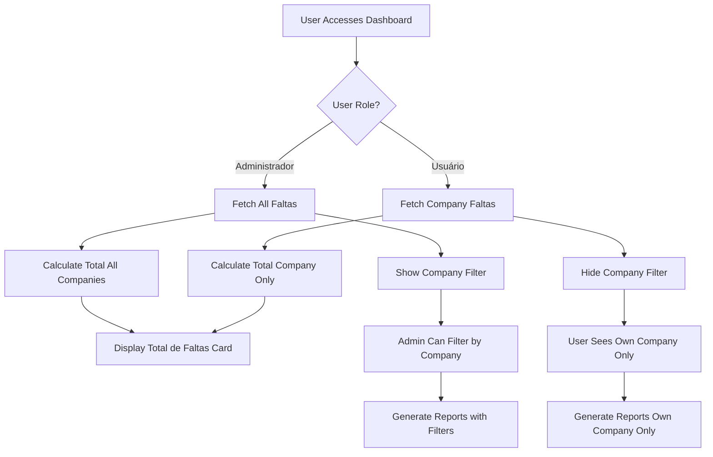

# RBAC Dashboard Implementation Plan

## Overview

This plan implements role-based access control (RBAC) requirements for the VisuLab application, specifically focusing on Dashboard visibility and navigation restrictions.

## Requirements

### Administradores
- ✅ Have access to all pages (already implemented in Navbar)
- ❌ "Total de Faltas" card must show total across ALL companies, independent of company filter
- ✅ Can view faltas from any company (already implemented in service layer)

### Usuários
- ✅ Only see "Painel" and "Faltas" in navbar (already implemented in Navbar)
- ❌ Can only view faltas from their own company
- ❌ Dashboard should only show data for their company

## Current State Analysis

### ✅ Already Implemented

1. **AuthContext** (`src/contexts/AuthContext.tsx`)
   - Manages user authentication with `role` and `empresa_id`
   - Role values: 'Administrador' or 'Usuário'

2. **Visibility Helpers** (`lib/utils/visibility/visibilityHelpers.ts`)
   - `isAdmin(user)` - Checks if user is admin
   - `getFaltasVisibilityFilter(user)` - Returns filter based on role
   - All permission checks implemented

3. **FaltasService** (`services/faltasService.ts`)
   - `getByUserVisibility(user)` - Filters faltas by role
   - Admins see all, users see only their company's faltas

4. **Navbar** (`components/Navbar.tsx`)
   - Lines 98-106: Filters nav items based on `userProfile.role`
   - Admin-only items: Usuários, Empresas, Compras
   - Regular users only see: Painel, Faltas

5. **Shortages Page** (`pages/Shortages.tsx`)
   - Line 79: Uses `faltasService.getByUserVisibility(currentUser)`
   - Correctly filters history based on user role

### ❌ Issues Found

1. **Dashboard.tsx** - Line 175
   - Currently uses `faltasService.getAll()` which fetches ALL faltas
   - Does NOT apply role-based filtering
   - Both admins and regular users see all data

2. **Dashboard "Total de Faltas" Card**
   - Shows total from filtered data, not respecting admin requirement
   - Admins should see total across ALL companies regardless of filter

3. **Dashboard Company Filter**
   - For regular users: Should be disabled or hidden
   - They can only see their own company's data anyway

## Implementation Plan

### Phase 1: Update Dashboard Data Fetching

**File:** `pages/Dashboard.tsx`

**Changes:**

1. Import `useAuth` hook and get current user
2. Replace `faltasService.getAll()` with `faltasService.getByUserVisibility(currentUser)`
3. Update `fetchDashboardData` function to pass user context

```typescript
// Add import at top
import { useAuth } from '../src/contexts/AuthContext';

// Inside Dashboard component
const { user: currentUser } = useAuth();

// Update fetchDashboardData function (around line 155)
const fetchDashboardData = useCallback(async () => {
    console.log('🔄 [DASHBOARD] Fetching dashboard data...');
    setIsChartLoading(true);
    setError(null);

    try {
        // Load Options in parallel
        const [empresas, indices, tratamientos] = await Promise.all([
            empresasService.getAll(),
            indicesService.getAllActive(),
            tratamentosService.getAllActive()
        ]);

        setCompanyOptions(['Todas', ...empresas.filter(e => e.tipo === 'Matriz' || e.tipo === 'Filial').map(e => e.nome)]);
        setIndexOptions(['Todos', ...indices.map(i => i.nome)]);
        setTreatmentOptions(['Todos', ...tratamientos.map(t => t.nome)]);

        // ✅ CHANGE: Use getByUserVisibility instead of getAll
        const dbData = await faltasService.getByUserVisibility(currentUser);
        
        // ... rest of the code remains the same
```

### Phase 2: Fix "Total de Faltas" Card for Admins

**File:** `pages/Dashboard.tsx`

**Requirement:** Admins should see total across ALL companies, regardless of company filter.

**Implementation:**

1. Add separate state for admin total (all companies)
2. Fetch admin total separately when user is admin
3. Display admin total in KPI card for admins

```typescript
// Add new state variable
const [adminTotalShortages, setAdminTotalShortages] = useState(0);

// In fetchDashboardData, after fetching dbData:
// Fetch admin total separately for admins
if (isAdmin(currentUser)) {
    const allFaltas = await faltasService.getAll();
    const adminTotal = allFaltas.reduce((sum, f) => sum + (f.quantidade || 1), 0);
    setAdminTotalShortages(adminTotal);
}

// Update KPI card display (around line 489)
<h3 className="text-2xl md:text-3xl font-black text-slate-900 dark:text-white mt-1">
    {isAdmin(currentUser) ? adminTotalShortages : totalShortages}
</h3>
```

### Phase 3: Handle Company Filter for Regular Users

**File:** `pages/Dashboard.tsx`

**Changes:**

1. Hide or disable company filter for regular users
2. Set default company filter to user's company for regular users
3. Prevent regular users from changing company filter

```typescript
// Update analyticsFilters initialization (around line 134)
const [analyticsFilters, setAnalyticsFilters] = useState(() => {
    if (currentUser?.role === 'Administrador') {
        return {
            company: 'Todas',
            range: '7 Dias',
            customStartDate: '',
            customEndDate: ''
        };
    } else {
        // Regular user - default to their company
        const companyName = currentUser?.company || '';
        return {
            company: companyName,
            range: '7 Dias',
            customStartDate: '',
            customEndDate: ''
        };
    }
});

// Update company filter rendering (around line 556-564)
{currentUser?.role === 'Administrador' && (
    <div className="min-w-[160px] px-2">
        <CustomSelect
            label="Empresa"
            value={analyticsFilters.company}
            onChange={(val) => handleAnalyticsChange('company', val)}
            options={companyOptions}
            triggerClassName="bg-transparent border-none p-0 !px-0"
        />
    </div>
)}
```

### Phase 4: Update Report Generation

**File:** `pages/Dashboard.tsx`

**Changes:**

1. Apply role-based filtering to report generation
2. Regular users can only generate reports for their company

```typescript
// Update handleExportTxt function (around line 396)
const handleExportTxt = () => {
    setIsExporting(true);

    // Start with all data based on user visibility
    let filteredReportData = allShortages;

    // Filter by company (only for admins)
    if (currentUser?.role === 'Administrador' && reportFilters.company && reportFilters.company !== 'Todas') {
        filteredReportData = filteredReportData.filter(item => item.company === reportFilters.company);
    }

    // ... rest of filtering logic remains the same
```

### Phase 5: Update Report Filter UI

**File:** `pages/Dashboard.tsx`

**Changes:**

1. Hide company filter in report generation for regular users
2. Only show for admins

```typescript
// Update report filter rendering (around line 838-845)
{currentUser?.role === 'Administrador' && (
    <div className="space-y-1.5">
        <CustomSelect
            label="Empresa"
            value={reportFilters.company}
            onChange={(val) => handleReportFilterChange('company', val)}
            options={companyOptions}
        />
    </div>
)}
```

## Architecture Diagram



## Implementation Checklist

### Phase 1: Dashboard Data Fetching
- [ ] Import `useAuth` hook in Dashboard.tsx
- [ ] Get `currentUser` from auth context
- [ ] Replace `faltasService.getAll()` with `getByUserVisibility(currentUser)`
- [ ] Test admin sees all faltas
- [ ] Test regular user sees only their company's faltas

### Phase 2: Total de Faltas Card
- [ ] Add `adminTotalShortages` state variable
- [ ] Fetch admin total separately for admins
- [ ] Update KPI card to display admin total for admins
- [ ] Test admin sees total across all companies
- [ ] Test regular user sees total for their company only

### Phase 3: Company Filter
- [ ] Update analyticsFilters initialization based on role
- [ ] Hide company filter for regular users
- [ ] Set default company to user's company for regular users
- [ ] Test admin can filter by company
- [ ] Test regular user cannot change company filter

### Phase 4: Report Generation
- [ ] Apply role-based filtering to `handleExportTxt`
- [ ] Hide company filter in report UI for regular users
- [ ] Test admin can generate reports for any company
- [ ] Test regular user can only generate reports for their company

### Phase 5: Testing & Validation
- [ ] Test admin user sees all faltas in Dashboard
- [ ] Test admin "Total de Faltas" shows total across all companies
- [ ] Test admin can filter by company in analytics
- [ ] Test admin can generate reports for any company
- [ ] Test regular user sees only their company's faltas
- [ ] Test regular user "Total de Faltas" shows their company only
- [ ] Test regular user cannot see company filter
- [ ] Test regular user navbar shows only Dashboard and Shortages
- [ ] Test regular user cannot access Users, Companies, or Purchases pages

## Testing Strategy

### Test Cases for Administradores

1. **Dashboard Visibility**
   - Login as admin
   - Navigate to Dashboard
   - Verify: All faltas from all companies are displayed in charts
   - Verify: "Total de Faltas" shows sum across ALL companies
   - Verify: Company filter is visible and functional

2. **Company Filter**
   - Select specific company in filter
   - Verify: Charts update to show only that company's data
   - Verify: "Total de Faltas" STILL shows total across ALL companies (requirement)
   - Verify: Recent activity shows only selected company's faltas

3. **Report Generation**
   - Open report generation section
   - Verify: Company filter is visible
   - Select specific company
   - Verify: Report contains only that company's data
   - Select "Todas"
   - Verify: Report contains all companies' data

4. **Navigation**
   - Verify: All menu items visible (Painel, Faltas, Usuários, Empresas, Compras)
   - Verify: Can access all pages

### Test Cases for Usuários

1. **Dashboard Visibility**
   - Login as regular user (e.g., from "Matriz")
   - Navigate to Dashboard
   - Verify: Only faltas from "Matriz" are displayed
   - Verify: "Total de Faltas" shows total for "Matriz" only
   - Verify: Company filter is NOT visible

2. **Analytics**
   - Verify: Cannot change company filter
   - Verify: Charts show only user's company data
   - Verify: Recent activity shows only user's company's faltas

3. **Report Generation**
   - Open report generation section
   - Verify: Company filter is NOT visible
   - Verify: Can only generate reports for own company
   - Verify: Reports contain only user's company's data

4. **Navigation**
   - Verify: Only "Painel" and "Faltas" visible in navbar
   - Verify: Cannot see "Usuários", "Empresas", or "Compras"
   - Verify: Attempting to access restricted pages shows error or redirects

5. **Shortages Page**
   - Navigate to Faltas page
   - Verify: History modal shows only user's company's faltas
   - Verify: Creating new falta assigns correct empresa_id

## Security Considerations

1. **Defense in Depth**
   - Service layer filtering (primary)
   - UI component restrictions (secondary)
   - Database RLS policies (tertiary - optional)

2. **Edge Cases**
   - User without empresa_id: Should throw error
   - User with null role: Should be treated as regular user
   - Admin user without empresa_id: Should still see all data

3. **Data Integrity**
   - Ensure regular users cannot bypass filters via direct API calls
   - Validate empresa_id on create operations
   - Prevent cross-company data access

## Migration Notes

### Breaking Changes
- None - this is an enhancement to existing functionality

### Backward Compatibility
- Existing admin functionality preserved
- Regular users get restricted access (improvement)

## Success Criteria

✅ Administradores can:
- Access all pages in the application
- View all faltas from all companies in Dashboard
- See "Total de Faltas" showing total across ALL companies (independent of filter)
- Filter Dashboard analytics by company
- Generate reports for any company

✅ Usuários can:
- Access only Dashboard and Shortages pages
- View only their own company's faltas in Dashboard
- See "Total de Faltas" showing total for their company only
- Generate reports only for their company
- Cannot see or use company filters

✅ Both roles:
- Cannot delete faltas (already enforced)
- See appropriate navigation items based on role
- Have data properly isolated by company

## Conclusion

This implementation ensures proper role-based access control for the Dashboard while maintaining the existing functionality for admins and providing appropriate restrictions for regular users. The changes are minimal and focused, leveraging the existing infrastructure in the codebase.
