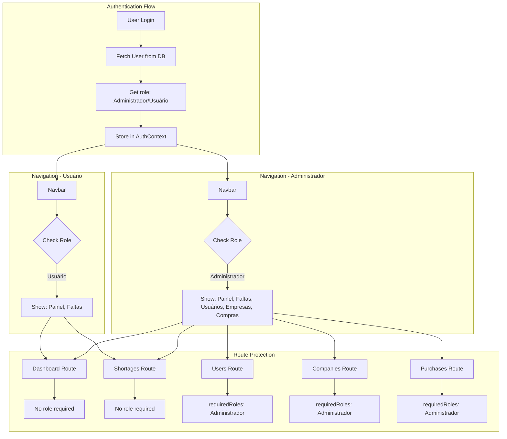

# Role-Based Access Control (RBAC) Implementation Plan

## Overview
Implement proper role-based access control to separate administrators from regular users in the VisuLab application.

## Current State Analysis

### ✅ Already Implemented
- Database `usuarios` table has `role` column with values: 'Administrador' or 'Usuário'
- `AuthUser` type includes role field
- `AuthContext` provides `hasRole()` and `hasPermission()` utility functions
- `ProtectedRoute` component supports role-based access control via `requiredRoles` prop
- `Navbar` component has `adminOnly: true` flags on admin nav items
- Login process fetches user's role from database (AuthContext.tsx lines 614-630)

### ❌ Issues Found
1. **Hardcoded admin role override** in `Navbar.tsx` line 38:
   ```typescript
   role: 'Administrador', // user.role  <-- This forces all users to be admins
   ```

2. **Missing role enforcement** in `App.tsx` admin routes:
   - Users, Companies, and Purchases routes don't use `requiredRoles` prop
   - Any authenticated user can access these pages

## Architecture Diagram



## Access Control Matrix

| Page/Feature | Administrador | Usuário |
|--------------|---------------|---------|
| Dashboard (/dashboard) | ✅ | ✅ |
| Faltas (/shortages) | ✅ | ✅ |
| Usuários (/users) | ✅ | ❌ |
| Empresas (/companies) | ✅ | ❌ |
| Compras (/purchases) | ✅ | ❌ |

## Implementation Steps

### Step 1: Remove Hardcoded Admin Role Override
**File:** [`components/Navbar.tsx`](components/Navbar.tsx:38)

**Change:**
```typescript
// BEFORE (line 38)
role: 'Administrador', // user.role

// AFTER
role: user.role
```

**Impact:** This will allow the actual role from the database to be used instead of forcing all users to be administrators.

---

### Step 2: Add Role-Based Access Control to Admin Routes
**File:** [`App.tsx`](App.tsx:110-145)

**Changes:**

#### Users Route (lines 110-117)
```typescript
// BEFORE
<Route
  path="/users"
  element={
    <ProtectedRoute>
      <Users />
    </ProtectedRoute>
  }
/>

// AFTER
<Route
  path="/users"
  element={
    <ProtectedRoute requiredRoles={['Administrador']}>
      <Users />
    </ProtectedRoute>
  }
/>
```

#### Companies Route (lines 124-131)
```typescript
// BEFORE
<Route
  path="/companies"
  element={
    <ProtectedRoute>
      <Companies />
    </ProtectedRoute>
  }
/>

// AFTER
<Route
  path="/companies"
  element={
    <ProtectedRoute requiredRoles={['Administrador']}>
      <Companies />
    </ProtectedRoute>
  }
/>
```

#### Purchases Route (lines 138-145)
```typescript
// BEFORE
<Route
  path="/purchases"
  element={
    <ProtectedRoute>
      <Purchases />
    </ProtectedRoute>
  }
/>

// AFTER
<Route
  path="/purchases"
  element={
    <ProtectedRoute requiredRoles={['Administrador']}>
      <Purchases />
    </ProtectedRoute>
  }
/>
```

**Impact:** These changes will prevent regular users from accessing admin-only pages, even if they try to navigate directly to the URL.

---

### Step 3: Verify Role Fetching During Login
**File:** [`src/contexts/AuthContext.tsx`](src/contexts/AuthContext.tsx:614-630)

**Current Implementation (already correct):**
```typescript
// Lines 614-630
const { supabase } = await import('../../lib/supabase');
const { data: userData, error: userError } = await supabase
    .from('usuarios')
    .select('empresa_id')
    .eq('id', session.user.id)
    .single();

if (userError) {
    console.warn('Failed to fetch empresa_id:', userError);
}

const userWithEmpresa = {
    ...session.user,
    empresa_id: userData?.empresa_id
};
```

**Required Enhancement:**
The current implementation only fetches `empresa_id`. We need to also fetch the `role` field from the database.

**Change:**
```typescript
// BEFORE
const { data: userData, error: userError } = await supabase
    .from('usuarios')
    .select('empresa_id')
    .eq('id', session.user.id)
    .single();

// AFTER
const { data: userData, error: userError } = await supabase
    .from('usuarios')
    .select('empresa_id, role')
    .eq('id', session.user.id)
    .single();
```

And update the user object:
```typescript
// BEFORE
const userWithEmpresa = {
    ...session.user,
    empresa_id: userData?.empresa_id
};

// AFTER
const userWithEmpresa = {
    ...session.user,
    empresa_id: userData?.empresa_id,
    role: userData?.role || 'Usuário' // Default to regular user if role is missing
};
```

**Impact:** This ensures the user's role is properly fetched from the database and stored in the auth context.

---

## Testing Checklist

### Test 1: Administrator Access
1. Login as an administrator user
2. **Expected:** All nav items visible (Painel, Faltas, Usuários, Empresas, Compras)
3. **Expected:** Admin badge displayed in profile section
4. **Expected:** Can access all pages (Dashboard, Shortages, Users, Companies, Purchases)
5. **Expected:** Can navigate to admin pages without errors

### Test 2: Regular User Access
1. Login as a regular user (role: 'Usuário')
2. **Expected:** Only 2 nav items visible (Painel, Faltas)
3. **Expected:** No admin badge in profile section
4. **Expected:** Can access Dashboard and Shortages pages
5. **Expected:** Cannot access Users, Companies, or Purchases pages
6. **Expected:** Attempting to access admin pages shows AccessDenied screen

### Test 3: Direct URL Access
1. Login as a regular user
2. Try to navigate directly to `/users`, `/companies`, or `/purchases`
3. **Expected:** Redirected to AccessDenied page with message
4. **Expected:** Cannot bypass role restrictions

### Test 4: Role Persistence
1. Login as administrator
2. Refresh the page
3. **Expected:** Admin role persists, all nav items still visible
4. Logout and login as regular user
5. **Expected:** Regular user role, only 2 nav items visible

## Security Considerations

### Client-Side vs Server-Side
- ✅ **Client-Side:** Navbar filtering provides immediate UI feedback
- ✅ **Client-Side:** ProtectedRoute with requiredRoles prevents route access
- ✅ **Server-Side:** RLS policies in database enforce data-level security
- ⚠️ **Important:** Both layers work together for defense in depth

### RLS Policies
According to [`database-schema-summary.md`](database-schema-summary.md:178-185):
- `auth.uid()` returns the ID of the logged-in user
- `auth.is_admin()` returns `true` if the logged-in user has role 'Administrador'
- Regular users can only see data from their own company
- Only administrators can manage users, companies, and purchases

### Notes
1. The frontend role-based access control provides UX improvements and prevents unnecessary API calls
2. RLS policies provide the ultimate security layer at the database level
3. Both should be implemented together for complete security

## Files to Modify

1. [`components/Navbar.tsx`](components/Navbar.tsx:38) - Remove hardcoded admin role
2. [`App.tsx`](App.tsx:110-145) - Add requiredRoles to admin routes
3. [`src/contexts/AuthContext.tsx`](src/contexts/AuthContext.tsx:614-630) - Fetch role from database

## Estimated Complexity
- **Low complexity** - All infrastructure is already in place
- **Minimal code changes** - Only 3 files need modifications
- **Low risk** - Changes are straightforward and well-isolated

## Rollback Plan
If issues arise:
1. Revert `Navbar.tsx` line 38 to `role: 'Administrador'`
2. Remove `requiredRoles` props from `App.tsx` routes
3. Revert `AuthContext.tsx` to original select query

## Success Criteria
- ✅ Administrators see all 5 nav items
- ✅ Regular users see only 2 nav items (Painel, Faltas)
- ✅ Regular users cannot access admin pages
- ✅ Role is properly fetched from database
- ✅ Role persists across page refreshes
