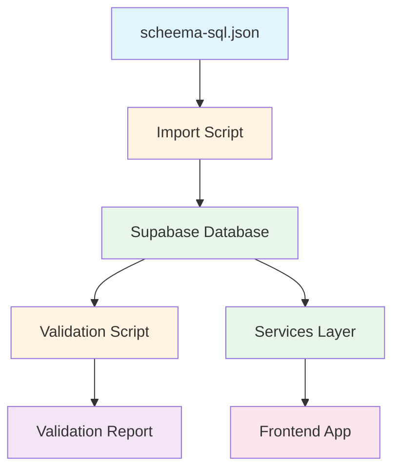
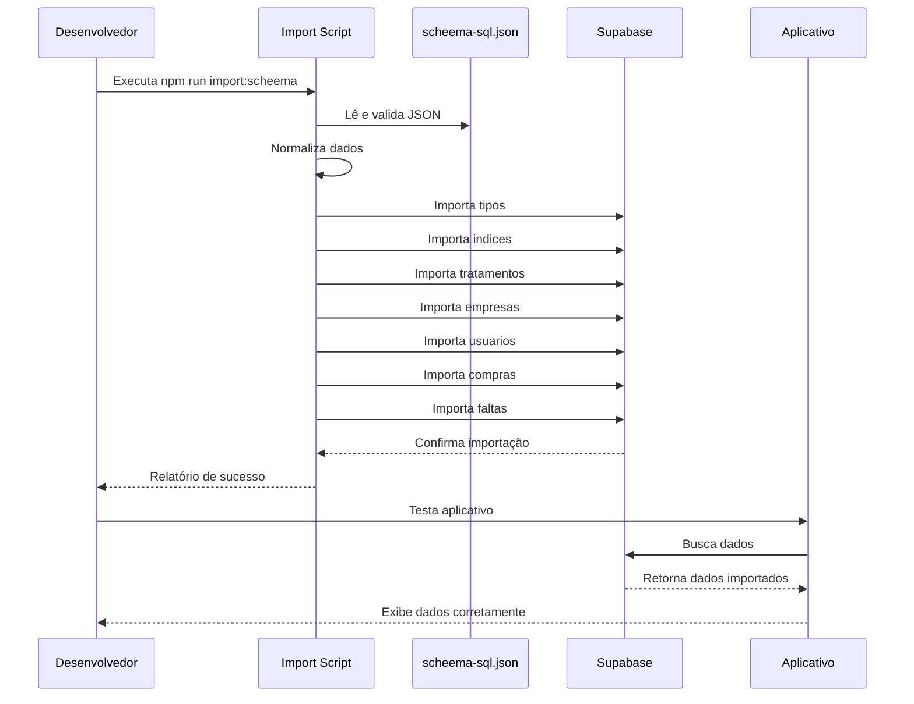

# Plano de Integração do scheema-sql.json

## Objetivo
Integrar o arquivo `scheema-sql.json` no projeto VisuLab para carregar dados reais do banco de dados no aplicativo.

## Análise Inicial

### Estrutura do Arquivo scheema-sql.json
O arquivo contém dados exportados do Supabase com a seguinte estrutura:
```json
[
  {
    "export_all_public_tables": {
      "tipos": [...],
      "faltas": [...],
      "compras": [...],
      "indices": [...],
      "empresas": [...],
      "usuarios": [...],
      "tratamentos": [...]
    }
  }
]
```

### Tabelas e Dados Existentes
- **tipos**: 2 registros (Incolor, Photo)
- **faltas**: 2 registros com relacionamentos completos
- **compras**: 2 registros (Hoya, Essilor)
- **indices**: 8 registros (1.49, 1.53, 1.56, 1.59, 1.60, 1.61, 1.67, 1.74)
- **empresas**: 4 registros (AMX, Master, Ultra Optics, GBO)
- **usuarios**: 1 registro (Junior - Administrador)
- **tratamentos**: 4 registros (Incolor, AR, Filtro Azul, BlueCut)

### Discrepâncias Identificadas

1. **Nome da tabela de tratamentos**:
   - Schema YAML: `tratamientos` (espanhol)
   - Serviços TypeScript: `tratamentos` (português)
   - Arquivo JSON: `tratamentos` (português)
   - **Ação**: Verificar qual nome está correto no banco Supabase

2. **Tipos de dados**:
   - JSON usa valores específicos (ex: role "Administrador")
   - TypeScript enum usa valores diferentes (ex: role "admin")
   - **Ação**: Normalizar valores durante importação

## Arquitetura da Solução

### Componentes a Criar



## Plano de Implementação

### Fase 1: Script de Importação

**Arquivo**: `scripts/import-scheema-json.ts`

**Funcionalidades**:
1. Ler o arquivo `scheema-sql.json`
2. Validar estrutura do JSON
3. Normalizar dados (converter nomes, tipos, etc.)
4. Importar dados para o Supabase na ordem correta (respeitando FKs)
5. Gerar relatório de importação

**Ordem de Importação** (respeitando dependências):
1. `tipos` (sem dependências)
2. `indices` (sem dependências)
3. `tratamentos` (sem dependências)
4. `empresas` (sem dependências)
5. `usuarios` (depende de empresas)
6. `compras` (sem dependências)
7. `faltas` (depende de todos acima)

**Estrutura do Script**:
```typescript
interface ScheemaData {
  export_all_public_tables: {
    tipos: Tipo[];
    indices: Indice[];
    tratamentos: Tratamento[];
    empresas: Empresa[];
    usuarios: Usuario[];
    compras: Compra[];
    faltas: Falta[];
  };
}
```

### Fase 2: Script de Validação

**Arquivo**: `scripts/validate-scheema.ts`

**Funcionalidades**:
1. Ler dados do arquivo `scheema-sql.json`
2. Buscar dados atuais do Supabase
3. Comparar registros (quantidade, valores, relacionamentos)
4. Identificar discrepâncias
5. Gerar relatório detalhado

**Validações**:
- Contagem de registros por tabela
- Integridade de FKs
- Consistência de tipos de dados
- Valores obrigatórios presentes
- Timestamps válidos

### Fase 3: Integração com Scripts Existentes

**Atualização de `scripts/seed-database.ts`**:
- Adicionar opção para usar dados do `scheema-sql.json`
- Manter dados de teste existentes como fallback
- Permitir escolha entre fontes de dados

### Fase 4: Testes

**Testes de Importação**:
1. Importar dados do JSON em banco limpo
2. Verificar se todos os registros foram inseridos
3. Validar relacionamentos
4. Testar aplicativo com dados importados

**Testes de Validação**:
1. Validar dados do JSON vs banco atual
2. Validar após modificações no banco
3. Validar após importação

### Fase 5: Documentação

**Documentos a criar**:
1. README em `scripts/README.md`
2. Guia de uso do `scheema-sql.json`
3. Troubleshooting de importação

## Detalhes Técnicos

### Normalização de Dados

**Mapeamento de Roles**:
```typescript
const ROLE_MAPPING = {
  'Administrador': 'admin',
  'Usuário': 'user'
};
```

**Mapeamento de Status**:
```typescript
const STATUS_MAPPING = {
  'Active': 'Active',
  'Ativa': 'Ativa',
  'Inativa': 'Inativa'
};
```

### Tratamento de Erros

**Estratégias**:
- Continuar importação mesmo com erros em registros individuais
- Logar todos os erros com detalhes
- Gerar relatório final com estatísticas
- Opção de rollback (opcional)

### Comandos npm

```json
{
  "scripts": {
    "import:scheema": "tsx scripts/import-scheema-json.ts",
    "validate:scheema": "tsx scripts/validate-scheema.ts",
    "seed:from-json": "tsx scripts/seed-database.ts --from-json"
  }
}
```

## Fluxo de Trabalho



## Checklist de Implementação

### Fase 1: Script de Importação
- [ ] Criar estrutura do script `scripts/import-scheema-json.ts`
- [ ] Implementar leitura do arquivo JSON
- [ ] Implementar validação da estrutura do JSON
- [ ] Implementar normalização de dados
- [ ] Implementar importação em ordem correta
- [ ] Implementar tratamento de erros
- [ ] Implementar geração de relatório
- [ ] Adicionar script ao package.json

### Fase 2: Script de Validação
- [ ] Criar estrutura do script `scripts/validate-scheema.ts`
- [ ] Implementar leitura do arquivo JSON
- [ ] Implementar busca de dados do Supabase
- [ ] Implementar comparação de registros
- [ ] Implementar validação de FKs
- [ ] Implementar geração de relatório
- [ ] Adicionar script ao package.json

### Fase 3: Integração
- [ ] Atualizar `scripts/seed-database.ts` (opcional)
- [ ] Testar importação em banco limpo
- [ ] Testar aplicativo com dados importados
- [ ] Validar todas as funcionalidades

### Fase 4: Documentação
- [ ] Criar `scripts/README.md`
- [ ] Documentar uso do `scheema-sql.json`
- [ ] Documentar troubleshooting
- [ ] Adicionar exemplos de uso

## Riscos e Mitigações

### Risco 1: Inconsistência de nomes de tabelas
**Mitigação**: Verificar nome correto da tabela de tratamentos no Supabase antes da importação

### Risco 2: Conflitos de IDs
**Mitigação**: Usar upsert com onConflict para evitar duplicatas

### Risco 3: Dados corrompidos no JSON
**Mitigação**: Validação rigorosa antes da importação

### Risco 4: RLS policies bloqueando importação
**Mitigação**: Usar service role key para importação ou desabilitar RLS temporariamente

## Próximos Passos

1. Verificar nome correto da tabela de tratamentos no Supabase
2. Criar script de importação
3. Criar script de validação
4. Testar importação
5. Documentar processo

## Referências

- Arquivo JSON: `scheema-sql.json`
- Schema YAML: `specs/database_scheema.yaml`
- Serviços existentes: `services/*.ts`
- Scripts de seed: `scripts/seed-database.ts`
