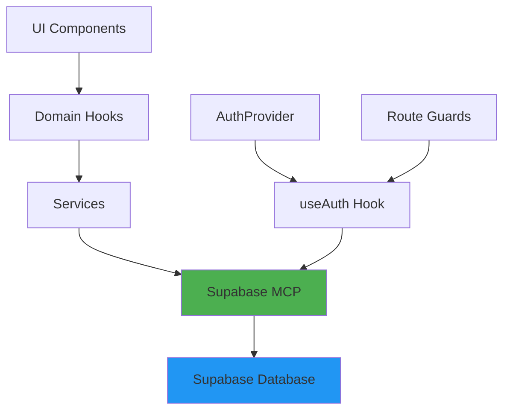

# Supabase MCP Integration Plan

## Project Configuration

**Supabase URL**: `https://bcakjdsqariofrtkncxc.supabase.co`
**Supabase Anon Key**: `sb_publishable_becWoSMcxNE8dJZ95qLnJw_lUkkxNXE`

## Executive Summary

This plan outlines integration of Supabase MCP (Model Context Protocol) to make VisuLab application fully functional with real data and authentication. The plan follows the established architecture pattern: **UI → Domain Hooks → Services → Supabase MCP**.

## Current State Analysis

### Existing Infrastructure

| Component | Status | Notes |
|-----------|--------|-------|
| Supabase Client | Partial | [`lib/supabase.ts`](lib/supabase.ts) exists with mock fallback |
| AuthContext | Mock | [`src/contexts/AuthContext.tsx`](src/contexts/AuthContext.tsx) uses mock API client |
| Domain Hooks | Complete | [`src/hooks/domain/empresas.ts`](src/hooks/domain/empresas.ts) uses ServiceRegistry |
| Services | Complete | [`src/services/empresas/EmpresasService.ts`](src/services/empresas/EmpresasService.ts) extends BaseService |
| Repositories | Complete | [`lib/dal/repositories/empresasRepository.ts`](lib/dal/repositories/empresasRepository.ts) exists |
| ApiClient | Complete | [`src/lib/apiClient.ts`](src/lib/apiClient.ts) provides HTTP client |

### Identified Gaps

1. **No Supabase MCP Connection** - The app uses ApiClient (HTTP) instead of Supabase MCP
2. **AuthContext uses Mock** - Login page uses mock delay, not real Supabase Auth
3. **Missing Environment Variables** - No Supabase URL/Anon Key in `.env.local`
4. **No Route Protection** - Private pages accessible without authentication
5. **Services use HTTP** - BaseService calls ApiClient instead of Supabase MCP

## Architecture Overview

### Target Data Flow



### Layer Responsibilities

| Layer | Responsibility | Example |
|-------|---------------|---------|
| UI | Display data, handle user events | [`pages/Companies.tsx`](pages/Companies.tsx) |
| Domain Hooks | TanStack Query integration, caching | [`src/hooks/domain/empresas.ts`](src/hooks/domain/empresas.ts) |
| Services | Business logic, data transformation | [`src/services/empresas/EmpresasService.ts`](src/services/empresas/EmpresasService.ts) |
| Supabase MCP | Database queries, RLS enforcement | New layer |
| AuthProvider | Authentication state, session management | [`src/contexts/AuthContext.tsx`](src/contexts/AuthContext.tsx) |

## Implementation Plan

### Phase 1: Environment Setup & Validation

**Goal:** Configure Supabase connection and validate MCP availability

#### Tasks

1. **Add Supabase Environment Variables**
   - File: `.env.local`
   - Variables needed:
     - `VITE_SUPABASE_URL`
     - `VITE_SUPABASE_ANON_KEY`
   - Update [`lib/supabase.ts`](lib/supabase.ts) to use `VITE_` prefix

2. **Create Supabase MCP Client**
   - File: `lib/integration/supabase/supabaseMcpClient.ts`
   - Purpose: Wrapper for Supabase MCP operations
   - Methods:
     - `query(table, filters)` - Query with RLS
     - `insert(table, data)` - Insert with RLS
     - `update(table, id, data)` - Update with RLS
     - `delete(table, id)` - Delete with RLS

3. **Validate Supabase Connection**
   - Create test script: `scripts/validate-supabase.ts`
   - Test:
     - Connection to Supabase
     - MCP availability
     - RLS policies
     - Table access

**Deliverables:**
- Updated `.env.local` with Supabase credentials
- `lib/integration/supabase/supabaseMcpClient.ts`
- Validation script

---

### Phase 2: Authentication Implementation

**Goal:** Implement real Supabase Auth with session persistence

#### Tasks

1. **Create Supabase Auth Service**
   - File: `src/services/auth/SupabaseAuthService.ts`
   - Methods:
     - `signIn(email, password)` - Login with Supabase
     - `signOut()` - Logout
     - `getCurrentUser()` - Get current user
     - `onAuthStateChange(callback)` - Listen to auth changes
     - `refreshSession()` - Refresh token

2. **Refactor AuthContext**
   - File: [`src/contexts/AuthContext.tsx`](src/contexts/AuthContext.tsx)
   - Changes:
     - Replace ApiClient with SupabaseAuthService
     - Use Supabase session for auth state
     - Persist session to localStorage
     - Handle token refresh automatically

3. **Create useAuth Hook**
   - File: `src/hooks/auth/useAuth.ts`
   - Export from AuthContext
   - Provide:
     - `user`, `isAuthenticated`, `isLoading`
     - `login()`, `logout()`
     - `hasRole()`, `hasPermission()`

4. **Update Login Page**
   - File: [`pages/Login.tsx`](pages/Login.tsx)
   - Changes:
     - Use `useAuth` hook
     - Call real Supabase Auth
     - Handle auth errors properly

5. **Create Route Protection**
   - File: `src/components/auth/ProtectedRoute.tsx`
   - Purpose: Wrap private routes
   - Behavior:
     - Redirect to login if not authenticated
     - Show loading while checking auth
     - Allow access if authenticated

6. **Update App.tsx**
   - File: [`App.tsx`](App.tsx)
   - Changes:
     - Wrap app with AuthProvider
     - Protect private routes with ProtectedRoute
     - Handle auth state initialization

**Deliverables:**
- `src/services/auth/SupabaseAuthService.ts`
- Refactored `src/contexts/AuthContext.tsx`
- `src/hooks/auth/useAuth.ts`
- `src/components/auth/ProtectedRoute.tsx`
- Updated `pages/Login.tsx`
- Updated `App.tsx`

---

### Phase 3: Pilot Entity Integration (Empresas)

**Goal:** Fully integrate Empresas entity with Supabase MCP

#### Tasks

1. **Create Supabase MCP Repository**
   - File: `lib/dal/repositories/supabase/empresasSupabaseRepository.ts`
   - Purpose: Repository using Supabase MCP
   - Methods:
     - `findWithFilters(filters)` - Query with RLS
     - `findById(id)` - Get by ID
     - `create(data)` - Insert
     - `update(id, data)` - Update
     - `delete(id)` - Soft delete
     - `updateStatus(id, status)` - Update status
     - `bulkUpdateStatus(ids, status)` - Bulk update

2. **Create Supabase Service for Empresas**
   - File: `src/services/empresas/EmpresasSupabaseService.ts`
   - Purpose: Service using Supabase MCP repository
   - Extends: BaseSupabaseService
   - Methods:
     - `getAll(options)` - Get all empresas
     - `getById(id)` - Get by ID
     - `create(data)` - Create empresa
     - `update(id, data)` - Update empresa
     - `delete(id)` - Delete empresa
     - `updateStatus(id, status)` - Update status
     - `bulkUpdateStatus(ids, status)` - Bulk update
     - `getByStatus(status)` - Filter by status
     - `getByTipo(tipo)` - Filter by tipo
     - `searchByNome(nome)` - Search by name

3. **Update ServiceRegistry**
   - File: [`src/services/core/ServiceRegistry.ts`](src/services/core/ServiceRegistry.ts)
   - Changes:
     - Add `empresasSupabaseService` instance
     - Add getter method
     - Optionally replace old service

4. **Update Domain Hooks**
   - File: [`src/hooks/domain/empresas.ts`](src/hooks/domain/empresas.ts)
   - Changes:
     - Use `empresasSupabaseService` instead of `empresasService`
     - Ensure hooks work with Supabase responses

5. **Verify UI Integration**
   - File: [`pages/Companies.tsx`](pages/Companies.tsx)
   - Verify:
     - List loads real data
     - Create works
     - Update works
     - Delete works
     - Search works
     - Filters work

**Deliverables:**
- `lib/dal/repositories/supabase/empresasSupabaseRepository.ts`
- `src/services/empresas/EmpresasSupabaseService.ts`
- Updated `src/services/core/ServiceRegistry.ts`
- Updated `src/hooks/domain/empresas.ts`
- Verified `pages/Companies.tsx`

---

### Phase 4: Replicate Pattern to Remaining Entities

**Goal:** Apply same pattern to all other entities

#### Tasks

For each entity (Usuarios, Faltas, Compras, Indices, Tipos, Tratamientos):

1. **Create Supabase Repository**
   - Pattern: `lib/dal/repositories/supabase/{entity}SupabaseRepository.ts`

2. **Create Supabase Service**
   - Pattern: `src/services/{entity}/{Entity}SupabaseService.ts`

3. **Update ServiceRegistry**
   - Add new service instance
   - Add getter method

4. **Update Domain Hooks**
   - Use new Supabase service

5. **Verify UI Integration**
   - Test all CRUD operations

**Entities to migrate:**
- Usuarios
- Faltas
- Compras
- Indices
- Tipos
- Tratamientos

**Deliverables:**
- 6 Supabase repositories
- 6 Supabase services
- Updated ServiceRegistry
- Updated domain hooks
- Verified UI for all entities

---

### Phase 5: Final Validation & Cleanup

**Goal:** Ensure everything works end-to-end

#### Tasks

1. **End-to-End Testing**
   - Test login/logout flow
   - Test all CRUD operations for each entity
   - Test RLS policies
   - Test error handling

2. **Remove Mock Code**
   - Remove mock client from [`lib/supabase.ts`](lib/supabase.ts)
   - Remove mock delay from Login page
   - Remove any MSW or fake data

3. **Update Documentation**
   - Update README with Supabase setup instructions
   - Document environment variables
   - Document RLS policies

4. **Code Review**
   - Ensure no auth logic in domain hooks
   - Ensure all services use Supabase MCP
   - Ensure proper error handling

**Deliverables:**
- Clean codebase
- Updated documentation
- Working application

---

## File Structure

### New Files to Create

```
lib/integration/supabase/
  └── supabaseMcpClient.ts          # Supabase MCP wrapper

lib/dal/repositories/supabase/
  ├── empresasSupabaseRepository.ts  # Empresas repository with MCP
  ├── usuariosSupabaseRepository.ts  # Usuarios repository with MCP
  ├── faltasSupabaseRepository.ts   # Faltas repository with MCP
  ├── comprasSupabaseRepository.ts  # Compras repository with MCP
  ├── indicesSupabaseRepository.ts  # Indices repository with MCP
  ├── tiposSupabaseRepository.ts    # Tipos repository with MCP
  └── tratamientosSupabaseRepository.ts  # Tratamientos repository with MCP

src/services/auth/
  └── SupabaseAuthService.ts        # Supabase Auth service

src/services/empresas/
  └── EmpresasSupabaseService.ts    # Empresas service with MCP

src/services/usuarios/
  └── UsuariosSupabaseService.ts    # Usuarios service with MCP

src/services/faltas/
  └── FaltasSupabaseService.ts     # Faltas service with MCP

src/services/compras/
  └── ComprasSupabaseService.ts    # Compras service with MCP

src/services/indices/
  └── IndicesSupabaseService.ts    # Indices service with MCP

src/services/tipos/
  └── TiposSupabaseService.ts      # Tipos service with MCP

src/services/tratamientos/
  └── TratamientosSupabaseService.ts  # Tratamientos service with MCP

src/hooks/auth/
  └── useAuth.ts                   # Auth hook (export from AuthContext)

src/components/auth/
  └── ProtectedRoute.tsx            # Route protection component

scripts/
  └── validate-supabase.ts         # Supabase connection validation
```

### Files to Modify

```
.env.local                          # Add Supabase credentials
lib/supabase.ts                     # Use VITE_ prefix, remove mock
src/contexts/AuthContext.tsx         # Use SupabaseAuthService
src/services/core/ServiceRegistry.ts # Add Supabase services
src/hooks/domain/empresas.ts        # Use Supabase service
src/hooks/domain/usuarios.ts        # Use Supabase service
src/hooks/domain/faltas.ts         # Use Supabase service
src/hooks/domain/compras.ts        # Use Supabase service
src/hooks/domain/indices.ts        # Use Supabase service
src/hooks/domain/tipos.ts          # Use Supabase service
src/hooks/domain/tratamientos.ts    # Use Supabase service
pages/Login.tsx                     # Use real Supabase Auth
App.tsx                            # Add AuthProvider and ProtectedRoute
README.md                          # Update documentation
```

---

## Environment Variables Required

Add to `.env.local` (already provided):

```bash
# Supabase Configuration
VITE_SUPABASE_URL=https://bcakjdsqariofrtkncxc.supabase.co
VITE_SUPABASE_ANON_KEY=sb_publishable_becWoSMcxNE8dJZ95qLnJw_lUkkxNXE
```

---

## Supabase Database Requirements

### Tables Required

The following tables must exist in Supabase (based on [`database_setup.sql`](database_setup.sql)):

- `empresas` - Companies/Labs
- `usuarios` - Users
- `faltas` - Shortages
- `compras` - Purchases
- `indices` - Indices
- `tipos` - Types
- `tratamientos` - Treatments

### RLS Policies Required

Each table should have RLS policies:

```sql
-- Enable RLS
ALTER TABLE empresas ENABLE ROW LEVEL SECURITY;

-- Policy: Allow authenticated users to read
CREATE POLICY "Authenticated users can read empresas"
ON empresas FOR SELECT
TO authenticated
USING (true);

-- Policy: Allow authenticated users to insert
CREATE POLICY "Authenticated users can insert empresas"
ON empresas FOR INSERT
TO authenticated
WITH CHECK (true);

-- Policy: Allow authenticated users to update
CREATE POLICY "Authenticated users can update empresas"
ON empresas FOR UPDATE
TO authenticated
USING (true);

-- Policy: Allow authenticated users to delete
CREATE POLICY "Authenticated users can delete empresas"
ON empresas FOR DELETE
TO authenticated
USING (true);
```

### Auth Tables

Supabase Auth provides these tables automatically:
- `auth.users` - User accounts
- `auth.sessions` - User sessions

---

## Architecture Rules

### 1. Separation of Concerns

| Layer | Should | Should Not |
|-------|---------|------------|
| UI | Handle user events, display data | Make direct API calls |
| Domain Hooks | Manage caching, loading states | Contain auth logic |
| Services | Business logic, data transformation | Access UI components |
| Repositories | Database queries | Contain business logic |
| AuthProvider | Manage auth state | Make database queries |

### 2. Auth Logic Centralization

- All auth logic must be in `AuthProvider`
- Domain hooks must NOT contain auth logic
- Services must NOT contain auth logic
- Use `useAuth` hook to access auth state

### 3. Data Flow Pattern

```
UI → useEmpresasList() → empresasSupabaseService.getAll() → empresasSupabaseRepository.findWithFilters() → Supabase MCP → Database
```

### 4. Error Handling

- Services should throw errors with meaningful messages
- Domain hooks should catch and handle errors
- UI should display user-friendly error messages
- Use existing error handling utilities

---

## Implementation Order

### Step-by-Step Execution

1. **Phase 1: Environment Setup**
   - Add environment variables
   - Create Supabase MCP client
   - Validate connection

2. **Phase 2: Auth Implementation**
   - Create Supabase Auth service
   - Refactor AuthContext
   - Create useAuth hook
   - Update Login page
   - Create ProtectedRoute
   - Update App.tsx

3. **Phase 3: Pilot Entity (Empresas)**
   - Create Supabase repository
   - Create Supabase service
   - Update ServiceRegistry
   - Update domain hooks
   - Verify UI

4. **Phase 4: Remaining Entities**
   - Repeat for each entity
   - Test each entity thoroughly

5. **Phase 5: Final Validation**
   - End-to-end testing
   - Remove mock code
   - Update documentation
   - Code review

---

## Risk Mitigation

| Risk | Mitigation |
|------|------------|
| Supabase MCP not available | Fallback to direct Supabase client |
| RLS policies blocking access | Verify policies during Phase 1 |
| Breaking existing UI | Test thoroughly after each phase |
| Auth state issues | Use Supabase's built-in session management |
| Performance issues | Implement proper caching with TanStack Query |

---

## Success Criteria

The implementation is successful when:

1. ✅ Users can log in with real Supabase Auth
2. ✅ Session persists across page refreshes
3. ✅ Private routes are protected
4. ✅ Empresas page shows real data from Supabase
5. ✅ All CRUD operations work for Empresas
6. ✅ Pattern is replicated to all entities
7. ✅ No mock code remains
8. ✅ RLS policies are respected
9. ✅ Error handling is robust
10. ✅ Documentation is updated

---

## Next Steps

After approval of this plan:

1. Switch to **Code mode**
2. Implement Phase 1 (Environment Setup)
3. Validate and test
4. Implement Phase 2 (Auth)
5. Validate and test
6. Implement Phase 3 (Pilot Entity)
7. Validate and test
8. Implement Phase 4 (Remaining Entities)
9. Implement Phase 5 (Final Validation)
10. Complete and deliver

---

## User Configuration Summary

**Confirmed Configuration:**
- ✅ Supabase URL: `https://bcakjdsqariofrtkncxc.supabase.co`
- ✅ Supabase Anon Key: `sb_publishable_becWoSMcxNE8dJZ95qLnJw_lUkkxNXE`
- ✅ Auth Method: Email/Password (standard Supabase Auth)
- ✅ RLS Policies: Assumed to exist (will validate during Phase 1)
- ✅ Existing Users: Will use existing users in Supabase Auth

**Configuration Complete:**
- ✅ Supabase URL: `https://bcakjdsqariofrtkncxc.supabase.co`
- ✅ Supabase Anon Key: `sb_publishable_becWoSMcxNE8dJZ95qLnJw_lUkkxNXE`
- ✅ Auth Method: Email/Password (standard Supabase Auth)
- ✅ RLS Policies: Assumed to exist (will validate during Phase 1)
- ✅ Existing Users: Will use existing users in Supabase Auth
- ✅ Existing Data: Preserve existing data in all tables
- ✅ User Roles: Administrador and Usuário (Admin and User)
