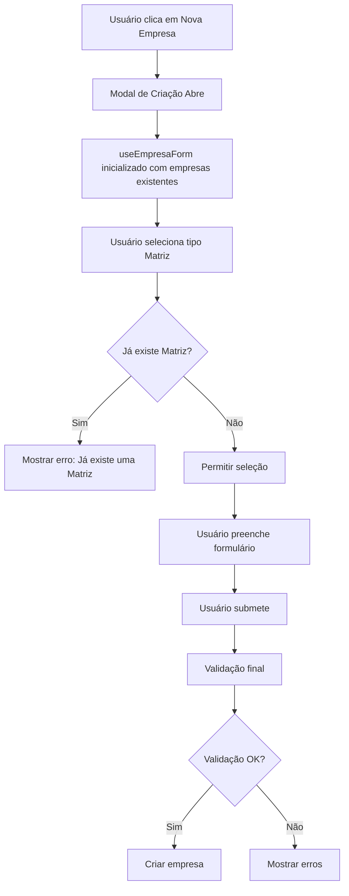

# Plano de Implementação - Validação de Matriz Única

## Objetivo
Impedir o cadastro de mais de uma empresa do tipo "Matriz". Se já existir uma Matriz cadastrada, não permitir a criação de nova empresa com esse tipo.

## Análise Atual

### Componentes Envolvidos
- **`src/components/EmpresaForm.tsx`** - Componente de formulário de empresas
- **`pages/Companies.tsx`** - Página de gerenciamento de empresas
- **`src/hooks/ui/useEmpresaForm.ts`** - Hook de gerenciamento de estado e validação do formulário
- **`services/empresasService.ts`** - Serviço de operações com empresas

### Fluxo Atual
1. Usuário clica em "Nova Empresa" em `Companies.tsx`
2. Modal é aberto com formulário `EmpresaForm.tsx`
3. Hook `useEmpresaForm` gerencia estado e validações
4. Ao submeter, chama `handleCreate` que usa `useCreateEmpresa`
5. Serviço `empresasService.create` insere no banco

## Solução Proposta

### Estratégia
Adicionar validação no nível do formulário para verificar se já existe uma Matriz antes de permitir a criação de nova empresa com esse tipo.

### Mudanças Necessárias

#### 1. **`services/empresasService.ts`**
Adicionar método para verificar existência de matriz:

```typescript
// Verificar se já existe uma Matriz cadastrada
async hasMatriz(): Promise<boolean> {
    const { data, error } = await supabase
        .from('empresas')
        .select('id')
        .eq('tipo', 'Matriz')
        .is('deleted_at', null)
        .limit(1);

    if (error) throw error;
    return data && data.length > 0;
}
```

#### 2. **`src/hooks/ui/useEmpresaForm.ts`**
Modificar hook para incluir validação de matriz única:

- Adicionar parâmetro `existingEmpresas` nas opções
- Adicionar validação no campo `tipo` para verificar se já existe matriz
- Mostrar erro apropriado quando tentar criar segunda matriz

```typescript
export interface UseEmpresaFormOptions {
    initialData?: Partial<EmpresaFormData>;
    onSubmit: (data: EmpresaFormData) => Promise<void>;
    onSuccess?: () => void;
    onError?: (error: Error) => void;
    existingEmpresas?: any[]; // Nova prop para validação
    isEditing?: boolean; // Nova prop para diferenciar create/edit
}
```

Validação no campo `tipo`:
```typescript
case 'tipo':
    if (!value) {
        return 'Tipo da empresa é obrigatório';
    }
    // Validar matriz única apenas em modo de criação
    if (value === 'Matriz' && !isEditing && existingEmpresas) {
        const hasMatriz = existingEmpresas.some((e: any) => e.tipo === 'Matriz');
        if (hasMatriz) {
            return 'Já existe uma Matriz cadastrada. Só pode existir uma Matriz.';
        }
    }
    break;
```

#### 3. **`pages/Companies.tsx`**
Atualizar para passar empresas existentes para o formulário:

- No modal de criação, passar lista de empresas para validação
- No modal de edição, não aplicar a validação de matriz única (permitir editar empresa existente)

## Diagrama de Fluxo



## Casos de Uso

### Caso 1: Criar primeira Matriz
- ✅ Nenhuma Matriz existe
- ✅ Usuário seleciona "Matriz"
- ✅ Validação passa
- ✅ Empresa é criada

### Caso 2: Tentar criar segunda Matriz
- ❌ Já existe uma Matriz
- ❌ Usuário seleciona "Matriz"
- ❌ Validação falha com mensagem: "Já existe uma Matriz cadastrada. Só pode existir uma Matriz."
- ❌ Empresa NÃO é criada

### Caso 3: Criar Filial ou Fornecedor
- ✅ Pode existir ou não Matriz
- ✅ Usuário seleciona "Filial" ou "Fornecedor"
- ✅ Validação passa
- ✅ Empresa é criada

### Caso 4: Editar empresa existente
- ✅ Seja qual for o tipo
- ✅ Validação de matriz única NÃO é aplicada
- ✅ Empresa é editada normalmente

## Considerações Importantes

1. **Modo de Edição**: A validação de matriz única deve ser aplicada APENAS em modo de criação, não em edição.

2. **Soft Delete**: A verificação deve considerar apenas empresas não deletadas (`deleted_at IS NULL`).

3. **Feedback ao Usuário**: A mensagem de erro deve ser clara e informativa.

4. **Performance**: A verificação deve ser eficiente - usar lista já carregada em memória em vez de nova consulta.

## Arquivos a Modificar

1. `services/empresasService.ts` - Adicionar método `hasMatriz()`
2. `src/hooks/ui/useEmpresaForm.ts` - Adicionar validação de matriz única
3. `pages/Companies.tsx` - Passar empresas existentes para o formulário

## Testes Manuais Sugeridos

1. Criar primeira empresa como Matriz - deve funcionar
2. Tentar criar segunda empresa como Matriz - deve falhar com erro
3. Criar empresa como Filial/Fornecedor - deve funcionar
4. Editar empresa existente para Matriz - deve funcionar (se não houver outra)
5. Editar empresa existente que é Matriz - deve funcionar

## Notas

- Não alterar nada além do necessário para implementar esta validação
- Manter a estrutura existente do código
- Seguir os padrões já estabelecidos no projeto
