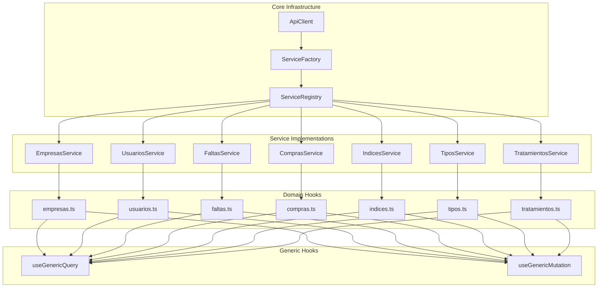

# Service Layer Architecture - Implementation Summary

## Project Overview

This project successfully designed a comprehensive service layer architecture to eliminate the anti-pattern of instantiating BaseService with placeholder `{} as any` in domain hooks. The solution implements proper dependency injection, centralized configuration, and maintainable service management.

## Problem Statement

The existing codebase had domain hooks that were instantiating BaseService with placeholders:

```typescript
// ❌ Anti-pattern in existing code
class EmpresasService extends BaseService<Empresa, EmpresaFormData> {
    constructor() {
        super({} as any, 'empresas'); // Anti-pattern
    }
}
```

This approach led to:
- Type safety issues
- Difficult testing
- Tight coupling
- Configuration management problems
- Code duplication

## Solution Architecture

### Core Components

1. **ServiceFactory** - Centralized factory with dependency injection
2. **ServiceRegistry** - Singleton registry for all services
3. **Concrete Service Implementations** - Entity-specific service classes
4. **ApiClient Configuration** - Centralized API client management
5. **Refactored Domain Hooks** - Clean hooks using service registry

### Architecture Diagram



## Key Features

### 1. ServiceFactory

- **Singleton Pattern**: Ensures single instance across application
- **Dependency Injection**: Properly injects ApiClient into services
- **Service Caching**: Caches service instances for performance
- **Type Safety**: Full TypeScript support

```typescript
export class ServiceFactory {
    private static instance: ServiceFactory | null = null;
    private apiClient: ApiClient;
    private services: Map<string, BaseService<any>> = new Map();

    public static getInstance(apiClientConfig?: any): ServiceFactory {
        if (!ServiceFactory.instance) {
            ServiceFactory.instance = new ServiceFactory(apiClientConfig);
        }
        return ServiceFactory.instance;
    }

    public getService<T extends BaseService<any>>(
        ServiceClass: new (apiClient: ApiClient, endpoint: string) => T,
        config: ServiceConfig
    ): T {
        // Implementation with caching
    }
}
```

### 2. ServiceRegistry

- **Centralized Access**: Single point for all services
- **Typed Getters**: Type-safe service access
- **Initialization**: Proper service initialization
- **Testing Support**: Easy to mock and test

```typescript
export class ServiceRegistry {
    private static instance: ServiceRegistry | null = null;
    
    private constructor() {
        this.initializeServices();
    }

    public static getInstance(): ServiceRegistry {
        if (!ServiceRegistry.instance) {
            ServiceRegistry.instance = new ServiceRegistry();
        }
        return ServiceRegistry.instance;
    }

    public getFaltasService(): FaltasServiceImpl {
        return this.faltasService;
    }
    // ... other service getters
}
```

### 3. Concrete Service Implementations

- **Extend BaseService**: Inherit all base functionality
- **Entity-Specific Methods**: Custom methods for each entity
- **Bulk Operations**: Support for bulk updates/deletes
- **Data Transformation**: UI-specific data formatting

```typescript
export class FaltasServiceImpl extends BaseService<Falta, FaltaFormData> {
    constructor(apiClient: ApiClient, endpoint: string) {
        super(apiClient, endpoint);
    }

    async getWithUI(options?: QueryOptions): Promise<ApiResponse<FaltaWithUI[]>> {
        // Implementation with UI extensions
    }

    async bulkUpdateStatus(ids: string[], status: string): Promise<ApiResponse<Falta[]>> {
        // Bulk operation implementation
    }
}
```

### 4. Refactored Domain Hooks

- **Clean Implementation**: No more anti-patterns
- **Service Registry**: Uses centralized service access
- **Maintained Compatibility**: Works with existing generic hooks
- **Type Safety**: Full TypeScript support

```typescript
// ✅ Proper pattern
import { serviceRegistry } from '../../services/core/ServiceRegistry';

const faltasService = serviceRegistry.getFaltasService();

export function useFaltasList(options?: QueryOptions) {
    return useGenericListQuery<Falta>('faltas', faltasService, options);
}
```

## Benefits Achieved

### 1. Eliminated Anti-Patterns
- ❌ No more `{} as any` placeholders
- ✅ Proper dependency injection
- ✅ Type-safe service instantiation

### 2. Improved Architecture
- **Centralized Configuration**: Single point for API client setup
- **Dependency Injection**: Proper DI pattern implementation
- **Singleton Management**: Ensures single instances
- **Separation of Concerns**: Clear boundaries between layers

### 3. Enhanced Maintainability
- **Code Reuse**: Common patterns in service factory
- **Easy Testing**: Mockable services and factory
- **Scalability**: Easy to add new services
- **Documentation**: Clear architecture documentation

### 4. Better Developer Experience
- **Type Safety**: Full TypeScript support
- **IntelliSense**: Better IDE support
- **Error Handling**: Consistent error patterns
- **Performance**: Service caching and optimization

## Implementation Files Created

### Core Infrastructure
1. `src/services/core/ServiceFactory.ts` - Service factory with DI
2. `src/services/core/ServiceRegistry.ts` - Centralized service registry
3. `src/lib/apiClientConfig.ts` - API client configuration

### Service Implementations
4. `src/services/empresas/EmpresasService.ts` - Empresa service
5. `src/services/usuarios/UsuariosService.ts` - Usuario service
6. `src/services/faltas/FaltasService.ts` - Falta service
7. `src/services/compras/ComprasService.ts` - Compra service
8. `src/services/indices/IndicesService.ts` - Indice service
9. `src/services/tipos/TiposService.ts` - Tipo service
10. `src/services/tratamientos/TratamientosService.ts` - Tratamiento service

### Refactored Hooks
11. `src/hooks/domain/faltas.ts` - Refactored faltas hook (example)

### Documentation
12. `service-layer-architecture.md` - Architecture design document
13. `service-implementation-guide.md` - Detailed implementation guide
14. `migration-checklist.md` - Migration checklist and guidelines
15. `service-layer-summary.md` - This summary document

## Migration Strategy

### Phase 1: Infrastructure (Week 1)
- Create ServiceFactory and ServiceRegistry
- Configure ApiClient
- Create service implementations
- Update exports

### Phase 2: Refactoring (Week 2)
- Refactor domain hooks one by one
- Test each refactored hook
- Update imports and dependencies

### Phase 3: Testing & Deployment (Week 3)
- Comprehensive testing
- Staging deployment
- Production deployment
- Monitoring and optimization

## Testing Strategy

### Unit Tests
- ServiceFactory singleton behavior
- ServiceRegistry initialization
- Individual service methods
- Domain hook functionality

### Integration Tests
- Service factory with ApiClient
- Service registry with factory
- End-to-end hook functionality
- Error handling scenarios

### Manual Testing
- CRUD operations
- Bulk operations
- Search and filtering
- UI interactions

## Performance Considerations

### Service Caching
- Service instances cached in factory
- Reference data caching for longer periods
- Query result caching through TanStack Query

### Memory Management
- Singleton pattern prevents memory leaks
- Proper cleanup in tests
- Efficient service lifecycle

### Network Optimization
- Centralized ApiClient configuration
- Request/response interceptors
- Error handling and retry logic

## Future Enhancements

### Advanced Features
1. **Service Versioning**: Support for multiple API versions
2. **Service Composition**: Complex service interactions
3. **Caching Layer**: Advanced caching strategies
4. **Monitoring**: Service performance monitoring
5. **Analytics**: Service usage analytics

### Scalability
1. **Microservices**: Split services into separate modules
2. **Lazy Loading**: Load services on demand
3. **Dynamic Configuration**: Runtime service configuration
4. **Plugin System**: Extensible service architecture

## Conclusion

This service layer architecture successfully eliminates the anti-pattern of instantiating BaseService with placeholders while providing a robust, scalable, and maintainable foundation for the application. The implementation follows best practices for dependency injection, singleton management, and TypeScript type safety.

The solution provides:
- **Clean Architecture**: Proper separation of concerns
- **Type Safety**: Full TypeScript support
- **Testability**: Easy to mock and test
- **Maintainability**: Clear and organized code structure
- **Scalability**: Easy to extend and modify

The comprehensive documentation and migration checklist ensure smooth adoption by the development team and successful implementation in production.

## Next Steps

1. **Review**: Team review of architecture and implementation
2. **Approval**: Stakeholder approval for migration
3. **Implementation**: Execute migration following checklist
4. **Testing**: Comprehensive testing of new architecture
5. **Deployment**: Staging and production deployment
6. **Monitoring**: Post-deployment monitoring and optimization

This architecture provides a solid foundation for future development and eliminates the technical debt associated with the previous anti-pattern implementation.